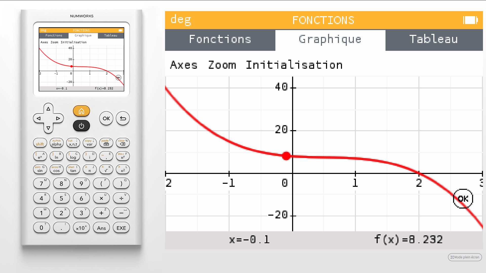

---
presentation:
  theme: solarized.css
  width: 800
  height: 600

print_background: true
---

<!-- slide -->

Exercice [78, page 150](https://www.lelivrescolaire.fr/page/7418770?docId=SlDy0KrVwWJOWy3AISxNS)

<!-- slide vertical=true-->

$g$ est la fonction définie sur $\mathbb R$ par :
$g(x) = -2x^3 + 3x^2 -2x +8$.

On note $g'$ la fonction dérivée de $g$ sur $\mathbb R$.

> Les affirmations suivantes sont-elles vraies ou fausses ?
> **Justifier les réponses.**

<!-- slide -->

On note :
$$h(x) = -6\left(x - \frac12\right)^2 - \frac12$$

> A-t-on $h = g'$ ?

<!-- slide vertical=true-->
On sait que :
$$g(x) = -2x^3 + 3x^2 -2x +8$$

Donc :
$$g'(x) = -2\times3x^2 + 3\times2x^1 -2x^0 + 0$$

Et donc :
$$g'(x) = -6x^2 + 6x -2$$

<!-- slide vertical=true-->

**Première méthode** :
1. On teste avec $x=0$. C'est souvent facile.
2. On teste avec $x=\frac12$. Ici, simple avec $h$.
3. On teste avec $x=1$, souvent facile.

<!-- slide vertical=true-->

**Test 1** : $x=0$

Avec :
* $g'(x) = -6x^2 + 6x -2$
* $h(x) = -6\left(x - \frac12\right)^2 - \frac12$

On a :
* $g'(0) = -2$ ; calcul direct !
* $h(0) = -6\times\frac14 -\frac12 = \frac{-3}2 - \frac12 = -2$

Ainsi, $h = g'$ est possible, mais pas certain.

<!-- slide vertical=true-->

**Test 2** : $x=\frac12$

Avec :
* $g'(x) = -6x^2 + 6x -2$
* $h(x) = -6\left(x - \frac12\right)^2 - \frac12$

On a :
* $g'(\frac12) = -6\times\frac14 + 6\times\frac12 -2 = \frac{-6+12-8}4 = \frac{-2}{4}=\frac{-1}2$
* $h(\frac12) = -6\times0 -\frac12 = \frac{-1}2$

Ainsi, $h = g'$ est possible, mais pas certain.

<!-- slide vertical=true-->

**Test 3** : $x=1$

Avec :
* $g'(x) = -6x^2 + 6x -2$
* $h(x) = -6\left(x - \frac12\right)^2 - \frac12$

On a :
* $g'(1) = -6 +6 -2 = -2$
* $h(1) = h(0) = -2$ ; d'après le test 1.

Ainsi, $h = g'$ est possible, mais pas certain.

<!-- slide vertical=true-->

On vient de vérifier sur trois valeurs différentes pour $x$ que $h(x) = g'(x)$.
> Pour deux polynômes de degré deux, cela implique qu'ils sont égaux. (*Hors programme*.)

On va appliquer une autre méthode pour le prouver.

<!-- slide vertical=true-->

$g'(x) = -6x^2 + 6x -2$ est un polynôme du second degré que l'on va mettre sous forme canonique.

> Rappel : Si $f(x) = ax^2 + bx + c$, avec $a\neq0$
> $f(x) = a\left(x + \frac{b}{2a}\right)^2 -a\frac{b^2}{4a^2}+ a\frac{4ac}{4a^2}$
> $f(x) = a\left[\left(x + \frac{b}{2a}\right)^2 -\frac{\Delta}{4a^2}\right]$
> où $\Delta = b^2-4ac$

<!-- slide vertical=true-->
Ainsi, avec $g'(x) = -6x^2 + 6x -2$, on a :

$\Delta = 6^2-4\times{(-6)}\times{(-2)} = 36 - 48 = -12$

$g'(x) = -6\left[\left(x + \frac6{2\times-6}\right)^2-\frac{-12}{4\times(-6)^2}\right]$

$g'(x) = -6\left(x - \frac12\right)^2-\frac{-12}{4\times(-6)}$

$g'(x) = -6\left(x - \frac12\right)^2-\frac12$

Pour tout $x\in \mathbb R$, $\quad g'(x) = h(x)$.

> **L'affirmation 1 est vraie**.

<!-- slide -->

Avec $g'(x) = -6x^2 + 6x -2$, et son discriminant $\Delta = -12$ qui est négatif, on peut affirmer que $g'$ est de signe constant, le signe de $a=-6$, donc négatif sur $\mathbb R$.

$g'$ étant négative sur $\mathbb R$, on peut affirmer que

$g$ est décroissante sur $\mathbb R$.

> **L'affirmation 2 est vraie**.

<!-- slide -->

Pour connaître le signe sur $\mathbb R$ de

$$g(x) = -2x^3 + 3x^2 -2x +8$$

on peut déjà regarder sa courbe représentative sur un intervalle borné.

> On peut utiliser :
> * [l'émulateur Numworks](https://www.numworks.com/fr/simulateur/) en ligne ;
> * [l'application Numworks](https://play.google.com/store/apps/details?id=com.numworks.calculator&hl=fr) pour tablette ;
> * ou la calculatrice elle-même...

<!-- slide vertical=true -->

Courbe représentative de $g$ sur $[-2 ; 3]$, avec 
$g(x) = -2x^3 + 3x^2 -2x +8$

<!-- slide vertical=true -->

On aurait pu constater par un calcul immédiat que

$g(0) = +8$, qui est positif.

> **L'affirmation 3 est donc fausse**.

<!-- slide -->

Pour $x\in [2 ; +\infty[$, la représentation graphique laisse penser que $g(x)\leqslant 0$, mais ce n'est pas une preuve.

Calculons d'abord $g(2)$.

* $g(2) = -2\times2^3 + 3\times2^2 -2\times2 +8$
* $g(2) = -2\times8 + 3\times4 -2\times2 +8$
* $g(2) = -16 + 12 -4 +8 = 0$

<!-- slide vertical=true -->

On rappelle que $g$ est décroissante sur $\mathbb R$, donc en particulier sur $[2 ; +\infty[$, on en déduit que :

$x \geqslant 2$ implique que $g(x) \leqslant g(2)$

et avec $g(2) = 0$, on déduit

$x \in [2 ; +\infty[$ implique $g(x) \leqslant 0$

> **L'affirmation 4 est donc vraie**.

<!-- slide -->

* $g(\sqrt2) = -2\times\sqrt2^3 + 3\times\sqrt2^2 -2\times\sqrt2 +8$
* $g(\sqrt2) = -2\times\sqrt2^2\times\sqrt2 + 3\times2 -2\times\sqrt2 +8$
* $g(\sqrt2) = 14 -4\sqrt2 -2\times\sqrt2$
* $g(\sqrt2) = 14 -6\sqrt2$

> **L'affirmation 5 est donc vraie**.

