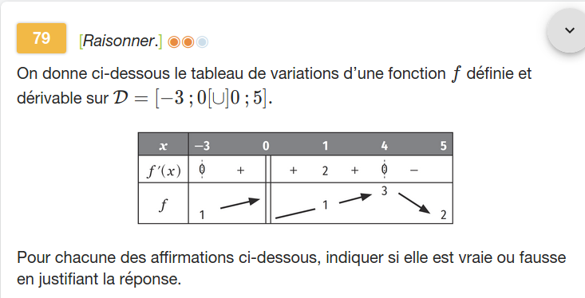
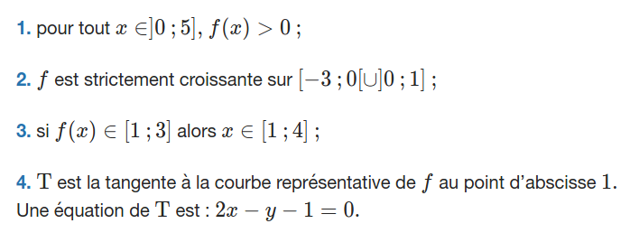

---
presentation:
  theme: solarized.css
  width: 800
  height: 600

print_background: true
---

<!-- slide -->

Exercice [79, page 150](https://www.lelivrescolaire.fr/page/7418770?docId=O7gU_2WduyLbgdCwwPsbx)

<!-- slide vertical=true -->

<!-- slide -->
### Q1

On ne connaît pas la limite de $f(x)$ quand $x\rightarrow 0^+$ ($x$ tend vers $0$ par valeurs supérieures) ; on pourrait très bien avoir $f(\frac12) = 0$ et $f(\frac14) = -1$ et  donc
> « pour tout $x\in]0;5], f(x)>0$ » est **fausse**;

<!-- slide -->
### Q2

$[−3;0[\cup]0;1]$ n'est pas un intervalle, ainsi il est interdit de parler de croissance sur cet ensemble.

> **L'affirmation 2 est fausse**.

Variante : On pourrait très bien avoir $f(-1) = 2$ et $f(1)=1$.

<!-- slide -->
### Q3

On pourrait avoir $f(-1)=2 \in [1 ; 3]$,
 or $-1 \not\in [1 ; 4]$.

> **L'affirmation 3 est fausse**.

<!-- slide -->
### Q4

> **Rappel** : Si $f$ est dérivable en $a$, l'équation de la tangente à $\mathscr C_f$ au point d'abscisse $a$ est 
> $\mathscr T_a : y = f(a) + f'(a)\times(x-a)$

<!-- slide vertical=true-->

Au point d'abscisse $1$, on a $f(1) = 1$, et $f'(1) = 2$, ainsi

$\mathscr T_1 : y = 1 + 2\times(x-1)$

Équation qui se réécrit : $2x-y-1 = 0$

> **L'affirmation 4 est vraie**.
