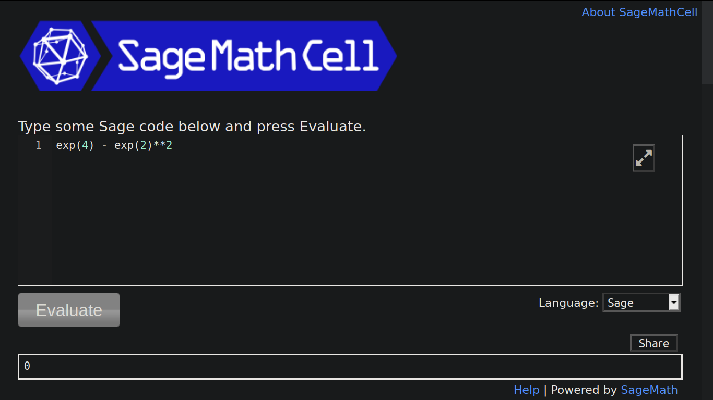

### Exercice 65

Calcul exact :
$\mathrm e^4 - (\mathrm e^2)^2 = \mathrm e^4 - \mathrm e^4 = 0$.

Avec Python :
```py{cmd="python3"}
from math import exp

print(exp(4) - exp(2)**2)
```

On n'obtient pas zéro, mais un nombre très petit. C'est normal.
* Avec une calculatrice normale ou bien un langage de programmation qui travaille avec des flottants (nombres à virgule flottante), les nombres sont stockés en binaire, et souvent approchés.
* Le résultat des opérations est donc lui aussi approché, et on peut ne pas tomber pile sur une valeur exacte. C'est normal.

> Pour obtenir un résultat exact, on peut utiliser un CAS (_**C**omputer **A**lgebra **S**ystem_), comme [Sage](https://sagecell.sagemath.org/) par exemple. Essayez !!! Vous obtiendrez $0$, la valeur exacte !

