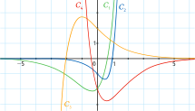

# Exercice 88 p 175

* $f(x) = (3x-2)\mathrm e^x$, $f$ s'annule quand $x = \dfrac23$, ainsi $f$ est représentée par $\mathcal C_1$.
* $g(x)= (-5x-2)\mathrm e^{-x}$, $g$ s'annule quand $x=\dfrac{-2}5$, ainsi $g$ est représentée par $\mathcal C_4$.
* $h(x)= (x-1)\mathrm e^{2x}$, $h$ s'annule quand $x=1$, ainsi $h$ est représentée par $\mathcal C_2$.
* $p(x)= (x+2)\mathrm e^{-x}$, $p$ s'annule quand $x=-2$, ainsi $p$ est représentée par $\mathcal C_3$.

