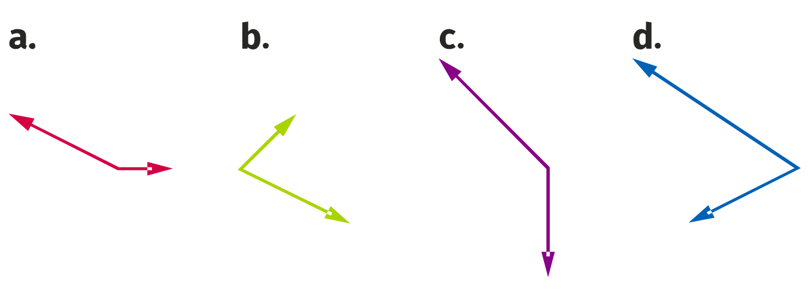

# Exercice 32

Le signe du produit scalaire de deux vecteurs **non nuls** est donné par le cosinus de l'angle formé par ces deux vecteurs.
* Si l'angle est aigu le cosinus est positif,
* si l'angle est obtus le cosinus est négatif.

Ainsi, on a :
* a. Négatif
* b. Positif
* c. Négatif
* d. Positif
