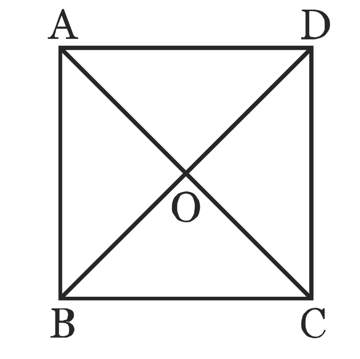

# Exercice 35

Identifier les couples de produits scalaires égaux

On choisit comme unité de longueur le côté du carré.

1. $\vec{BC}⋅\vec{BA} = \vec 0 = \vec{OC}⋅\vec{OD}$
2. $\vec{BC}⋅\vec{BO} = \frac12\vec{BA}⋅\vec{CD}$, avec la méthode du projeté orthogonal.
3. $\vec{AB}⋅\vec{AC} = 1 = \vec{BD}⋅\vec{BA}$, avec projectio orthogonales sur $(AB)$.
4. $\vec{OA}⋅\vec{OC} = \frac{-1}4 = -\vec{OB}⋅\vec{OB}$