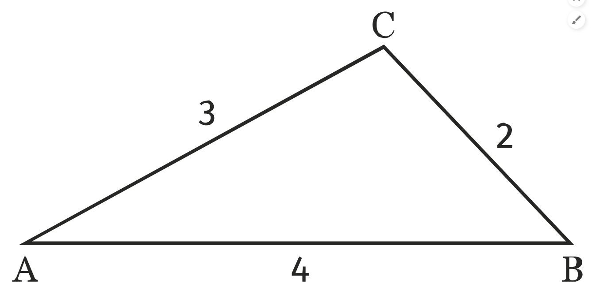

# Exercice 36

Calculons :

1. $\vec{AB}⋅\vec{AC} = ?$
On a :
    * $\vec{AB} + \vec{AC} = ???$
    * $\vec{AB} - \vec{AC} = \vec{AB} + \vec{CA} = \vec{CA} + \vec{AB} = \vec{CB}$
Avec $\vec u ⋅ \vec v = \frac12\left(||\vec u||^2 + ||\vec v||^2 - ||\vec u - \vec v||^2\right)$, on a :
$\vec{AB}⋅\vec{AC} = \frac12\left(||\vec {AB}||^2 + ||\vec {AC}||^2 - ||\vec {CB}||^2\right) = \frac12(4^2 + 3^2 - 2^2) = \frac{21}2$
$\boxed{\vec{AB}⋅\vec{AC} =\frac{21}2}$

2. $\vec{BC}⋅\vec{BA} = ?$
    * $\vec{BC} + \vec{BA} = ???$
    * $\vec{BC} - \vec{BA} = \vec{BC} + \vec{AB} = \vec{AB} + \vec{BC} = \vec{AC}$
Avec $\vec u ⋅ \vec v = \frac12\left(||\vec u||^2 + ||\vec v||^2 - ||\vec u - \vec v||^2\right)$, on a :
$\vec{BC}⋅\vec{BA} = \frac12\left(||\vec {BC}||^2 + ||\vec {BA}||^2 - ||\vec {AC}||^2\right) = \frac12(2^2 + 4^2 - 3^2) = \frac{11}2$
$\boxed{\vec{BC}⋅\vec{BA} =\frac{11}2}$