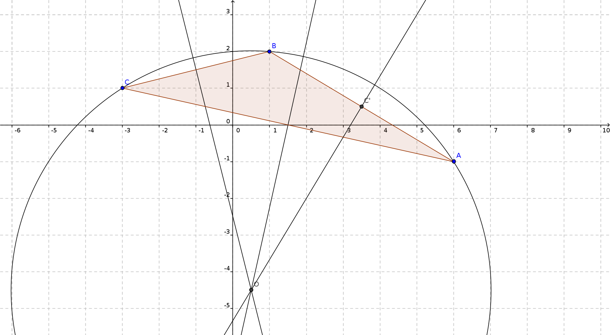

# Exercice 75

On considère le triangle $ABC$ tel que $A(6;−1)$, $B(1;2)$ et $C(−3;1)$.

1. Soit $M$ un point de la médiatrice de $[BC]$, alors $MB = MC$, ainsi $||\vec{MB}||^2 = ||\vec{MC}||^2$

Si $M$ a pour coordonnées $(x ; y)$, alors
* $\vec{MB} = \binom{1-x}{2-y}$ et donc  $||\vec{MB}||^2 = (1-x)^2 + (2-y)^2$.
* $\vec{MC} = \binom{-3-x}{1-y}$ et donc  $||\vec{MC}||^2 = (-3-x)^2 + (1-y)^2$.
On déduit 
$$ (1-x)^2 + (2-y)^2 = (-3-x)^2 + (1-y)^2$$

$$(1-2x+x^2) + (4-4y+y^2) = (9 + 6x + x^2) + (1-2y+y^2)$$

$$(-2x-6x) + (-4y+2y) + (1+4-9-1) = 0$$

$$-8x -2y -5 = 0$$

$$8x +2y +5 = 0$$

Ceci est l'équation de la médiatrice de $[BC]$.

2. De même, on trouve l'équation de la médiatrice de $[AC]$ :
$$18x - 4y - 27 = 0$$

3. Si $O(x ; y)$ est l'intersection de ces deux droites, alors :
$$\begin{cases}
8x+2y = -5\\
18x - 4y = 27
\end{cases}$$

d'où

$$\begin{cases}
16x+4y = -10\\
18x - 4y = 27
\end{cases}$$

d'où

$$\begin{cases}
34x+0y = 17\\
8x+2y = -5\\
\end{cases}$$

d'où

$$\begin{cases}
x = \frac12\\
8×\frac12+2y = -5\\
\end{cases}$$

d'où

$$\begin{cases}
x = \frac12\\
2y = -5-4\\
\end{cases}$$

d'où

$$\begin{cases}
x = \frac12\\
y = \frac{-9}2\\
\end{cases}$$

Les coordonnées de $O$ sont $(\frac12 ; \frac{-9}2)$.

4. $C'$ est le milieu de $[AB]$, donc ses coordonnées sont :
$$C'((6+1)/2; (-1+2)/2)$$

$$C'\left(\frac72; \frac12\right)$$

On rappelle :
* $\vec{AB} =\binom{1-6}{2-(-1)} = \binom{-5}{3}$
* $\vec{C'O} = \binom{\frac12 - \frac72}{\frac{-9}2 - \frac12} = \binom{-3}{-5}$

Ainsi $\vec{AB}⋅\vec{C'O} = -5×(-3) + 3×(-5) = +15+ (-15)$

D'où, $\vec{AB}⋅\vec{C'O} = 0$

Ainsi $(AB)$ est perpendiculaire à $(C'O)$, et donc $(C'O)$ est la troisième médiatrice du triangle $ABC$, et ces trois médiatrices sont bien concourantes en $O$, centre du cercle circonscrit au triangle $ABC$.

---

Version classe de 5ème :

* $O$ appartient à la médiatrice de $[BC]$, donc $OB = OC$.
* $O$ appartient à la médiatrice de $[AC]$, donc $OA = OC$.
On déduit $OB = OA$, alors $O$ appartient à la médiatrice de $[BC]$, et *in fine*, $O$ est le centre du cercle circonscrit.
