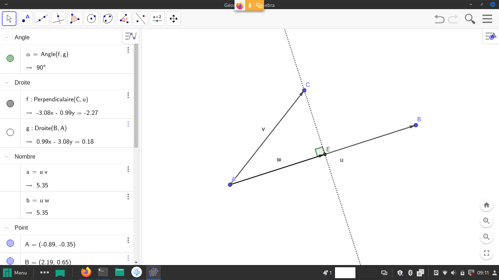

# Produit scalaire

## Définition

Le produit scalaire de deux vecteurs indique le défaut d'orthogonalité entre deux vecteurs, avec :
* $\vec u = \binom{x}{y}$
* $\vec v = \binom{x'}{y'}$

On définit le produit scalaire de $\vec u$ par $\vec v$ :
$$\vec u \cdot \vec v = xx'+yy'$$

Ou alors par :
$$\vec u \cdot \vec v = ||\vec u|| × ||\vec v|| × \cos(\vec u, \vec v)$$

## Propriétés

### Avec $\vec u=\vec v$

* $\vec u \cdot \vec u = x^2+y^2$

* $\vec u \cdot \vec u = ||\vec u|| × ||\vec u|| × \cos(\vec u, \vec u) = ||\vec u||^2$

En effet $(\vec u, \vec u)$ est un angle nul, donc de cosinus égal à $1$.

> On retrouve $||\vec u||^2 = x^2+y^2$, ou encore $||\vec u|| = \sqrt{x^2+y^2}$

### Commutativité

Si $\vec u = \binom x y$ et $\vec v = \binom{x'}{y'}$ sont deux vecteurs, alors leur **produit scalaire est commutatif** :
$$\vec u \cdot \vec v = \vec v \cdot \vec u$$

> Preuve :
> * $\vec u \cdot \vec v = xx'+yy'$
> * $\vec v \cdot \vec u = x'x+y'y$
* Or les multiplications **réelles** $xx'$ et $yy'$ sont **commutatives**, et donc égales à $x'x$ et $y'y$. Ainsi **le produit scalaire est commutatif**.

### Distributivité

On rappelle **la distributivité de la multiplication des réels par rapport à l'addition des réels**.
$$k(a+b) = ka+kb$$

On a de même, **la distributivité du produit scalaire par rapport à l'addition des vecteurs** :
$$\vec u \cdot (\vec v + \vec w) = \vec u \cdot \vec v + \vec u \cdot \vec w$$

> Preuve, avec :
> * $\vec u = \binom x y$
> * $\vec v = \binom {x'} {y'}$
> * $\vec w = \binom {x''} {y''}$
> * On a d'une part :
>   * $\vec v + \vec w = \binom{x'+x''}{y'+y''}$
>    * ainsi $\vec u \cdot (\vec v + \vec w) =x(x'+x'') + y(y'+y'')$
>    * d'où $\vec u \cdot (\vec v + \vec w) = (xx'+yy') + (xx''+yy'')$, par simple distributivité *de la multiplication par rapport à l'addition* **avec les nombres réels**.
>* d'autre part :
>    * $\vec u \cdot \vec v + \vec u \cdot \vec w = (xx'+yy') + (xx''+yy'')$
>* D'où l'égalité. $\square$

### Linéarité
Avec $k$ un nombre réel (on dit $k$ est un scalaire).

$$\vec u \cdot (k × \vec v) = k × (\vec u \cdot  \vec v)$$

> **Preuve** avec $\vec u = \binom{x}{y}$, $\vec v = \binom{x'}{y'}$, ainsi $k × \vec v = \binom{kx'}{ky'}$ 
>On a d'une part :
>* $\vec u \cdot (k × \vec v) = x×kx' + y×ky'$ (avec commutativité du produit des réels)
>* $ \vec u \cdot (k × \vec v)= k×xx' + k×yy'$ (avec factorisation)
>* $ \vec u \cdot (k × \vec v)= k×(xx' + yy')$
>
>D'autre part :
>* $k × (\vec u \cdot  \vec v) = k×(xx'+yy')$

On en déduit une formule :

$$\vec u \cdot (\lambda \vec v + \mu \vec w) = \vec u \cdot (\lambda \vec v) + \vec u \cdot (\mu \vec w) = \lambda \vec u \cdot \vec v + \mu \vec u \cdot \vec w$$

### À retenir

Le produit scalaire indique un défaut d'orthogonalité, et $\vec u \cdot \vec v = 0$ signifie que $\vec u$ et $\vec v$ sont orthogonaux.

Au passage, si $\vec u = \vec 0 = \binom 0 0$, alors $\vec u$ est orthogonal à tout vecteur $\vec v$.

Réciproquement, si le produit scalaire est nul :
* Ou bien, un des deux (au moins) des vecteurs est nul,
* ou bien, les deux vecteurs sont non nuls, et l'angle formé (existe donc bien) est un angle droit.

### Exemples pratiques simples

* $\binom{11}{-17} \cdot \binom{1}{0} = 11$
* $\binom{3,2}{4,5} \cdot \binom{0}{1} = 4,5$

On généralise aux formules :
Avec $\vec u=\binom x y$
* $\vec u \cdot \binom1 0=x$
* $\vec u \cdot \binom0 1=y$

C'est une méthode pour obtenir (par projection) les coordonnées d'un vecteur.

### Projection

On a constaté que :
* si $E$ est le projeté orthogonal de $C$ sur $(AB)$,
* alors $\vec{AC} \cdot \vec{AB} = \vec{AE} \cdot \vec{AB}$

### Calcul d'angle entre deux vecteurs **non nuls**

Avec la formule
$$\vec u \cdot \vec v = ||\vec u|| × ||\vec v|| × \cos(\vec u, \vec v)$$

On déduit, pour $\vec u$ et $\vec v$ non nuls :

$$\cos(\vec u, \vec v) = \dfrac{\vec u \cdot \vec v}{||\vec u|| × ||\vec v||}$$

Ainsi, par exemple, avec :
* $\vec u=\binom{4}{-3}$
* $\vec v=\binom{1}{5}$

On a :
* $\vec u \cdot \vec v = 4×1 + (-3)×5 = 4 + (-15) = -11$
* $||\vec  u|| = \sqrt{4^2+(-3)^2} = \sqrt{25} = 5$
* $||\vec  v|| = \sqrt{1^2+5^2} = \sqrt{26}$

On déduit :
* $\cos(\vec u, \vec v) = \dfrac{-11}{5\sqrt{26}}$
* $(\vec u, \vec v) = \arccos\left(\dfrac{-11}{5\sqrt{26}}\right)$, environ $116°$