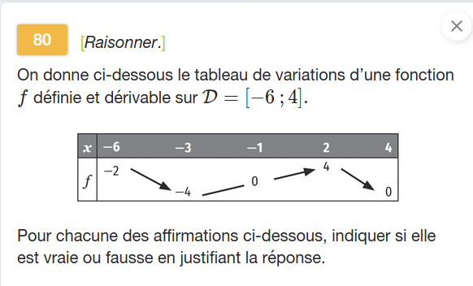
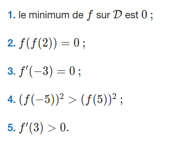

---
presentation:
  theme: solarized.css
  width: 800
  height: 600

print_background: true
---

<!-- slide -->

Exercice [80, page 150](https://www.lelivrescolaire.fr/page/7418770?docId=QG5syUvezEhQRYZ7eSjIe)

<!-- slide vertical=true -->

<!-- slide -->
### Q1

$-3\in \mathscr D$ et $f(-3)=-4$, donc le minimum de $f$ sur $\mathcal D$ n'est pas $0$.

> **L'affirmation 1 est donc fausse**.

<!-- slide -->
### Q2

* On a $f(2) = 4$, et $f(4) = 0$, donc
* $f(f(2)) = f(4) = 0$.

> **L'affirmation 2 est donc vraie**.

<!-- slide -->
### Q3

* La fonction $f$ est dérivable sur $\mathcal D$, et
* $-3$ est dans l'intérieur de $\mathcal D$. ($-3$ n'est pas une extrémité)
* De plus, $x=-3$ donne un minimum local $f(-3) = -4$.

On en déduit $f'(-3) = 0$.

> **L'affirmation 3 est donc vraie**.

<!-- slide -->
### Q4

$f(5)$ n'est pas défini donc l'affirmation 4 n'est pas vraie.

> **L'affirmation 4 est donc fausse**.

<!-- slide -->
### Q5

* $f$ est dérivable sur $\mathcal D$, donc en particulier sur $[2 ; 4]$ ;
* $f$ est décroissante sur l'intervalle $[2 ; 4]$.

On déduit que $f'(x) \leqslant 0$ pour tout $x$ dans $[2 ; 4]$, et enfin que $f'(3) > 0$ est faux.

> **L'affirmation 5 est donc fausse**.
