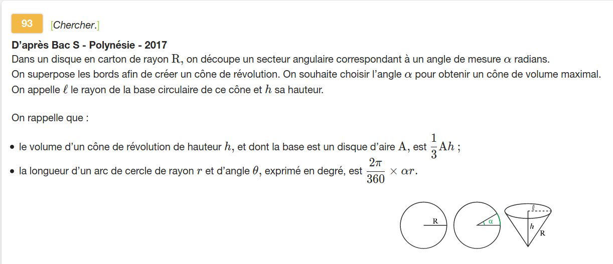

---
presentation:
  theme: solarized.css
  width: 800
  height: 600

print_background: true
---

<!-- slide -->

Exercice [93, page 153](./sujet_93p153.pdf)

<!-- slide -->

## question 1

$V(h) = \frac13 \times A \times h$
$V(h) = \frac13 \times \pi \times l^2 \times h$

avec $l^2 + h^2 = R^2$, $R=20$, donc $R^2 = 400$,
ainsi $l^2 = 400 - h^2$, et donc

$V(h) = \frac13 \times \pi (400 - h^2) \times h$
$V(h) = \frac\pi3 (400h - h^3)$

<!-- slide -->

## Question 2

$V'(h) = \frac \pi 3 (400 - 3h^2)$
$V'(h) = 0$ équivalent à $400 - 3h^2 = 0$, donc $h^2 = \frac{400}3$, et enfin $h=\pm \sqrt{\frac{400}3} = \pm\frac {20} {\sqrt 3} = \pm\dfrac{20\sqrt 3}{3}$.

Avec $h>0$, on ne conserve que $h=\dfrac{20\sqrt 3}{3}$.

$V$ s'annule en $h$ en changeant de signe, ainsi on a un extremum local en $h$.

<!-- slide -->

## Q3

$\dfrac{2\pi}{360} \alpha R = 2\pi l$
$\dfrac{2\pi}{360} \alpha R = 2\pi l$

avec $l>0$, on a $l = \sqrt{400 - h^2}$

$\dfrac{2\pi}{360} 20\alpha = 2\pi \sqrt{400 - h^2}$

Quand le volume est maximal, on a $h^2 = \dfrac {400}3$, donc

<!-- slide vertical=true-->

$\dfrac{2\pi}{360} 20\alpha = 2\pi \sqrt{400 - \dfrac {400}3}$

$\dfrac{2\pi}{360} 20\alpha = 2\pi \sqrt{\dfrac {800}3}$

$\dfrac{20}{360} \alpha =  \sqrt{\dfrac {800}3}$

<!-- slide vertical=true-->

$\alpha =  18\sqrt{\dfrac {800}3}$
$\alpha =  18\sqrt{\dfrac {2\times 400}3}$
$\alpha =  18\times 20 \sqrt{\dfrac {2}3}$
$\alpha =  360 \sqrt{\dfrac {2}3}$ en degrés
$\alpha =  \sqrt{\dfrac {2}3}$ en tours
$\alpha =  2\pi \sqrt{\dfrac {2}3}$ en radians

<!-- slide -->

## Q4

$\dfrac{2\pi}{360} R \alpha = 2\pi \sqrt{R^2 - h^2}$
avec $h^2 = \dfrac{R^2}3$

donc
$\dfrac{2\pi}{360} R \alpha = 2\pi \sqrt{\dfrac23 R^2}$
$\dfrac{2\pi}{360} R \alpha = 2\pi \sqrt{\dfrac23}\times\sqrt{ R^2}$
<!-- slide vertical=true-->

$\dfrac{2\pi}{360} \alpha = 2\pi \sqrt{\dfrac23}$
$\dfrac{1}{360} \alpha = \sqrt{\dfrac23}$
$\alpha = 360\sqrt{\dfrac23}$

<!-- slide -->

## bonus

Pourquoi une cubique a au maximum, deux _extrema_ ?

Si $f$ est un polynôme de degré 3, alors
$f'$ est un polynôme de degré 2.

1. $f'$ s'annule en deux points distincts.
2. $f'$ s'annule en un seul point.
3. $f'$ ne s'annule pas.

<!-- slide vertical=true-->

Donc

1. $f'$ s'annule en deux points **et** en changeant de signe, ainsi $f$ possède deux _extrema_.
2. Certes $f'$ s'annule en un point, mais sans changer de signe, ainsi il n'y a pas d'extremum local.
3. $f'$ est toujours de même signe, ainsi $f$ est monotone sur $\mathbb R$.
