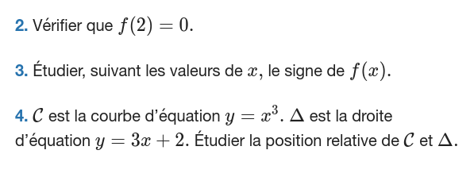
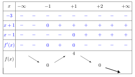
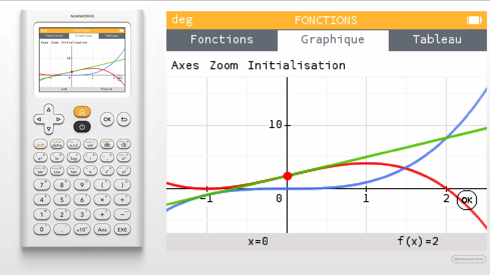

---
presentation:
  theme: solarized.css
  width: 800
  height: 600

print_background: true
---

<!-- slide -->

Exercice [95, page 154](https://www.lelivrescolaire.fr/page/7416288?docId=VqPlJy-jN5PxIAS5TZdu_)

<!-- slide -->
### Q1

Pour $x\in \mathbb R$, on a $f(x) = -x^3+3x+2$, donc
$f'(x) = -3x^2 +3$, expression qui se factorise aisément ;

* $f'(x) = -3(x^2 -1)$,
* $f'(x) = -3(x -1)(x+1)$,

<!-- slide vertical=true -->

Tableau obtenu avec [Scratchwork](https://www.scratchwork.io) : outils de schéma en ligne.

<!-- slide -->
### Q2

Pour $x\in \mathbb R$, on a $f(x) = -x^3+3x+2$, donc

$f(2) = -2^3+3\times2+2 = -8 + 6 +2 = 0$

<!-- slide -->
### Q3

Pour $x\in \mathbb R$, on a $f(x) = −x^3+3x+2$, donc

$f(-1) = -(-1)^3+3\times(-1)+2 = +1 -3 +2 = 0$

<!-- slide vertical=true -->

Ce tableau de variation a été obtenu avec [**Pdf**_add_](https://www.xm1math.net/pdfadd/), qui est simple d'utilisation. Il a ensuite été modifié avec [InkScape](https://inkscape.org/fr/) pour obtenir un fichier `.svg` avec la partie en bleu pour $f'$.

> Entraînez-vous avec **Pdf**_add_

<!-- slide -->
### Q4

<!-- slide vertical=true -->

* En vert, la droite d'équation : $y = 3x + 2$ ;
* En bleu, la courbe d'équation : $y =x^3$ ;
* En rouge, la courbe d'équation : $y = f(x) = -x^3 +3x +2$ ;

Étudier la position relative de deux courbes, c'est indiquer laquelle (et quand) est située au dessus ou en dessous de l'autre.

<!-- slide vertical=true -->

Graphiquement, on conjecture que :
*  la verte est au-dessus de la bleue pour $x<-1$ ;
*  la verte est au-dessus de la bleue pour $-1 < x < 2$ ;
*  la verte est **au-dessous** de la bleue pour $2 < x $ ;
* la verte et la bleue se croise en $x=0$ et $x=2$.

Tout ceci s'explique parfaitement par lecture du tableau de variation de $f$ qui est la différence entre l'équation de la verte et la bleue.

<!-- slide vertical=true -->

On constate de plus que la verte semble être la tangente à la bleue en $x=-1$. En effet :

* Vert : $y = 3\times(-1) + 2 = -1$
* Bleu : $y = (-1)^3 = -1$

D'autre part :
* Vert : $y' = 3$
* Bleu : $y' = 3\times(-1)^2 = 3$

Verte et bleue ont la même équation de tangente en $x=-1$ ; c'est la droite verte !