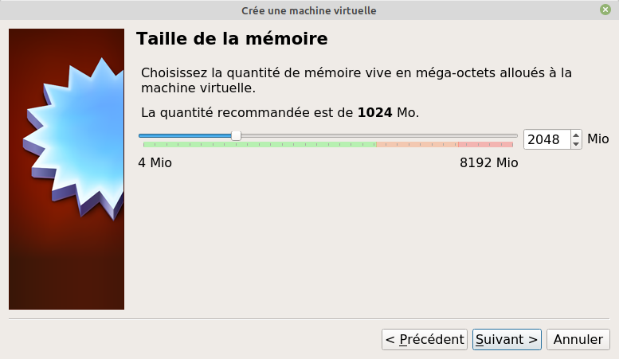

---
export_on_save:
  html: true
title: 🖥 Virtualisation Système
lang: fr-FR
author: Franck CHAMBON
---

<!-- @import "assets/EducNat.jpg" {width="400px" title="Logo de l'Éducation Nationale" alt="Logo de l'Éducation Nationale"} -->

# Virtualisation système {ignore=true}

Auteur
: [:envelope_with_arrow: Franck CHAMBON](mailto:franck.chambon@ac-aix-marseille.fr), enseignant au lycée Lucie AUBRAC de Bollène (84).
 
Licence
: :free: Les documents suivants sont placés sous licence libre [CC - BY-NC-SA 4.0](https://creativecommons.org/licenses/by-nc-sa/4.0/legalcode.fr) :
  - Ils sont accessibles gratuitement.
  - Ils peuvent être modifiés, adaptés, étoffés, quitte à citer les différents auteurs.
  - Leur utilisation commerciale n'est pas acceptée.
    @import "assets/CC-BY-NC-SA.svg" {width="100px" title="Licence" alt="Licence CC-BY-NC-SA-4.0"}

**Premières expériences** de virtualisation en première NSI.

La [virtualisation système](https://fr.wikipedia.org/wiki/Virtualisation) consiste, en informatique, à exécuter sur une machine hôte, dans un environnement isolé, des systèmes d'exploitation.
* La machine hôte sera votre ordinateur, au lycée ou à la maison.
* Les systèmes d'exploitations seront libres, conformément au programme du B.O. ; et il n'y a pas que Linux...

> Si certains mots vous semblent inconnus, les définitions arrivent...

**Exemple** : Trois machines virtuelles invitées dans une machine hôte Linux Mint. On peut y observer des versions différentes de Python3 qui y sont installées.

## Sommaire {ignore=true}
[TOC]

## Pourquoi virtualiser ?

* **Pour l'élève en NSI** :

  * C'est un bac à sable pédagogique pour les premières installations d'un système d'exploitation.
  * Découvrir Linux, et être administrateur d'une machine.
  * Faire des expériences sans conséquences en cas de mauvaises manipulations.
  * Travailler à la maison dans les conditions prévues par le B.O. en NSI.

* **Pour les professionnels** : 

  * Préparer son développement web.
  * Faire des tests variés, du partage de ressources, de la sécurisation de réseau, du déploiement ...
  * Faire des économies d'énergies, et d'[autres raisons](https://fr.wikipedia.org/wiki/Virtualisation#Int%C3%A9r%C3%AAts) encore.

## Comment virtualiser ?

Il existe plusieurs [techniques](https://fr.wikipedia.org/wiki/Virtualisation#Diff%C3%A9rentes_techniques) de virtualisation, et donc [plusieurs logiciels]() :

* [Boxes](https://wiki.gnome.org/Apps/Boxes) ; libre, très simple pour débuter, mais uniquement sous Linux.
* [KVM](https://fr.wikipedia.org/wiki/Kernel-based_Virtual_Machine) ; libre, uniquement pour Linux.
* [QEMU](https://fr.wikipedia.org/wiki/QEMU) ; libre et multiplateforme, mais plus performant actuellement avec Linux.
* [VMware](https://fr.wikipedia.org/wiki/VMware) ; non libre, uniquement pour Windows.
* [Virtual Machine Manager](https://virt-manager.org/) ; libre, technique, uniquement pour les administrateurs Linux.
* **VirtualBox** ; notre choix ici.
* [VirtualPC](https://fr.wikipedia.org/wiki/VirtualPC) ; non libre, uniquement pour Mac et Windows.

> Nous utiliserons [VirtualBox](https://fr.wikipedia.org/wiki/Oracle_VM_VirtualBox) ; un logiciel libre et multiplateforme qui a des performances correctes, et homogènes.
>
> On pourra alors installer un **système d'exploitation libre** de type Linux *(ou non)*.

## Vocabulaire

Machine hôte (*Host*)
: :computer: C'est l'ordinateur physique qui va "héberger" une ou plusieurs machines virtuelles.

> Votre ordinateur actuel sera prêt si vous disposez d'**au moins** 1 Go de mémoire vive disponible, et 20 Go de place sur votre disque dur.

Système hôte
: :minidisc: C'est le système d'exploitation (_**O**perating_ _**S**ystem_ ; *O.S.*) de la machine hôte. 

> *VirtualBox* est multiplateforme, vous pouvez l'installer avec un système hôte *Windows*, *Linux* ou *MacOS*.

Machine invitée (*Guest*)
: C'est la machine virtuelle qui sera allouée et gérée par l'hyperviseur VirtualBox.

> Cette machine aura un disque dur virtuel, un lecteur DVD virtuel, un écran virtuel, un processeur avec un ou plusieurs cœurs virtuels, etc. Cette machine peut capturer votre souris et votre clavier. On pourra aussi y bricoler virtuellement : ajout/suppression de matériel...

Système invité
: C'est le système d'exploitation que vous installez sur la machine virtuelle.

> :penguin: Nous expérimenterons l'installation de différentes versions de *Linux* comme  Debian, Ubuntu, Linux Mint, Manjaro, CentOS, ou Fedora.
>> :apple: [L'installation de versions variées](https://www.virtualbox.org/wiki/Screenshots) de Windows ou MacOS est possible.

Les suppléments invités (*Guest Additions*)
 : C'est un pack logiciel à installer sur la machine virtuelle pour optimiser son fonctionnement, comme pour avoir une meilleure résolution d'écran.

> :warning: Ce pack n'est pas un logiciel libre et il est interdit de l'utiliser en entreprise ou à l'Université.
À titre privé, vous avez le droit de l'installer ; nous verrons comment.

## Installation de VirtualBox

* Sur la [page de téléchargement](https://www.virtualbox.org/wiki/Downloads) du site officiel,
  * choisir la version correspondant à votre machine hôte.

* Dans certains cas, il faudra [activer le support de virtualisation](https://support.bluestacks.com/hc/fr-fr/articles/115003910391--Comment-puis-je-activer-la-virtualisation-VT-sur-mon-PC).
* En cas de problème avec la version 6.0 pour Windows,
  * vous pouvez tenter la version 5.2 pour Windows.

Bonne installation ...

**Premier démarage du logiciel** : VirtualBox sans aucune machine virtuelle.

## Présentation de Linux

[Linux](https://fr.wikipedia.org/wiki/Linux) est un noyau de systèmes d'exploitation pour :
* passerelle domestique [(*Box Internet*)](https://fr.wikipedia.org/wiki/Box_(Internet)) ;
* objet connecté comme [Raspberry Pi](https://fr.wikipedia.org/wiki/Raspberry_Pi) ;
* smartphone basé sur [Android](https://fr.wikipedia.org/wiki/Android) ;
* ordinateur personnel, (alternative libre à Windows) ;
* la majorité des [serveurs informatique](https://fr.wikipedia.org/wiki/Serveur_informatique) ;
* presque tous les [supercalculateurs](https://fr.wikipedia.org/wiki/Superordinateur) ;
* ordinateur d'entreprise sécurisé : banque, armée, ...

### Distribution Linux

Une distribution Linux propose :
* un noyau Linux plus ou moins récent, parfois expérimental, parfois très stable ;
* un ensemble de logiciels plus ou moins complet ;
* un gestionnaire de paquets pour en installer d'autres; et poursuivre les mises à jour ;
* d'autres services comme de la documentation, un forum.

> **Exemples** : Manjaro, Linux Mint, Debian, Ubuntu, Fedora, CentOS, Arch.

### Le noyau Linux

Le [noyau Linux](https://fr.wikipedia.org/wiki/Noyau_Linux) a été **créé en 1991 par [Linus Torvalds](https://fr.wikipedia.org/wiki/Linus_Torvalds)**.

> Ses caractéristiques principales sont d'être multitâche et multi-utilisateur. Il respecte les normes POSIX ce qui en fait un digne héritier des systèmes UNIX.

* Il est écrit essentiellement en langage C,
* par des milliers de bénévoles et salariés,
* en travail collaboratif sur Internet.

### Les logiciels disponibles

* Des navigateurs web : [Mozilla Firefox](https://fr.wikipedia.org/wiki/Mozilla_Firefox), [Chromium](https://fr.wikipedia.org/wiki/Chromium), ...
* Des applications multimédia : [VLC](https://fr.wikipedia.org/wiki/VLC_media_player), [OBS](https://fr.wikipedia.org/wiki/Open_Broadcaster_Software), ...
* Des suites bureautiques comme [LibreOffice](https://fr.wikipedia.org/wiki/LibreOffice) ;
* Des outils graphiques :  [GIMP](https://fr.wikipedia.org/wiki/GIMP), [Pinta](https://pinta-project.com/pintaproject/pinta/), [MyPaint](http://mypaint.org/), [Inkscape](https://inkscape.org/fr/), [Krita](https://krita.org/fr/) ...
* Des interpréteurs pour les langages Bash, Python, OCaml, ...
* Des compilateurs pour les langages C, C++, java, ...
* Des [éditeurs de texte](https://fr.wikipedia.org/wiki/%C3%89diteur_de_texte), et des environnements de développement intégré, ...
* De nombreux logiciels éducatifs comme [GeoGebra](https://fr.wikipedia.org/wiki/GeoGebra), [GCompris](https://fr.wikipedia.org/wiki/GCompris), [Stellarium](https://fr.wikipedia.org/wiki/Stellarium), ...
* Mais aussi des [jeux](https://www.dotslashplay.it/) ...

### Les gestionnaires de paquets

Ils permettent de gérer les mises à jour et l'installation de logiciels via des paquets :

* `dpkg` avec le format [.deb](https://fr.wikipedia.org/wiki/Deb), pour Debian, Ubuntu, Linux Mint, ...
* `rpm` avec le format [.rpm](https://fr.wikipedia.org/wiki/RPM_Package_Manager), pour Red Hat, Fedora, CentOS, ...
* [pacman](https://fr.wikipedia.org/wiki/Pacman_(Arch_Linux)) est le gestionnaire pour Manjaro, Arch, ...
* [**snap**craft](https://snapcraft.io/store) est un nouveau gestionnaire pour les paquets les plus récents. À suivre s'il survit...

### Les environnements de bureau

Un [environnement de bureau](https://fr.wikipedia.org/wiki/Environnement_de_bureau) est un ensemble de logiciels qui donne une cohérence graphique à l'ensemble d'une distribution et en permet le réglage.

**Exemples** basés sur GTK : [GNOME](https://fr.wikipedia.org/wiki/GNOME), [Cinnamon](https://fr.wikipedia.org/wiki/Cinnamon_(logiciel)), [Xfce](https://fr.wikipedia.org/wiki/Xfce), ...

**Exemples** basés sur Qt : [KDE](https://fr.wikipedia.org/wiki/KDE), [LXQt](https://fr.wikipedia.org/wiki/LXQt), ...

> [GTK](https://fr.wikipedia.org/wiki/GTK_(bo%C3%AEte_%C3%A0_outils)) et [Qt](https://fr.wikipedia.org/wiki/Qt) sont des bibliothèques graphiques, un ensemble d'outils.

### Quelques exemples de distributions

[DistroWatch](https://distrowatch.com/) présente les distributions populaires.

 Chaque distribution peut proposer plusieurs gestionnaires de bureaux.
 
**Exemples** :

* [Manjaro](https://manjaro.org/) : avec Xfce ; [lien direct]()
* [Linux Mint](https://linuxmint.com) : avec Cinnamon ; [lien direct](https://linuxmint.com/download.php)
* [Fedora](https://getfedora.org/) : avec GNOME ; [lien direct](https://getfedora.org/fr/workstation/download/)
* [Debian](https://www.debian.org/) : avec KDE ; [lien direct](https://cdimage.debian.org/debian-cd/current-live/amd64/iso-hybrid/)
* [Ubuntu](https://ubuntu.com/) avec LXQt ; [lien direct](https://lubuntu.me/downloads/)

Il faudra télécharger une image disque (fichier .iso) de 1, 2 ou 3 Go.

[Parrot OS](https://parrotlinux.org/), une distribution orientée sécurité et *hack*.

## Création d'une machine virtuelle

On poursuit ici l'expérience avec [Linux Mint MATE 64-bit](https://linuxmint.com/download.php).
> Mint est, par défaut, basée sur Ubuntu qui, elle-même est basée sur Debian.

1. On télécharge l'image disque de 2 Go.
    * Avec le [nœud BitTorrent Transmission](https://fr.wikipedia.org/wiki/Transmission_(logiciel)), **ou**
    * avec le miroir de téléchargement de son choix.
2. On [vérifie l'intégrité](https://linuxmint.com/verify.php) du téléchargement.
    * C'est optionnel ici ; uniquement pour un test.
    * C'est important en production ; sécurité !
    * Un torrent est auto vérifié ; bonne pratique.
3. On dispose d'une image disque :
    * elle pourrait être gravée sur un DVD,
    * on pourrait créer une clé USB bootable avec,
    * plaçons-la dans une machine virtuelle !

On utilise VirtualBox :
1. On crée une **nouvelle** machine ; <kbd>Ctrl</kbd>+<kbd>N</kbd> ;
2. On l'appellera `Mint MATE`

3. On offre au moins 1024 Mo de mémoire vive, **2048 Mo de préférence**, pour la machine invitée.

4. On crée un disque dur virtuel maintenant, de type VDI, dynamiquement alloué.
5. On **modifie son nom**, et on **choisit une taille de 20Go** au moins. On peut même choisir le maximum ; c'est dynamiquement alloué donc seul l'espace nécessaire sera pris.

Notre machine virtuelle est créée, elle possède :
* un procésseur virtuel,
* de la mémoire virtuelle,
* une carte vidéo virtuelle et sa mémoire,
* une carte réseau, une carte sons, des ports USB, ...
* un lecteur DVD virtuel vide,
* un disque dur virtuel vide !

Dans la configuration ( <kbd>Ctrl</kbd>+<kbd>S</kbd> ) de cette machine, on va insérer notre disque virtuel téléchargé.

* Dans `stockage`, on clique sur `vide` dans le contrôleur IDE, puis (à droite) dans attributs, lecteur optique,
* on clique sur l'icône de DVD à droite et son menu... `Choisissez un fichier de disque virtuel` ;
* on sélectionne notre fichier image .iso qui a été téléchargée.

On peut fermer la configuration et démarrer la machine virtuelle.
* Elle va booter sur le DVD virtuel pour la première fois.
* On va installer le système sur le disque virtuel.
* On retirera le DVD virtuel.
* Aux redémarrages suivants, la machine bootera sur le disque dur.
* Notre machine sera prête !

> L'origine du verbe [*booter*](https://fr.wiktionary.org/wiki/booter) est en rapport avec [*bootstrap*](https://fr.wiktionary.org/wiki/bootstrap).

## 1er Démarrage en *live*

Au bout de quelques secondes, Linux Mint démarrera ; on peut aussi appuyer sur <kbd>Entrée</kbd>.

* Notre clavier sera capturé dans la machine virtuelle,
* on peut voir l'écran virtuel de démarrage.
* La souris sera également capturée.
* On pourra cocher 'ne plus afficher ce message'.
* `Start Linux Mint`.

Quand La machine a fini de booter :
* On peut la tester, ses logiciels, ses paramètres, ...
* On va installer cet O.S. sur le disque dur virtuel.

Cette machine invitée est une application parmi d'autres du système hôte.

* On peut agrandir la fenêtre de VirtualBox à presque tout l'écran.
  * Dans ce cas, **attention** à ne pas confondre les deux menus de démarrage.

* Dans le menu de VirtualBox, on peut aussi choisir `Écran`, puis `Mode plein écran`.

  * :warning: **Attention**, pour en sortir, on pourra déplacer notre souris tout en bas de l'écran, pour faire apparaître le menu de la machine virtuelle.

> Il y a un raccourci clavier qui pourrait être <kbd>Ctrl(droit)</kbd>+<kbd>F</kbd> .
> Dans ce cas, la touche <kbd>Ctrl(droit)</kbd> est votre touche <kbd>**Host**</kbd>.

## Installation virtuelle

Il vaut mieux ici être en mode plein écran (ou presque).

* On double clique (ou bien un seul clic + <kbd>Entrée</kbd>) sur `Install Linux Mint`
* On répond à la langue que l'on souhaite pour l'installation ; c'est au choix !
* On choisit son fuseau horaire.
* On choisit sa disposition de clavier. :warning: **Attention**, il vaut mieux choisir `Français (variante)`.
> Explications complètes à venir... On pourra écrire très facilement les caractères ÇÉÈÖËœŒæÆ×÷¡¿…

`Français (variante)` (ou `French (alt.)`) est un très bon choix.

---

Ensuite, vous avez le droit d'installer les logiciels tiers propriétaires mais ils sont inutiles ici.

:warning: :warning: :warning: **Pour une première installation avec VirtualBox seulement !!!** :warning: :warning: :warning:

On peut **effacer le disque et installer Linux Mint**.

> :white_check_mark: Le disque dur en question est le disque virtuel ; aucun problème, il est vide.

**Quand vous ferez une installation sur une machine réelle, soyez prudent, ce sera peut-être différent.**

* On choisit le bon fuseau horaire.

---

* On entre les paramètres de l'administrateur.
* Majuscules et espaces possibles pour le nom.
* Majuscules et espaces **déconseillées** pour le nom de la machine. [Tiret bas](https://fr.wikipedia.org/wiki/Tiret_bas) ( `_` ) possible.
* Majuscules et espaces **interdites** pour le nom d'utilisateur (*login*).
* On **note soigneusement** un bon mot de passe.
* **Pour un premier test**, on peut choisir : `Se connecter automatiquement`.

:warning: Pour qui tente l'installation de **Linux Mint Debian Edition**, une autre étape technique est :

On continue avec l'installation du chargeur de démarrage `GRUB`. C'est lui qui donne un menu quand plusieurs systèmes d'exploitation sont disponibles au moment du *boot*.
* Ici, on laisse le choix par défaut. `/dev/sda` désignera le descripteur de notre unique disque virtuel.
    * `dev` est un répertoire Linux en lien avec les périphériques (_**dev**ices_).
    * `sda` est le premier disque dur branché en SCSI sur la carte mère. [(*more info in english*)](https://en.wikipedia.org/wiki/Device_file#Naming_conventions)

L'installation va prendre plusieurs minutes.

Une fois l'installation terminée :

* On peut redémarrer cette machine virtuelle et la faire booter sur le disque dur virtuel au lieu du DVD virtuel. Il **faut** bien éjecter le DVD virtuel avant le redémarrage. C'est souvent automatique (mais pas toujours). Sinon, on booterait à nouveau sur le DVD prêt à refaire une installation...
* Pour vérifier que le DVD a bien été éjecté, aller dans le menu `Périphériques` de la machine virtuelle, puis dans `lecteurs optiques`.

Rien n'est coché ; c'est bon !

## Quelques systèmes à tester

1. [**Linux Mint 19.3**](https://blog.linuxmint.com/?p=3832), **fortement recommandée**, basée sur `Ubuntu`, utilise le bureau `Cinnamon`.
2. [MX Linux](https://mxlinux.org/), basée sur `Debian (stable)`, utilise le bureau `XFCE`. Succès récent.
3. [Manjaro](https://manjaro.org/download/), basée sur `Arch`, utilise le bureau `XFCE`, `KDE`, ou d'autres... **Idéale pour tester KDE.**
4. [Ubuntu 20.04](https://ubuntu-fr.org/), basée sur `Debian`. Idéale pour tester le bureau `Gnome`.
4. [elementary OS](https://elementary.io/), basée sur `Ubuntu`, utilise le bureau `Pantheon`. Jolie !
5. [CentOS](https://www.centos.org/download/), basée sur `Fedora` et `Red Hat`, utilise le bureau `Gnome` ou `KDE`. Utilisée dans l'industrie.
6. [ReactOS](https://reactos.org/), un clone libre de Windows XP. Ici, ce n'est pas Linux !
7. [SparkyLinux](https://sparkylinux.org/download/), basée sur `Debian (stable ou non !!!)`, rapide et légère.
8. [Tails](https://tails.boum.org/), pour tester un *live*, objectif préservation de la vie privée et de l'anonymat.
9. [Lubuntu 20.04 Focal Fossa](https://lubuntu.me/downloads/), basée sur `Ubuntu`, utilise le bureau `LXQt` très léger.
10. [Parrot](https://www.parrotlinux.org/download/), basée sur `Debian (testing)`, utilise le bureau `MATE` ou `KDE`, pour les hackers.
11. [FreeDOS](http://wiki.freedos.org/wiki/index.php/Main_Page), un clone libre de MS-DOS, pour le *retro-gaming* en particulier.

Beaucoup de distributions Linux proposent plusieurs bureaux au choix. Testez-en plusieurs !
