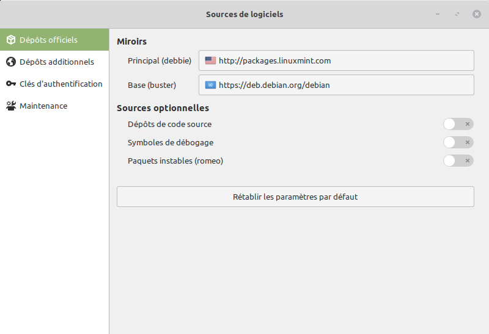
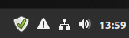
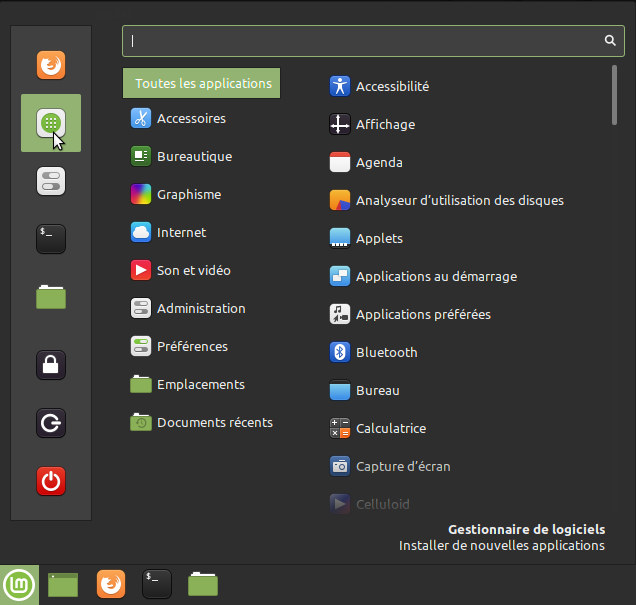

---
export_on_save:
  html: true

presentation:
  width: 1920
  height: 1200
  theme: solarized.css
  margin: 0.1

  progress: true
---

<!-- slide -->

# Première configuration de *Linux*

Avec l'exemple de *Linux Mint* LMDE 4

<!-- slide vertical=true -->

On supposera qu'une installation toute fraîche vient d'être réalisée. Nous allons :

1. choisir les dépôts pour les sources ;
2. effectuer les mises à jour du système ;
3. installer de nouveaux logiciels.

> Nous verrons comment faire à la souris, mais aussi en ligne de commande.

<!-- slide -->

## Sources & Mises à jour
* On peut modifier le choix des serveurs qui offrent les mises à jour. On choisit en général un dépôt proche, ayant un bon débit, et fiable dans le temps. Il faut alors ensuite recharger le cache.

* On installe ensuite les mises à jour.

> Dans la barre en bas du bureau, le bouclier avec un point d'exclamation indique des mises à jours à faire.

<!-- slide vertical=true -->

On clique sur `Valider`

<!-- slide vertical=true -->

On clique sur `Oui`

<!-- slide vertical=true -->

On clique sur `Principal` (puis de même sur `Base`), et on choisit un serveur réactif. *Inutile de tout attendre.*

<!-- slide vertical=true -->

On clique sur `OK`. Cela prend quelques instants.

<!-- slide vertical=true -->

**Pour information** : avec un terminal, on peut voir les dépôts ainsi.

<object type="image/svg+xml" data="assets/sources.svg"></object>

<!-- slide vertical=true -->

On clique sur `Installer les mises à jour`.

Après quelques minutes... Et voilà.

<!-- slide vertical=true -->

En bas à droite, , il reste une notification avec un point d'exclamation dans un triangle.

<!-- slide vertical=true -->
* Configurer l'utilitaire de restauration système.
    * **Ignorer ce problème.** *Timeshift* vous permettra une autre fois de revenir en arrière facilement avec toute mise à jour. *Inutile pour notre expérience.*
* Installer les codecs multimédia.
    * Ces sont des codecs non libres, mais qui peuvent être utiles. **Vous pouvez les installer.**
* Installer les paquets linguistiques.
    * **Oui**, pour une prise en charge complète du français.

<!-- slide -->

## Installation de logiciels

<!-- slide vertical=true -->

En bas à gauche, le `Menu démarrer` propose du haut vers le bas :
* Le navigateur `Firefox`
* Le `Gestionnaire de logiciels`. **Cliquer là.**
* Le `Centre de contrôle`, pour différents réglages.
* Un `Émulateur de Terminal`.
* L'`Explorateur de fichiers`.
* Un `Verrou d'écran` ; avec reprise par mot de passe.
* Une `Déconnexion`, pour changer d'utilisateur.
* Une `Extinction` (ou redémarrage, ou mise en veille) de l'ordinateur.

<!-- slide vertical=true -->

* Dans les `Suggestions`, vous pouvez installer `Inkscape` ; un outil pour travailler les images vectorielles, ou bien pour modifier un `.pdf`.
* Dans `Accessoires`, vous pouvez installer `Htop` pour mieux visualiser les processus.
* Dans `Bureautique`, il n'y a rien de plus à chercher pour l'instant.
* Dans `Multimédia`, vous pouvez installer `VLC` et `Audacious`.
* Pour le reste des logiciels utiles, nous verrons comment faire en ligne de commande, ou alors avec `synaptic`.