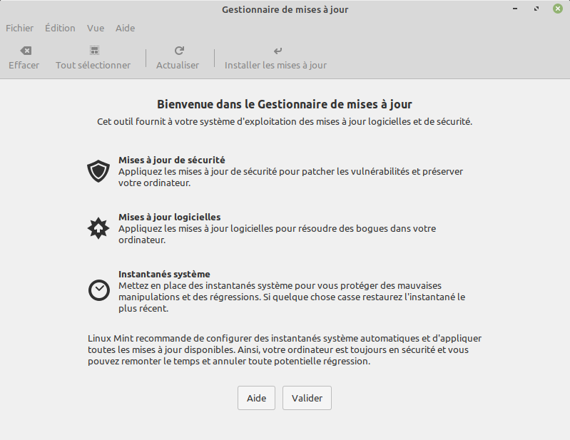
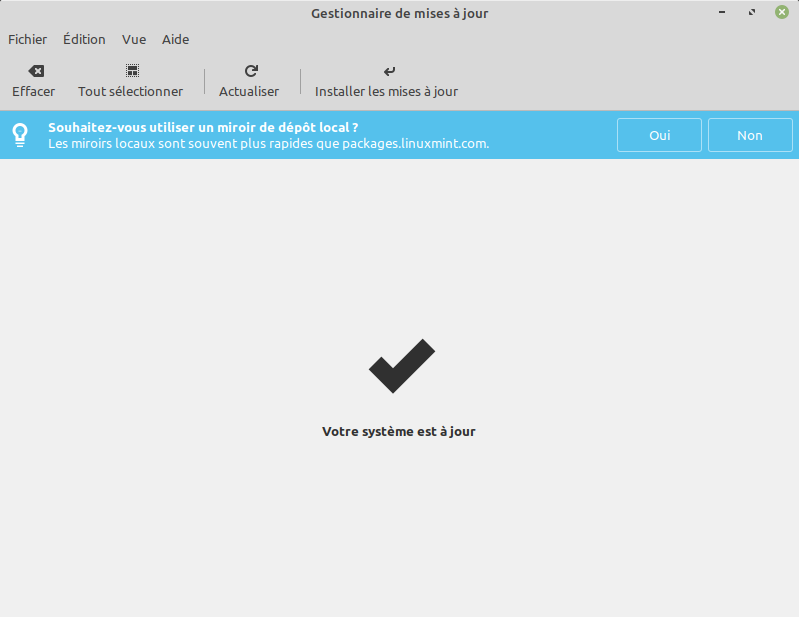
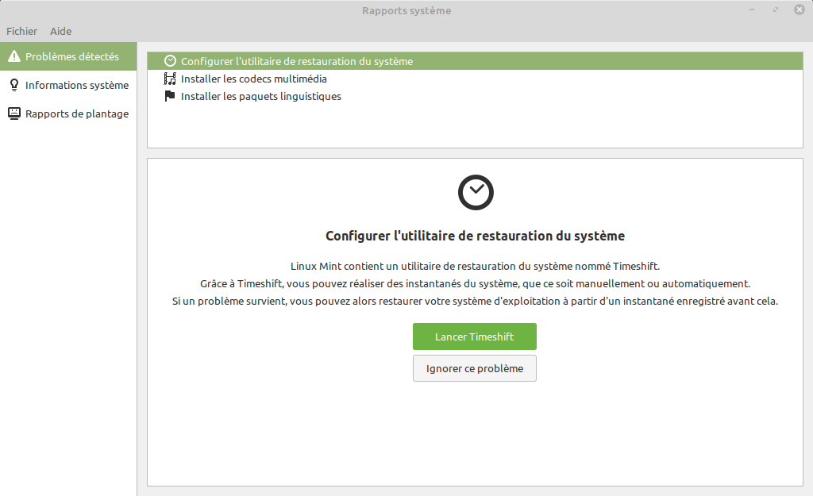
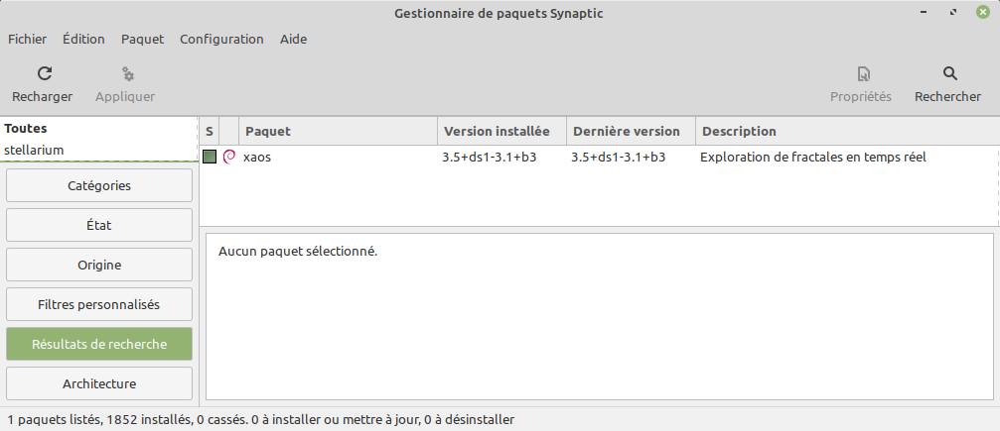

---
export_on_save:
  html: true

presentation:
  width: 1920
  height: 1200
  theme: solarized.css
  margin: 0.1

  progress: true
---

<!-- slide -->

# Première configuration de *Linux*

Avec l'exemple de *Linux Mint* LMDE 4

<!-- slide vertical=true -->

On supposera qu'une installation toute fraîche vient d'être réalisée. Nous allons :

1. choisir les dépôts pour les sources ;
2. effectuer les mises à jour du système ;
3. installer de nouveaux logiciels.

> Nous verrons comment faire à la souris, mais aussi en ligne de commande.

<!-- slide -->

## Sources & Mises à jour
* On peut modifier le choix des serveurs qui offrent les mises à jour. On choisit en général un dépôt proche, ayant un bon débit, et fiable dans le temps. Il faut alors ensuite recharger le cache.

* On installe ensuite les mises à jour.


> Dans la barre en bas du bureau, le bouclier avec un point d'exclamation indique des mises à jours à faire.

<!-- slide vertical=true -->


On clique sur `Valider`

<!-- slide vertical=true -->


On clique sur `Oui`

<!-- slide vertical=true -->


On clique sur `Principal` (puis de même sur `Base`), et on choisit un serveur réactif. *Inutile de tout attendre.*

<!-- slide vertical=true -->


On clique sur `OK`. Cela prend quelques instants.

<!-- slide vertical=true -->

**Pour information** : avec un terminal, on peut voir les dépôts ainsi.

<object type="image/svg+xml" data="assets/sources.svg"></object>

<!-- slide vertical=true -->

On clique sur `Installer les mises à jour`.

Après quelques minutes... Et voilà.

<!-- slide vertical=true -->

En bas à droite, , il reste une notification avec un point d'exclamation dans un triangle.



C'est pour régler les détails classiques 'post-install'.

<!-- slide vertical=true -->
* Configurer l'utilitaire de restauration système.
    * **Ignorer ce problème.** *Timeshift* vous permettra, une autre fois, de revenir en arrière facilement sur toute mise à jour ou installation de logiciel. *Inutile pour notre expérience.*
* **Installer les codecs multimédia**.
    * Ces sont des codecs non libres, mais qui peuvent être utiles. **Vous pouvez les installer.**
* **Installer les paquets linguistiques.**
    * **Oui**, pour une prise en charge complète du français.

<!-- slide -->

## Installation de logiciels


Le `menu démarrer` est en bas à gauche.

<!-- slide vertical=true -->

En bas à gauche, le `Menu démarrer` propose du haut vers le bas :
* Le navigateur `Firefox`.
* Le `Gestionnaire de logiciels`. **Cliquer là.**
* Le `Centre de contrôle`, pour différents réglages.
* Un `Émulateur de Terminal`.
* L'`Explorateur de fichiers`.
* Un `Verrou d'écran` ; avec reprise par mot de passe.
* Une `Déconnexion`, pour changer d'utilisateur.
* Une `Extinction` (ou redémarrage, ou mise en veille) de l'ordinateur.

<!-- slide vertical=true -->
 
 Le `Gestionnaire de logiciels` est un outil pour débutant.

* Dans les `Suggestions`, vous pouvez installer `Inkscape` ; un outil pour travailler les images vectorielles, ou bien pour modifier un `.pdf`.
* Dans `Accessoires`, vous pouvez installer `Htop` pour mieux visualiser les processus.
* Dans `Bureautique`, il n'y a rien de plus à chercher pour l'instant.
* Dans `Multimédia`, vous pouvez installer `VLC` et `Audacious`.

> Pour le reste des logiciels utiles, nous verrons comment faire avec `synaptic`, ou alors en ligne de commande.

<!-- slide -->
## Avec `Synaptic`

`Synaptic` est un utilitaire graphique, à opposer à un utilitaire en ligne de commande.
Il permet d'installer des logiciels et/ou des paquets.

Voyons comment, par exemple, installer [XaoS](https://xaos-project.github.io/) (prononcer *chaos*).


XaoS permet de manipuler graphiquement des fractales.
On peut y zoomer de manière continue par un clic de souris.

<!-- slide vertical=true -->



* Dans le `Menu démarrer`, puis `Administration`, ouvrir le `Gestionnaire de paquets Synaptic`. Le mot de passe administrateur est requis.
* Dans `Synaptic`, taper **`xaos`** dans la boîte de recherche.
* Cocher la case `xaos` ; puis `sélectionner pour installation`.
* D'autres paquets (des dépendances) sont nécessaires, cliquer sur `Ajouter à la sélection`.
* Cliquer sur `Appliquer`, et une autre fois pour confirmer.
* Le téléchargement des paquets se fait depuis les dépôts que vous avez choisis.
* Enfin, l'installation est automatique.
* Vous avez une entrée dans le `Menu Démarrer` à la section `Graphisme`.

<!-- slide -->
## Avec le terminal

Commençons par un exemple non direct. On va installer l'éditeur de code [VSCodium](https://vscodium.com/).

> Visual Studio Code est un excellent logiciel libre édité par Microsoft, cependant la présence de télémétrie n'est pas souhaitée. VSCodium est une version recompilée sans télémétrie. 

VSCodium est libre et multiplateforme ; vous êtes invité à l'installer sur votre machine de travail.

* On pourra facilement travailler avec les différentes versions de Python3 installées, son débuggueur, ...
* On pourra créer facilement des documents en Markdown ou bien en HTML...
* On pourra éditer du code dans de nombreux langages de programmation.

<!-- slide vertical=true -->

### Installation avec *Linux/Debian*
Pour une machine de type *Linux/Debian*, voici ce qu'il faut entrer dans un terminal :

```bash
wget -qO - https://gitlab.com/paulcarroty/vscodium-deb-rpm-repo/raw/master/pub.gpg | sudo apt-key add -
```

```bash
echo 'deb https://gitlab.com/paulcarroty/vscodium-deb-rpm-repo/raw/repos/debs/ vscodium main' | sudo tee --append /etc/apt/sources.list.d/vscodium.list
```

```bash
sudo apt update && sudo apt install codium
```

Nous verrons bientôt comment bien s'en servir.

<!-- slide vertical=true -->

Explications techniques facultatives :
* Première ligne :
    * `wget` télécharge un texte sur Internet ; ici dans un dépôt GitLab de Paul Carroty.
    * `|` est un *`pipe`* (tuyau) qui envoie le résultat à `sudo apt-key add`
        * `sudo` annonce que la commande à venir est au nom de l'administrateur ; un mot de passe est requis.
        * `apt-key add` : cette commande ajoute une clé au gestionnaire de paquets `APT`.
* Deuxième ligne :
    * `echo` envoie le texte qui suit dans le *`pipe`* récupéré par ...
    * `tee` qui l'ajoute à un fichier système.
* Troisième ligne :
    * `apt update` met le cache `APT` à jour. Nous l'avions déjà fait à la souris avant les premières mises à jour.
    * `&&` signale un enchaînement **ET** de deux commandes : la première et la suivante si aucun problème.
    * `apt install` nous permet d'installer le paquet `codium` qui est désormais dans un dépôt que nous suivons. Il sera mis à jour automatiquement avec tous les autres logiciels ; c'est une bonne pratique.

Idéalement, les bons logiciels sont inclus dans les dépôts officiels de la distribution. C'est le cas pour l'essentiel. Ici, nous faisons confiance à un tiers.
> Dans la distribution Linux `Parrot OS security`, VSCodium est inclus dans les dépôts.