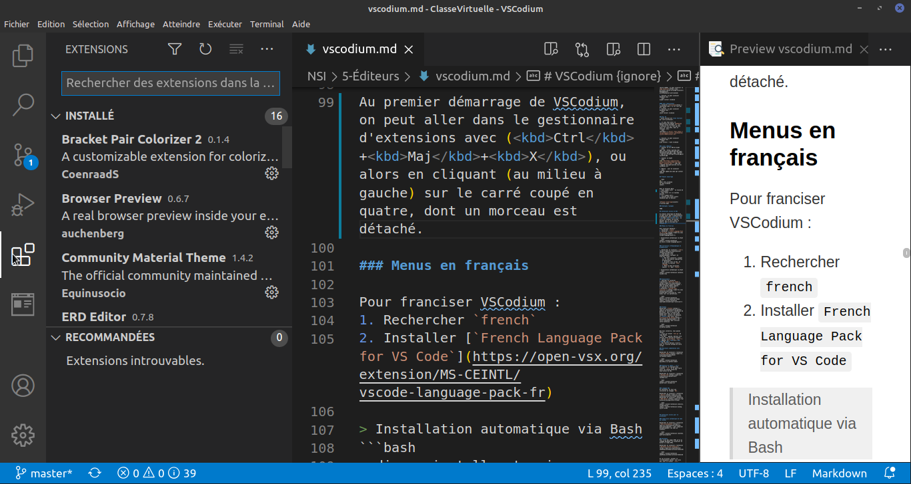

# VSCodium {ignore}

Visual Studio Code (VSCode) est un éditeur libre pour ordinateur, très complet, produit par Microsoft, mais qui inclut de la télémétrie (une sorte de mouchard). On peut certes la désactiver, mais par principe, nous ne pouvons pas recommander ces pratiques, surtout avec le risque induit par certaines extensions qui ne sont pas libres.

[VSCodium](https://github.com/VSCodium/vscodium) est une version de VSCode **sans télémétrie**, et distribuée avec une licence libre (MIT) qui est bien plus respectueuse.

Au sujet des extensions, il y a en effet un point délicat.
* Le [*MarketPlace*](https://marketplace.visualstudio.com/VSCode) de VSCode contient des extensions libres, mais aussi d'autres qui ne le sont pas, et qui peuvent inclure de la télémétrie également... Nous ne pouvons pas le recommander.
* Le [*MarketPlace*](https://open-vsx.org/) de **VSCodium ne contient que des extensions libres**, ce qui permet de pouvoir le recommander plus sereinement.
* On recommandera de n'utiliser que des extensions qui sont présentes sur les deux *MarketPlace*, les exceptions seront scrutées.

> Une fois installé, dans un terminal,
> * pour lancer VSCodium, on entre : `codium .`
> * Pour lancer VSCode, on aurait entré : `code .`
>
> Tout comme `chromium` est la version libre de `chrome`.
> L'aide que l'on peut trouver en ligne sur VSCode se traduit alors en remplaçant `code` par `codium`.

## Sommaire {ignore}

[TOC]

## Installation

VSCodium est multiplateforme, il suffit de suivre les indications proposées sur le [site officiel](https://github.com/VSCodium/vscodium). Ci-dessous, une traduction rapide.

### Windows

Il existe plusieurs gestionnaires de paquets pour Windows.

#### Avec *Windows Package Manager (WinGet)*
1. À partir de Windows 10 1709 (build 16299), on peut installer le [App Installer](https://www.microsoft.com/en-us/p/app-installer/9nblggh4nns1?activetab=pivot:overviewtab)

2. Ensuite, on peut installer VSCodium avec :
```bash
winget install vscodium 
```

#### Avec *Chocolatey*
1. Installer [Chocolatey](https://chocolatey.org/), si ce n'est pas déjà fait.
2. Ensuite, on peut installer VSCodium avec :
```bash
choco install vscodium 
```

### Mac OS

1. Il vous faut avoir le gestionnaire de paquet [Homebrew](https://brew.sh/index_fr), qui s'installe (si ce n'est pas déjà fait) sur votre Mac, dans un terminal, avec :
```bash
/bin/bash -c "$(curl -fsSL https://raw.githubusercontent.com/Homebrew/install/HEAD/install.sh)"
```

2. Ensuite, on peut installer VSCodium avec :
```bash
brew install --cask vscodium 
```

### Linux (Debian)
1. Ajouter la clé GPG du dépôt
```bash
wget -qO - https://gitlab.com/paulcarroty/vscodium-deb-rpm-repo/raw/master/pub.gpg | gpg --dearmor | sudo dd of=/etc/apt/trusted.gpg.d/vscodium.gpg 
```
2. Ajouter le dépôt
```bash
echo 'deb https://paulcarroty.gitlab.io/vscodium-deb-rpm-repo/debs/ vscodium main' | sudo tee --append /etc/apt/sources.list.d/vscodium.list 
```
3. Mettre à jour et installer
```bash
sudo apt update && sudo apt install codium 
```
### Linux (Debian), autre méthode

```bash
sudo apt install extrepo
sudo extrepo enable vscodium
sudo apt install vscodium
```

Merci à V. pour l'info.

## Premier démarrage

Avec Linux (ou macOS),

```bash
cd ~
mkdir test_vscodium
cd test_vscodium
codium .
```

Dans un terminal Bash,
1. Nous sommes aller à la racine de l'utilisateur.
2. Nous avons créé un nouveau dossier,
3. et y sommes entré,
4. ensuite nous avons ouvert VSCodium dans ce dossier.


### Quelques réglages

1. Vérifier dans le menu `Affichage`, que `Afficher les espaces blancs` est bien coché. Insister en le décochant, pour le cocher à nouveau.

### Quelques informations utiles

* [La documentation officielle (en anglais)](https://code.visualstudio.com/docs)

## Extensions utiles en NSI

Au premier démarrage de VSCodium, on peut aller dans le gestionnaire d'extensions avec (<kbd>Ctrl</kbd>+<kbd>Maj</kbd>+<kbd>X</kbd>), ou alors en cliquant (au milieu à gauche) sur le carré coupé en quatre, dont un morceau est détaché.



### Menus en français

Pour franciser VSCodium :
1. Rechercher *french*
2. Installer [*French Language Pack for VS Code*](https://open-vsx.org/extension/MS-CEINTL/vscode-language-pack-fr)

> Installation automatique via Bash
```bash
codium --install-extension ms-ceintl.vscode-language-pack-fr
```

### Correction orthographique et grammaticale

> Pour les variables du code, et les commentaires.

1. Rechercher et installer [*French - Code Spell Checker*](https://open-vsx.org/extension/streetsidesoftware/code-spell-checker-french)
2. Appuyer sur <kbd>F1</kbd> taper `spell` et choisir `Spell Checker configuration info`
3. Choisir l'onglet `USER`, et décocher `English`, puis cocher `French`.

> Pour les fichiers LaTeX et Markdown.

1. Rechercher et installer [*LTeX*](https://open-vsx.org/extension/valentjn/vscode-ltex)
2. LTeX n'est pas automatiquement configuré pour le français, ainsi
    1. Une fois installée, cliquer sur la roue dentée de `LTeX` (paramètres d'extensions)
    2. Dérouler vers le bas, et chercher la section `Ltex: language`
    3. Dans le menu déroulant, choisir `fr` pour `french`.

> Installation automatique via Bash
```bash
codium --install-extension valentjn.vscode-ltex
```


### Enjoliveurs
1. Des thèmes sombres
    1. Chercher et installer l'extension [*Material Theme*](https://open-vsx.org/extension/Equinusocio/vsc-material-theme) ; pour un thème sombre complet.
    2. Ou alors, chercher et installer l'extension [*Nord*](https://open-vsx.org/extension/arcticicestudio/nord-visual-studio-code)
2. Chercher et installer l'extension [*Bracket Pair Colorizer 2*](https://open-vsx.org/extension/CoenraadS/bracket-pair-colorizer-2) ; pour mieux voir vos parenthèses.

```bash
codium --install-extension Equinusocio.vsc-material-theme
codium --install-extension CoenraadS.bracket-pair-colorizer-2
```


### Python
Rechercher [*Python*](https://open-vsx.org/extension/ms-python/python) et installer l'extension de Microsoft. Ceci n'installe pas Python mais fera le lien entre Python déjà installé et VSCodium. Il **faut** donc avoir fait l'[installation de Python](https://www.python.org/downloads/) sur votre ordinateur pour utiliser cette extension.

```bash
codium --install-extension ms-python.python
```

Une fois installée, vous pouvez tester.
1. Créer un fichier `test.py` de type Python.
2. En bas, à gauche, devrait être affiché votre version de python.
3. Éditer `print("Salut à tous !")`
4. Appuyer sur (<kbd>Ctrl</kbd>+<kbd>F5</kbd>)
5. Une fenêtre devrait s'ouvrir, avec le résultat attendu de votre script.

### Meilleure indentation avec Python

Rechercher et installer l'extension [*Python Indent*](https://open-vsx.org/extension/KevinRose/vsc-python-indent)

```bash
codium --install-extension KevinRose.vsc-python-indent
```

### Données en table (`.csv`)
En première, on manipule des fichiers `.csv`, et on peut faire aussi les toutes premières expériences de SQL.

Rechercher et installer l'extension [*Rainbow CSV*](https://open-vsx.org/extension/mechatroner/rainbow-csv)

```bash
codium --install-extension mechatroner.rainbow-csv
```


### Langage SQL
En terminale, on fait une initiation au langage `SQL`.

Rechercher et installer l'extension [*SQLite*](https://open-vsx.org/extension/alexcvzz/vscode-sqlite)
Rechercher et installer l'extension [*ERD Editor*](https://open-vsx.org/extension/dineug/vuerd-vscode)

```bash
codium --install-extension alexcvzz.vscode-sqlite
codium --install-extension dineug.vuerd-vscode
```


## Extensions utiles pour le professeur

### Complétion automatique de noms de fichier

Rechercher et installer l'extension [*Path Autocomplete*](https://open-vsx.org/extension/ionutvmi/path-autocomplete) ; pour compléter automatiquement les noms de fichiers.

```bash
codium --install-extension ionutvmi.path-autocomplete
```

### Markdown
Pour créer des pages HTML grâce au langage Markdown, et visualiser en direct le rendu HTML.

Rechercher et installer l'extension [*Markdown Preview Enhanced*](https://open-vsx.org/extension/shd101wyy/markdown-preview-enhanced)

```bash
codium --install-extension shd101wyy.markdown-preview-enhanced
```

En cas d'erreur, essayer le téléchargement manuel, voir plus bas, avec le fichier `.vsix`.

### Langage HTML
Pour prévisualiser en direct votre rendu HTML/JavaScript.

Il faut avoir le navigateur `Chromium` déjà installé.


Rechercher et installer l'extension [*Browser Preview*](https://open-vsx.org/extension/auchenberg/vscode-browser-preview)

```bash
codium --install-extension auchenberg.vscode-browser-preview
```


### Édition de documents LaTeX

Rechercher et installer l'extension [*LaTeX Workshop*](https://open-vsx.org/extension/James-Yu/latex-workshop)

```bash
codium --install-extension james-yu.latex-workshop
```

### Autres extensions Python

* [*Pyright*](https://open-vsx.org/extension/ms-pyright/pyright) ; pour le typage statique, entre autres...

```bash
codium --install-extension ms-pyright.pyright
```

## Compléments

### Suggestions d'extensions

* Ouvrir un fichier avec une extension particulière, puis le gestionnaire d'extensions. 
* Des suggestions sont proposées...


### Où sont les extensions ?

Les extensions sont stockées dans le répertoire :
* Windows : `%USERPROFILE%\.vscode-oss\extensions`
* Linux (tout comme macOS) : `~/.vscode-oss/extensions`

> Il est possible de lancer VSCodium en ligne de commande avec un autre répertoire d'extensions avec le paramètre : `--extensions-dir <dir>`


### Installer une extension qui n'est pas (encore) sur le MarketPlace libre.

Il est possible de :
* visiter le MarketPlace de VSCode,
* d'y repérer une extension libre intéressante,
* de la télécharger (chercher *Download* et cliquer sur le lien vers un fichier `.vsix`),
* de l'installer pour VSCodium en ligne de commande, comme ci-dessous.

`codium --install-extension mon_extension_toute_choupinou.vsix`

**Exercice** :
1. Chercher sur le MarketPlace de VSCode : [*Subtitles Editor*](https://marketplace.visualstudio.com/items?itemName=pepri.subtitles-editor)
2. L'installer pour VSCodium
3. Vous pourrez alors éditer des fichiers de sous-titres facilement (traduction automatique, décalage, ...)

> L'extension [*Asymptote*](https://marketplace.visualstudio.com/items?itemName=supakornras.asymptote) intéressera les enseignants qui dessinent avec ce logiciel.

> Il existe aussi de quoi jouer avec *emoji*.

### More Info (en)

*Just follow the [link](https://github.com/VSCodium/vscodium/blob/master/DOCS.md).*

En particulier, on y détaille les répertoires pour migrer de VSCode à VSCodium, pour ceux qui avaient commencé à utiliser VSCode avant.


### D'autres avis
* https://besson.link/visualstudiocode.fr.html
