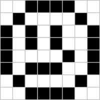

# Types simples : nombres, chaîne, tableau et tuple

## Données numériques

> Un rappel rapide de ce qui existe.

Il existe 4 types de données numériques avec Python.

### Les booléens (`bool`) 
Ils sont constitués de `False` et `True`.

C'est officiellement un type numérique, mais il est hors programme d'utiliser des booléens dans des opérations comme `+` ou `*`.

###  Les entiers (`int`)
Les entiers sont signés, ils peuvent être aussi grands que la mémoire de l'ordinateur le permet, il n'y a pas de limite théorique.

[Un rappel](https://htmlpreview.github.io/?https://raw.githubusercontent.com/FranckCHAMBON/Python-Lycee/master/Python-Console/Python-Console.html#travail-avec-des-entiers) des opérations classiques.

### Les flottants (`float`)
Ils sont constitués des nombres à virgule, ils peuvent s'écrire en notation scientifique en binaire 53 bits pour la mantisse et 11 bits pour l'exposant. Ce qui donne environ une précision de 16 chiffres en décimal, et un exposant décimal environ entre -300 et +300.

[Un rappel](https://htmlpreview.github.io/?https://raw.githubusercontent.com/FranckCHAMBON/Python-Lycee/master/Python-Console/Python-Console.html#travail-avec-les-flottants) des opérations classiques.

### Les complexes (`complex`)
Pour les élèves en maths expertes...

### Muables ou immuables ?

Les objets Python de type numérique sont qualifiés d'**immuables**. Même si une variable numérique peut changer de valeur, la valeur, elle, est fixe !

```python
x = 1337
x = x // 100
```

La variable `x` a été modifiée, mais les nombres $1337$, $100$ et $13$ sont **immuables**.

> Cette notion sera utilisée plus tard, au sujet des dictionnaires, les nombres peuvent être des clés de dictionnaires justement par ce qu'ils sont immuables.

> *More about [Python numbers](https://www.programiz.com/python-programming/numbers)* ; en anglais

## Les chaînes de caractères

Les chaînes de caractères (*string*, de type `str`) sont aussi des objets Python **immuables**, ils pourront être des clés de dictionnaires.

### Construction

Pour construire une chaîne de caractère dans un code Python, on utilise les délimiteurs :
* `'` : guillemet simple.
* `"` : guillemet double.
* `'''` : triple guillemet simple.
* `"""` : triple guillemet double.

Remarque : le guillemet simple n'est pas une apostrophe dactylographique, même si on utilise cette même touche pour l'obtenir. La touche du clavier `'` est la touche **guillemet simple**.

#### Exemples

```python
salut_en = 'Hello World!'        # en anglais, le ! est collé au mot
salut_fr = "Bonjour à tous !"    # en français, le ! n'est pas collé
phrase_1 = 'Il a dit "Bonjour" à tous.'
phrase_2 = """Il m'a dit "Bonjour" aussi."""
chaîne_vide = ""
un_seul_caractère = 'c'
```

⚠️ Dans `phrase_2`, on ne pouvait pas utiliser ni `'`, ni `"` qui étaient déjà utilisés à l'intérieur.

### Indices

Les chaînes de caractères sont indicées à partir de zéro.

    Indice     0  1  2  3  4  5  6  7  8  9  10 11 12 13 14
    Caractère  B  o  n  j  o  u  r     à      t  o  u  s  !

```python
>>> salut_fr = 'Bonjour à tous !'
>>> salut_fr[0]
'B'
>>> salut_fr[1]
'o'
>>> salut_fr[6]
'r'
>>> salut_fr[9]
' '
>>> salut_fr[14]
'!'
>>> len(salut_fr)
15
```

### Longueur
Ici la chaîne est de longueur (_**len**gth_) $15$, comme donné par la fonction `len`.

Pour une chaîne de caractères de longueur $l$ les indices vont de $0$ inclus à $l$ **exclu**.

⚠️ Essayer d'accéder à un caractère d'indice $l$ ou plus provoque une erreur.

```python
>>> salut_fr[15]
Traceback (most recent call last):
  File "<stdin>", line 1, in <module>
IndexError: string index out of range
```

Ici l'erreur est `IndexError` (Erreur d'indice), *string index out of range* (indice de la chaîne en dehors de l'intervalle).

### Itération

On peut itérer sur les chaînes de deux façons.
1. La première est utile si on a besoin de l'indice en court de boucle.
2. La seconde est plus claire et simple si on n'a pas besoin de l'indice au court de la boucle.

#### Itération par indices

```python
mot = "Salut"
longueur = len(mot)
for i in range(longueur):
    print("La lettre d'indice", i, "est", mot[i])
```

    La lettre d'indice 0 est S
    La lettre d'indice 1 est a
    La lettre d'indice 2 est l
    La lettre d'indice 3 est u
    La lettre d'indice 4 est t

#### Itération sur la chaîne

```python
mot = "Salut"
for caractère in mot:
    print("Voici un caractère :", caractère)
```

Voici un caractère : S
Voici un caractère : a
Voici un caractère : l
Voici un caractère : u
Voici un caractère : t

### Appartenance

On peut savoir si une sous chaîne `extrait` est incluse dans une chaîne `phrase` avec le code `extrait in phrase`.

#### Exemple

```python
CONST_voyelles = "aeiouy"
mot = "Bonjour"
for lettre in mot:
    if lettre in CONST_voyelles:
        print(lettre, end="")
```

    oou

Ce code n'affiche que les voyelles de `mot` après avoir testé si `lettre` est dans `CONST_voyelles`.


### Indices négatifs

Python autorise aussi les indices négatifs, cela peut être très pratique.

Faisons une boucle avec une chaîne, et 
* l'indice $-1$ correspond au dernier caractère,
* l'indice $-2$ correspond à l'avant dernier caractère.
* l'indice $-i$ correspond au $i$-ème caractère en partant de la fin.

```
Indice   -7 -6 -5 -4 -3 -2 -1  0  1  2  3  4  5  6
Chaîne    B  o  n  j  o  u  r  B  o  n  j  o  u  r
```

> Pour une chaîne de longueur $l$, les indices Python valables vont de $-l$ inclus à $+l$ exclu. ⚠️ Les indices négatifs ne sont pas légaux avec tous les langages de programmation, ici c'est un exemple de sucre syntaxique autorisé par Python, pour simplifier certains codes.

### Tranches (*slice*)

Python autorise l'extraction d'une tranche d'une chaîne de caractères.

    Indice      0  1  2  3  4  5  6  7  8  9
    Chaîne      T  r  a  v  a  i  l  l  e  r

```python
>>> verbe = "Travailler"
>>> verbe[3:6] # du 3 inclus au 6 exclu
'vail'
>>> verbe[:4] # du début au 4 exclu
'Trav'
>>> verbe[:7] # les 7 premiers (du début au 7 exclu)
'Travail'
>>> verbe[7:] # tout sauf les 7 premiers (du 7 inclus à la fin)
'ler'
>>> verbe[-2:] # les deux derniers
'er'
>>> verbe[:-2] # tout sauf les deux derniers
'Travaill'
>>> verbe[:] # une copie complète
'Travailler'
```

### Lecture d'une chaîne

On utilise la fonction `input()` pour récupérer une chaîne depuis un utilisateur qui utilise un programme Python.

```python
print("Quel est ton prénom ?")
prénom = input()
print("Tu t'appelles", prénom)
```

    Quel est ton prénom ?
    Franck
    Tu t'appelles Franck

⚠️ Avec Python3, La fonction `input()` renvoie une chaîne de caractères ; **toujours**.

```python
print("Quel est ton âge ?")
âge = input()
print("Dans dix ans, tu auras", âge + 10)
```

    Quel est ton âge ?
    42
    Traceback (most recent call last):
    File "<stdin>", line 1, in <module>
    TypeError: can only concatenate str (not "int") to str

On expliquera bientôt ce qu'est la concaténation, mais simplement, ici, Python ne sait pas ajouter du texte et un entier, c'est une erreur de type (`TypeError`).

> Pour travailler avec des nombres donnés par un utilisateur, il faut les convertir avec les fonctions `int()` ou bien `float()`.

```python
print("Quel est ton âge ?")
âge = int(input())
print("Dans dix ans, tu auras", âge + 10, "ans.")
print("Quelle est est ta masse en kg ?")
masse = float(input()) # en kg
print("Si tu prends 3.2kg, ta masse sera", poids + 3.2, "kg.")
```

    Quel est ton âge ?
    42
    Dans dix ans, tu auras 52 ans.
    Quelle est est ta masse en kg ?
    74.3
    Si tu prends 3.2kg, ta masse sera 77.5 kg.

**À retenir**
* pour lire du texte : `texte = input()`
* pour lire un entier : `entier = int(input())`
* pour lire un nombre : `nombre = float(input())`


> Nous avons évoqué la concaténation, un peu avant ; voyons quelles opérations élémentaires on peut faire avec les chaînes de caractères.

### Concaténation

La concaténation, c'est le fait de rabouter, de coller, deux chaînes.

```python
>>> "bon" + "jour"
'bonjour'
>>> "bon" + "bon"
'bonbon'
>>> "bon" * 2
'bonbon'
>>> "O" * 10
'OOOOOOOOOO'
```

> On peut donc aussi multiplier une chaîne de caractère avec un entier, on obtient plusieurs copies de la chaîne collées ensemble.

⚠️ Cette technique n'existe pas avec tous les langages de programmation, elle est peut être hors programme.

### Caractères échappés

Il est possible d'écrire des sauts de lignes, ou des tabulations dans une chaîne de caractères.
* `'\n'` est le caractère saut de ligne,
* `'\t'` est le caractère tabulation horizontal,
* il y en a d'autres moins utiles.

> *More about [Python string](https://www.programiz.com/python-programming/string)* ; en anglais

## Les listes

Les listes d'éléments (*list*, de type `list`) sont des objets Python **muables**.
* On pourra modifier les éléments de la liste, chose qu'on ne pouvait pas faire avec les `str` immuables.
* On **ne pourra pas** utiliser les `list` comme des clés de dictionnaire, mais on pouvait le faire avec les `str`.

À part cette grande différence, il y a de nombreux points communs entre `str` et `list` pour les débutants. Nous allons voir comment construire, accéder, modifier, itérer.

### Construction

Pour construire une liste dans un code Python, on utilise les délimiteurs :
* `[` : pour débuter
* `]` : pour finir
* `,` : pour séparer

⚠️ Même s'il est possible de construire des listes avec des éléments de types différents, nous le déconseillons.

#### Exemples

```python
cours_nsi = ["lundi", "mercredi", "vendredi"]
nb_premiers = [2, 3, 5, 7, 11]
hauteurs = [1.82, 1.75, 1.68, 1.89]
liste_vide = []
liste_avec_un_élément = [1337]
```

### Indices

Les listes sont indicées à partir de zéro.

```python
>>> cours_nsi[0]
'lundi'
>>> nb_premiers[3]
7
>>> hauteurs[-1]
1.89
```

Comme pour les `str`, les indices négatifs sont autorisés en Python, tout comme les tranches.

### Copie de liste
⚠️ Point délicat à signaler. Voyons deux façons de copier une liste.

```python
>>> ma_liste = [10, 11, 12, 13, 14]
>>> ma_liste_copie1 = ma_liste
>>> ma_liste_copie2 = ma_liste[:]
```

1. La première ligne définit une liste.
2. La seconde ligne fait pointer `ma_liste_copie1` sur la **même liste**, nous avons deux variables qui pointent vers le **même objet**.
3. La troisième ligne réalise une copie réelle de toute la tranche, ainsi on obtient une **autre liste** qui a le **même contenu**. *C'est différent*.

La preuve : 

```python
>>> ma_liste[0] = -1
>>> ma_liste_copie1
[-1, 11, 12, 13, 14]
>>> ma_liste_copie2
[10, 11, 12, 13, 14]
```

On constate qu'en modifiant `ma_liste` :
* `ma_liste_copie1` est modifiée également ; oui, c'est bien la même liste !
* `ma_liste_copie2` n'est pas modifiée ; en effet c'était une copie devenue indépendante !

### Longueur

Comme pour les `str`, on utilise la fonction `len()` (pour *length*, longueur), pour connaître le nombre d'éléments d'une liste.

```python
>>> len(hauteurs)
4
```

### Appartenance

Comme pour les chaînes, `x in ma_liste` renvoie un booléen, la réponse à : `x` est-il dans `ma_liste` ?


### Itération

Comme pour les `str`, on peut itérer sur une liste de deux manières différentes.

#### Itération avec l'indice

```python
hauteurs = [1.82, 1.75, 1.68, 1.89]
nb_élements = len(hauteurs)
somme = 0.0
for i in range(nb_éléments):
    somme = somme + hauteurs[i]
print("La hauteur totale est", somme)
```

    La hauteur totale est 7.14

#### Itération sans indice

```python
hauteurs = [1.82, 1.75, 1.68, 1.89]
somme = 0.0
for h in hauteurs:
    somme = somme + h
print("La hauteur totale est", somme)
```

    La hauteur totale est 7.14

> On constate que la deuxième méthode est bien plus simple. Elle est très utile lorsqu'on n'a pas besoin de l'indice pendant la boucle.

Voyons maintenant des méthodes alternatives de construction de liste.

### Concaténation

Comme pour les `str`, on peut concaténer des listes.

```python
début = [2, 3, 5, 7, 11]
suite = [13, 17, 19, 23]
print(début + suite)
```

    [2, 3, 5, 7, 11, 13, 17, 19, 23]

```python
tab = [0] * 5
print(tab)
```

    [0, 0, 0, 0, 0]

Cette dernière méthode est souvent utilisée pour initialiser de grands tableaux pleins de zéros.

⚠️ Le programme préconise plutôt une autre méthode, la construction des **listes en compréhension**.

### Les listes en compréhension

La syntaxe Python générale d'une création de liste en compréhension est : 

```python
<nom_liste> = [ <élément(it)> for it in itérable if <condition(it)> ]
```

Elle permet de créer une liste d'images (au sens des fonctions en mathématiques) depuis une liste d'antécédents, et avec la possibilité de filtrer suivant une condition.

Voyons des exemples progressifs.

```python
>>> [0 for _ in range(5)]
[0, 0, 0, 0, 0]
>>> [lettre + "_" for lettre in "azerty"]
['a_', 'z_', 'e_', 'r_', 't_', 'y_']
>>> [i*i for i in range(6)]
[0, 1, 4, 9, 16, 25]
>>> [i*i for i in range(20) if i*i%10 == 9]
[9, 49, 169, 289]
```

1. Une bonne façon de créer une liste remplie de 0.
2. L'itérable peut être une chaîne, une liste, ou un `range`, ou tout itérable...
3. La liste des 6 premiers carrés.
4. Le dernier exemple donne la liste des 20 premiers carrés, filtrée en ne conservant que ceux qui se terminent par un 9.

> C'est **la bonne méthode** à essayer d'utiliser le plus possible. On appelle ce style de programmation, le style fonctionnel, il fait penser fortement à une écriture mathématique.

#### Exercice

1. Quel est le plus grand entier inférieur à $1000$ dont le carré fini par `69` ?
2. Quelle est la somme de ces carrés ?

> Réponses : 
```python
>>> max([n for n in range(1000) if n*n%100 == 69])
987
>>> sum([n*n for n in range(1000) if n*n%100 == 69])
13330760
```


> On découvre, au passage, qu'il existe des fonctions classiques sur les listes : 
* `min()` pour le minimum d'une liste non vide
* `max()` pour le maximum d'une liste non vide
* `sum()` pour la somme d'une liste
* `len()` pour la longueur d'une liste
* `sorted()` pour renvoyer une copie triée de la liste. (À ne pas confondre avec `.sort()` qui fait un tri **en place**.)


### Les listes dynamiques de Python

D'un point de vue rigoureux, les listes que nous avons présentés précédemment sont des **tableaux**, des objets : 
* à taille fixée à la création,
* avec des éléments indicés de $0$ inclus à longueur **exclue**.

> Les tableaux sont utilisés dans presque tous les langages de programmation, c'est un outil élémentaire.

Les listes Python offrent d'autres possibilités que les tableaux officiels n'ont pas. Avec une liste Python, on peut : 
* ajouter des éléments à la fin avec `append()`
* récupérer en enlevant l'élément de fin avec `pop()`
* modifier des tranches par d'autres tranches même de longueur différente, ...

> Nous apprendrons plus tard à nous servir de ces méthodes, ce sera une introduction aux concepts de la programmation orientée objet.

⚠️ En attendant, essayez de ne pas utiliser ces méthodes. Les exercices pour débutants utilisent souvent les **tableaux** et non les **listes dynamiques**.

### Les listes de listes

* Une liste peut contenir tout type d'objets.
* On rappelle qu'on préfère ne pas mélanger les types à l'intérieur d'une liste.
* Une liste peut contenir elle-même des listes. C'est souvent le cas dans le cas de travail avec des images.

> Une image est souvent donnée par une liste de lignes. Chaque ligne est donnée par une liste de pixels. Et un pixel est souvent une liste de composante de couleurs.

#### Exercice

Compléter la définition de la liste qui correspond à l'image en noir et blanc ci-dessous.



```python
ligne0 = [0, 0 ,1, 1, 1, 1, 0, 0]
ligne1 = [0, 1, 0...
...
ligne7 =             ... 1, 0, 0]
smile = [ligne0, ligne1, ligne2, ... ligne7]
```

On peut aussi écrire : 
```python
smile = [[0,0,1,1,1,1,0,0], [0,1,0,...], ..., [...1,0,0]]
```

Pour modifier un pixel, on peut faire : 
```python
smile[2][4] = 0
```

> Comment lire `smile[2][4]` ?
> `smile` est une liste de **lignes**, on veut celle d'indice $2$, c'est `smile[2]` qui est une liste d'entiers, un par **colonne**, on veut celui d'indice $4$.
> `smile[2][4]` correspond donc au pixel de la ligne d'indice $2$, et de la colonne d'indice $4$.


## Les tuples

Les tuples sont similaires aux listes Python, mais en version **immuables**, on pourra donc les utiliser comme clés de dictionnaire.

### Différences entre `list` et `tuple`

1. Une liste est **muable**, un tuple est **immuable**.
2. Une liste se crée avec `[...]`, un tuple se crée avec `(...)`.
3. Un tuple ne possède pas les méthodes dynamiques d'une liste. Normal, on ne modifie pas un tuple en place.

### Exemples

```python
>>> coord = (5, 2)
>>> coord[0]
5
>>> cardinaux = ('N', 'S', 'E', 'O')
>>> cardinaux[2]
'E'
```


⚠️ Un tuple à un seul élément se crée avec une virgule orpheline comme `mon_tuple = (5,)`, sinon, sans la virgule, cela deviendrait l'entier $5$ ; c'est différent !

### Conversions de type

Il est possible de changer le type d'un objet `tuple` à `list`. Soit pour pouvoir le modifier, soit pour pouvoir l'utiliser comme une clé de dictionnaire.

```python
>>> mon_tuple = (2, 3, 5)
>>> ma_list = list(mon_tuple)
>>> ma_liste.append(7) # on ajoute 7 à la fin
>>> mon_tuple = tuple(ma_liste)
>>> mon_tuple
(2, 3, 5, 7)
```

* La fonction `list()` essaie de transformer son argument en liste, autant que possible. On l'utilise souvent pour transformer une chaîne de caractères en liste de carcatères. Liste que l'on peut modifier...
* La fonction `tuple()` essaie de transformer son argument en tuple...
* La fonction `int()` essaie de transformer son argument en entier...
* La fonction `float()` essaie de transformer son argument en flottant...
* La fonction `bool()` essaie de transformer son argument en booléen...
* On a de même pour les autres types ; dès que c'est possible.

