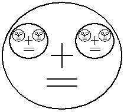

# [$0 + 0 =$ la tête à Toto](http://www.france-ioi.org/algo/task.php?idChapter=513&idTask=509)



Comme vous le savez, $0 + 0 = 0$. On pourrait aussi dire $0 = (0 + 0)$. Dans ce cas, on peut aussi aller un peu plus loin, et puisque $0$ vaut $(0 + 0)$, remplacer les $0$ de $(0 + 0)$ par leur valeur, et obtenir :

$$0 = ((0 + 0) + (0 + 0))$$

Rien n'empêche de continuer et d'écrire :

$$0 = (((0 + 0) + (0 + 0)) + ((0 + 0) + (0 + 0)))$$

**Votre programme doit impérativement utiliser une fonction récursive, et non une boucle.**

## Contraintes

* $0 \leqslant N \leqslant 15$

### Entrée

L'entier $N$.

### Sortie

La chaîne indiquant la valeur de $0$, en ayant remplacé $N$ fois les zéros à droite de l'égalité $0 = 0$ par leur valeur $(0 + 0)$.

## Exemples
### Exemple 1

entrée :

    0

sortie :

    0 = 0

### Exemple 2

entrée :

    2

sortie :

    0 = ((0 + 0) + (0 + 0))

### Exemple 3

entrée :

    3

sortie :

    0 = (((0 + 0) + (0 + 0)) + ((0 + 0) + (0 + 0)))

## Solution

```python
def toto(n: int) -> str:
    """Renvoie "0", où "0" est remplacé par "(0 + 0)",
    récursivement, n fois
    >>> toto(0)
    0
    >>> toto(1)
    (0 + 0)
    >>> toto(2)
    ((0 + 0) + (0 + 0))
    """
    if n == 0:
        return "0"
    else:
        toto_prec = toto(n-1)
        return "(" + toto_prec + " + " + toto_prec + ")"
    
n = int(input())
print("0 =", toto(n))
```


### Commentaires
* Le cœur de la fonction récursive est de construire un objet `str`, avec :
    * une parenthèse ouvrante, puis
    * le motif Toto précédent, puis
    * un symbole ` + `, puis
    * le même motif Toto précédent, puis
    * une parenthèse fermante.

* Le cas de base étant de ne renvoyer que `0`... avec le type `str` ! 
* On voit ici l'intérêt de conserver en mémoire `toto(n-1)` pour éviter un double appel à chaque profondeur, pour un même résultat.
* Pour faire la concaténation, on pourrait aussi écrire `return "".join(["(", toto_prec, " + ", toto_prec, ")"])` pour un style plus fonctionnel. Cela se lit : renvoie le collage (`join`) sans séparation (`""`) des éléments donnés dans la liste (`[...]`).
