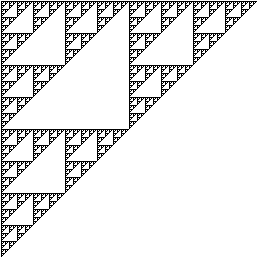
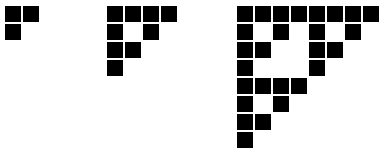

# [Fractale : triangle de Sierpinski](http://www.france-ioi.org/algo/task.php?idChapter=513&idTask=515)

Une image qui a une apparence similaire quelle-que soit l'échelle à laquelle on l'observe est appelée une fractale (il y a d'autres types de fractales).

Un exemple simple de fractale est le triangle de Sierpinski, dont voici une représentation :




Une telle image peut être réalisée en quelques minutes avec n'importe-quel logiciel de dessin. On commence par former un triangle de trois pixels. On en fait ensuite trois copies que l'on utilise pour former un plus grand triangle, et on recommence l'opération avec ce nouveau triangle, et ainsi de suite, jusqu'à obtenir une figure de la taille souhaitée.

Voici une vue zoomée des trois premières étapes de l'opération :




Les dimensions de la figure étant multipliées par 2 à chaque nouvelle étape, le côté de la figure finale est une puissance de 2.

A vous d'afficher un triangle de Sierpinski de la taille demandée.

**Votre programme doit impérativement être basé sur une fonction récursive, et non sur des boucles.**

## Contraintes

* $1 \leqslant N \leqslant 64$, où $N$ est le côté de la figure.

### Entrée

Un entier : la taille du côté de la figure. Ce sera toujours une puissance de $2$.

### Sortie

Le triangle de Sierpinski de la taille fournie en entrée.

Les pixels noirs doivent être affichés sous la forme de caractères `#`, et les pixels blancs sous la forme d'espaces. N'affichez pas d'espaces à la fin des lignes, lorsqu'il n'y a plus de caractères `#` sur la ligne.

## Exemple

entrée :

    8

sortie :

    ########
    # # # #
    ##  ##
    #   #
    ####
    # #
    ##
    #

## Solution

```python
def sierpinski(n: int) -> list:
    """Renvoie une liste de n lignes de longueur n, formant un triangle de Sierpinski.
    n est une puissance de 2.
    >>> sierpinski(1)
    ["#"]
    >>> sierpinski(2)
    ["##", "# "]
    >>> sierpinski(4)
    ["####", "# # ", "##  ", "#   "]
    """
    if n == 1:
        return ['#']
    demi_n = n // 2
    base = sierpinski(demi_n)
    motif = [ligne * 2 for ligne in base]
    for ligne in base:
        motif.append(ligne + ' ' * demi_n)
    return motif

n = int(input())
for ligne in sierpinski(n):
    print(ligne.rstrip())
```

### Commentaires
* On crée une fonction récursive qui renvoie une liste de chaînes de caractères ; cela aurait pu être un tableau bi-dimensionnel de booléens. Cela dépend du langage et de ses facilités ; ici en Python, les listes de chaînes sont très adaptées.
* Pour créer le motif, on part du motif de taille moitié.
    * Dans un premier temps, chaque ligne du motif de base est dupliquée-collée.
    * Ensuite, on ajoute à chaque ligne du motif de base, des espaces pour construire le bas du nouveau motif.
* Pour l'affichage final, on enlève les espaces superflus à droite avec `rstrip` (pour *right strip*).
