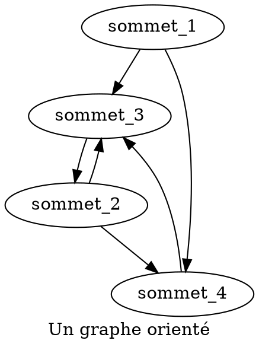
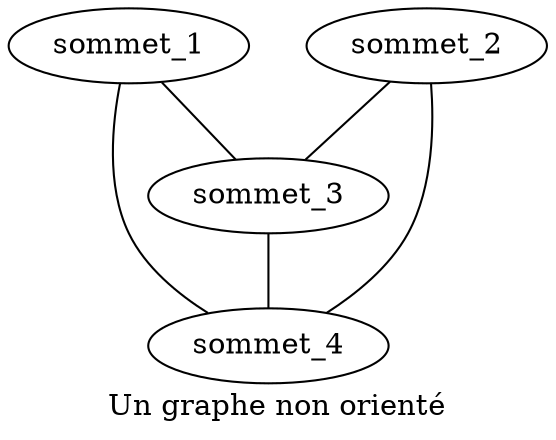
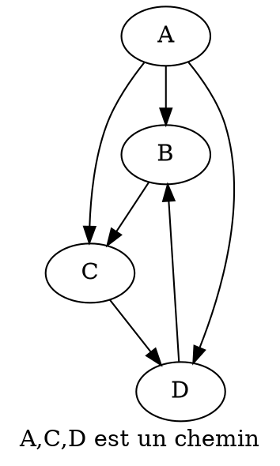

# :diamond_shape_with_a_dot_inside: Graphes {ignore=true}

## Sommaire {ignore=true}

[TOC]

## Exemples introductifs

### Réseaux et cartes
#### Réseau social
#### Réseau routier, cartes
#### Labyrinthe

### Positions à un jeu

## Définitions

Un **graphe** est un ensemble fini de **sommets** reliés entre eux par des **arcs**. On note souvent $G = (V, E)$.
* $V$ (pour _**V**ertex_, 'sommet' en anglais) est un ensemble fini ; ce sont les points ou sommet du graphe.
* $E$ (pour _**E**dge_, 'arête' en anglais) est un ensemble fini de paires de sommets distincts

* Un graphe peut être **orienté**, les arcs ont chacun un sens.

* Un graphe peut être **non orienté**, les arcs n'ont alors pas de sens en particulier. Dans ce cas on parle parfois d'**arêtes**.

## Vocabulaire sur les graphes non orientés
Une **chaîne** est un ensemble fini non vide de sommets reliés deux à deux consécutivement par des arêtes.

> Dans l'exemple précédent, [sommet_1, sommet_3, sommet_2] constitue une chaîne.

Un graphe non orienté est dit **connexe** si, pour toute paire de sommets, il existe une chaîne les reliant. Cela signifie que le graphe est en un seul morceau.

> Par exemple, s'il n'y a pas de pont entre deux îles, le réseau routier de ces îles n'est pas connexe.

Si une chaîne relie un sommet à lui-même, on parle de **cycle**.

> Dans l'exemple précédent, [sommet_1, sommet_3, sommet_4, sommet_1] constitue un cycle.

> On a déjà évoqué qu'un arbre enraciné est un graphe non vide, connexe et sans cycle, avec un sommet particulier désigné comme racine.

## Vocabulaire sur les graphes orientés

Un **chemin** est un ensemble fini de sommets reliés deux à deux consécutivement par des arcs.

Un graphe orienté est dit **connexe**, si sa version non orientée est connexe.

Un graphe orienté est dit **fortement connexe**, si, pour chaque paire de sommets, il existe un chemin les reliant.

> L'exemple précédent est connexe, mais pas fortement connexe ; en effet il n'y a pas de chemin reliant $\text{D}$ à $\text{A}$.

## Représentation en Python

### Matrice d'adjacence

### Listes d'adjacence

