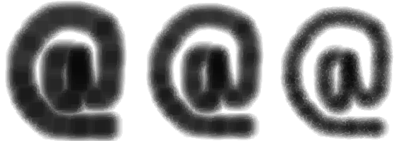

# [Érosion](http://www.france-ioi.org/algo/task.php?idChapter=564&idTask=1124)


Le but de ce sujet est d'implémenter une opération classique de traitement d'images appelée "érosion", qui consiste en gros à faire décroître légèrement la taille d'une forme donnée dessinée en noir sur un fond blanc. Le principe est d'effacer (i.e. rendre blanc) tous les pixels de l'image qui ne sont pas entourés de quatre pixels noirs. Dans ce sujet, on répète ce processus d'érosion un certain nombre de fois afin que la transformation soit bien visible.



Remarque : les pixels se trouvant sur le bord de l'image d'origine ne peuvent jamais être entourés par quatre pixels noirs, donc sont toujours blancs sur l'image obtenue.

## Contraintes

* $1 \leqslant N \leqslant 50$, où $N$ est le nombre de fois qu'il faut appliquer le processus d'érosion sur toute l'image.
* $1 \leqslant H, L \leqslant 250$, où $H$ et $L$ sont la hauteur et la largeur de l'image. 

## Entrée

* La première ligne contient un entier : $N$.
* La seconde ligne contient deux entiers séparés par des espaces décrivant les dimensions de l'image : $H$ et $L$.
* Chacune des *H* lignes suivantes contient *L* caractères qui sont des `.` ou des `#`, et qui décrivent l'image. Les `.` correspondent aux pixels blancs, et les `#` aux pixels noirs.

## Sortie

Vous devez afficher l'état final de l'image, sous forme d'une grille de `.` et de `#`.

## Exemple

entrée :

```
2
12 16
...########.....
..#########.....
.##########.....
################
################
######..#######.
.######.#######.
..############..
...###########..
....#########...
......#######...
........####....
```

sortie :

```
................
................
...######.......
..####..##......
..###....##.....
..##......###...
...##.....###...
....##...###....
......#.####....
........###.....
................
................
```

## Commentaires

L'exemple ci-dessus est un rectangle de 12 lignes et 16 colonnes, contenant une forme connexe trouée, que l'on doit éroder 2 fois. 

## Solution

```python
class Image:
    """objet Image en noir et blanc '#' et '.'
    avec méthodes pour noircir une case, d'érosion et d'affichage.
    """

    def __init__(self, nb_lignes, nb_colonnes, grille=None):
        """Si `grille` est absent, l'image sera blanche"""
        self.__nb_lignes = nb_lignes
        self.__nb_colonnes = nb_colonnes
        if grille is not None:
            self.__grille = grille
        else:
            self.__grille = [['.' for _ in range(nb_colonnes)]
                            for _ in range(nb_lignes)]
    
    def affiche(self):
        for ligne in self.__grille:
            print("".join(ligne))
    
    def noircir(self, i, j):
        self.__grille[i][j] = '#'

    def érosion(self):
        """Renvoie une nouvelle image érodée"""
        érodée = Image(self.__nb_lignes, self.__nb_colonnes)
        for i in range(1, self.__nb_lignes - 1):
            for j in range(1, self.__nb_colonnes - 1):
                if self.__grille[i][j] == '#' and all(
                    self.__grille[i+di][j+dj] == '#' 
                    for di,dj in [(-1, 0), (+1, 0), (0, -1), (0, +1)]):
                        érodée.noircir(i, j)
        return érodée


nb_érosion = int(input())
nb_lignes, nb_colonnes = map(int, input().split())
grille = [list(input()) for _ in range(nb_lignes)]
image = Image(nb_lignes, nb_colonnes, grille)
for _ in range(nb_érosion):
    image = image.érosion()
image.affiche()
```