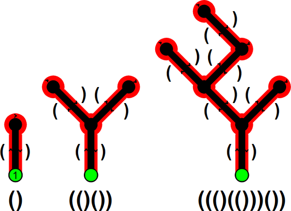

# [Carte des cavernes](http://www.france-ioi.org/algo/task.php?idChapter=527&idTask=2772)

## Énoncé

Les collines d'Algoréa regorgent de cavernes souterraines complétement inondées que vous avez décidé d'explorer à l'aide de votre matériel de plongée, afin d'en dresser les plans. Vous savez qu'il n'est pas possible de tourner en rond dans ces cavernes aussi vous avez mis au point un système très simple : dès que vous empruntez un couloir vous notez une parenthèse ouvrante et quand vous l'empruntez en sens inverse vous notez une parenthèse fermante. De plus quand vous avez plusieurs possibilités, vous les explorez de la gauche vers la droite. À la fin vous revenez à votre point de départ.

Voici un exemple sur plusieurs cavernes différentes :



Malheureusement une fois revenu d'expédition, vous constatez que certains plans ne sont pas valides : ils ne peuvent correspondre à une caverne !

À vous de déterminer quels plans sont valides et lesquels ne le sont pas.

### Contraintes

* $1 \leqslant N \leqslant 100\,000$ la longueur de l'expression

### Entrée

* Sur la première ligne, le nombre de caractères de l'expression décrivant la caverne.

* Sur la seconde ligne, l'expression à tester : elle ne contient que des parenthèses ou des espaces, elle commence et fini forcément par une parenthèse.

### Sortie

* Une seule ligne contenant l'entier 1 ou 0 indiquant si le plan est valide ou pas.

### Exemples

#### Exemple 1

---

entrée :

    18
    ( ( () (()) ) () )

sortie :

    1

---

#### Exemple 2

---

entrée :

    2
    )(

sortie :

    0

---

#### Exemple 3

---

entrée :

    9
    ( () (( )

sortie :

    0

---

## Solution alternative

On peut stocker le niveau de parenthèses ouvertes. On l'incrémente de un à chaque ouverture, on diminue de un à chaque fermeture. Un plan valide possède toujours un niveau de parenthèses ouvertes qui est positif ou nul à chaque instant ; un plan invalide non.

```python
def est_valide(n, ligne):
    nb_ouvertures = 0
    for c in ligne:
        if c == '(':
            nb_ouvertures += 1
        elif c == ')':
            nb_ouvertures -= 1
            if nb_ouvertures < 0:
                return False
    return nb_ouvertures == 0

n = int(input())
caverne = input()

print("1" if est_valide(n, caverne) else "0")
```

On peut aussi utiliser une pile pour simuler le parcours de la galerie, cela donne une raison pédagogique de montrer comment récupérer une exception levée par une erreur.

```python
class Pile():
    def __init__(self):
        self.données = []

    def __str__(self) -> str:
        return str(self.données)

    def est_vide(self) -> bool:
        return self.données == []

    def empile(self, valeur):
        self.données.append(valeur)
    
    def dépile(self):
        if self.est_vide():
            raise ValueError('Pile vide')
        return self.données.pop()


def est_valide(n, ligne):
    ouvertures = Pile()
    for c in ligne:
        if c == '(':
            ouvertures.empile(None) # None, ou bien n'importe quel objet...
        elif c == ')':
            try:
                ouvertures.dépile()
            except ValueError:
                return False
    return ouvertures.est_vide()


n = int(input())
caverne = input()

print("1" if est_valide(n, caverne) else "0")
```
