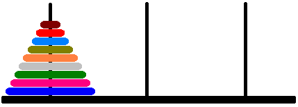

# [Tours de Hanoï](http://www.france-ioi.org/algo/task.php?idChapter=513&idTask=516)


Les tours de hanoï sont un casse-tête très ancien. Trois piquets sont plantés côte à côte sur le sol. Sur le premier piquet sont enfilés des disques de bois de différentes tailles, du plus grand au plus petit.

Voici une illustration d'un jeu de tours de Hanoï composé de 9 disques :



Le but du casse-tête est de déplacer l'ensemble de la pile de disques vers le troisième piquet. Un coup consiste à déplacer un disque du sommet d'un piquet vers le sommet d'un autre piquet, en respectant la règle suivante :

Un disque ne peut jamais être placé sur un disque plus petit que lui.

Illustration de l'état du jeu après quelques coups :


Vous devez écrire un programme qui, étant donné le nombre de disques se trouvant sur le premier piquet, décrit comment atteindre la position finale en effectuant un minimum de coups.

## Contraintes

* $1 \leqslant N \leqslant 12$, où $N$ est le nombre de disques.

### Entrée

Vous devez lire un entier sur l'entrée standard : le nombre de disques se trouvant sur le piquet 1 au départ.

### Sortie

Vous devez écrire une ligne sur la sortie par déplacement permettant d'arriver à la solution finale (dans l'ordre où ils doivent être effectués).

Chaque déplacement est décrit par le numéro du piquet duquel un disque est retiré, le texte ` -> `, puis le numéro du piquet sur lequel le disque est placé. Les piquets sont numérotés de 1 à 3.

### Exemple

entrée :

    3

sortie :

    1 -> 3
    1 -> 2
    3 -> 2
    1 -> 3
    2 -> 1
    2 -> 3
    1 -> 3

## Solution

```python
def déplace(n: int, origine: int, destination: int, temporaire: int) -> None:
    """Affiche les déplacements à effectuer pour déplacer
    n disques sur la pile origine,
    vers la pile destination,
    en utilisant la pile temporaire.
    Renvoie None

    >>> déplace(3, 1, 3, 2)
    1 -> 3
    1 -> 2
    3 -> 2
    1 -> 3
    2 -> 1
    2 -> 3
    1 -> 3

    """
    if n == 0:
        # il n'y a rien à faire
        pass
    else:
        déplace(n-1, origine, temporaire, destination)
        print(origine, "->", destination)
        déplace(n-1, temporaire, destination, origine)

n = int(input())
déplace(n, 1, 3, 2)
```

### Commentaires
* Pour le cas de base $n = 0$, il n'y a rien à faire. On aurait pu écrire `if n != 0:` puis le bloc associé, sans la clause `else`, mais cela aurait été moins explicite. Une histoire de style.
* Pour le cas général, pour déplacer une pile,
    * on déplace presque toute la pile (par récursivité) vers l'espace temporaire,
    * on déplace le disque du bas, seul,
    * on re-déplace du temporaire vers la destination les disques.
* On aurait pu se passer du quatrième paramètre `temporaire` dans l'entête de la fonction, en effet on a l'invariant `origine + destination + temporaire == 1 + 2 + 3 == 6`, ainsi l'un se déduit des deux autres.
