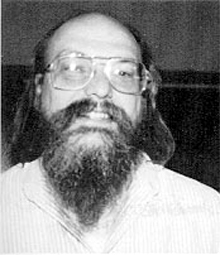

# Histoire de systèmes d'exploitation de type UNIX {ignore}

## Sommaire {ignore}
[TOC]

> Ce document ne fait que reprendre différents passages de Wikipédia.

## Multics
[Multics](https://fr.wikipedia.org/wiki/Multics) fut conçu à partir de 1964, conjointement par le MIT, les Laboratoires Bell et General Electric.

Quand les Laboratoires Bell se retirèrent du projet, deux ingénieurs qui travaillaient sur Multics (Ken Thompson et Dennis Ritchie) lancèrent leur propre projet baptisé initialement UNICS (UNiplexed Information and Computing Service) par opposition entre Uniplexed/Multiplexed du projet Multics qu'ils jugeaient beaucoup trop compliqué. Le nom fut ensuite modifié en UNIX.

## UNIX

En 1969, Ken Thompson qui travaillait alors pour les laboratoires Bell développa la première version d'un système d'exploitation mono-utilisateur sous le nom de New Ken's System. Le nom Unics fut suggéré par Brian Kernighan à la suite d'un jeu de mots « latin » avec Multics ; « Multi- car Multics faisait la même chose de plusieurs façons alors qu'Unics faisait chaque chose d'une seule façon ». Ce nom fut par la suite contracté en Unix (pour être déposé finalement sous le nom [UNIX](https://fr.wikipedia.org/wiki/Unix) par AT&T), à l'initiative de Brian Kernighan.

## Langage C

En 1971, conscient de la difficulté que représente la maintenance d'un système écrit en langage d'assemblage, Ken Thompson songea à réécrire Unix en TMG10, mais il trouva que le TMG n'offrait pas ce dont il avait besoin. Pendant une courte période il songea à réécrire Unix en Fortran, mais finalement conçut le B avec l'aide de Dennis Ritchie dans les années 1969 et 1970, en s'inspirant du langage BCPL11. Cependant Unix ne fut jamais réécrit en B ; le B ne supportait pas les types, toutes les variables étaient de la même taille que les mots de l'architecture, l'arithmétique sur les flottants n'était pas implémentée ; de plus, le compilateur B utilisait la technique du *threaded code*. C'est pourquoi Dennis Ritchie entreprit en 1971 d'écrire le New B, qui fut renommé en C. Le langage C est toujours l'un des langages les plus utilisés aujourd'hui.

## L'expansion d'UNIX

L'incompatibilité grandissante entre les nombreuses variantes d'Unix proposées par les différents éditeurs pour les différentes machines porte peu à peu atteinte à la popularité et à la diversité des systèmes Unix. De nos jours, les systèmes Unix propriétaires, longtemps majoritaires dans l'industrie et l'éducation, sont de moins en moins utilisés. En revanche, trois systèmes de type Unix basés sur BSD (FreeBSD, NetBSD et OpenBSD) d'une part, et le système GNU/Linux, compatible Unix, d'autre part, ainsi que macOS (anciennement OS X, basé sur Darwin), occupent une part de marché de plus en plus importante, permettant à Unix de concurrencer l'autre grande famille d'OS (propriétaire), Windows NT.

## GNU

[GNU](https://fr.wikipedia.org/wiki/GNU) est un système d'exploitation lancé en 1983 par Richard Stallman dans le but de fournir un équivalent d'Unix composé uniquement de logiciel libre.

En 1991, alors que le noyau de GNU, le Hurd traînait à être opérationnel, fut créé le noyau Linux (voir ci-dessous) qui sortit en 1992. Cela permit d'utiliser pour la première fois un système d'exploitation entièrement libre, une variante de GNU utilisant le noyau Linux connue sous le nom de GNU/Linux, ou plus couramment, simplement Linux.

GNU et GNU/Linux sont utilisés sous la forme de distributions qui les accompagnent de logiciels supplémentaires. Parmi les distributions les plus populaires, on compte notamment Debian, Ubuntu, Linux Mint, Red Hat, Fedora et Arch. 

## Linux

En 1991 un étudiant finlandais, Linus Torvalds, décida de concevoir, sur le modèle de Minix, un système d'exploitation capable de fonctionner sur les architectures à base de processeur Intel 80386. Le noyau, qui était alors au stade expérimental, devait être généré sur un système Minix.

Le nom de Linux vient de la personne qui hébergeait le projet pour sa diffusion (version 0.0.1) et non d'un choix de Linus. Il voulut un temps rebaptiser son système Freax, mais il était trop tard, Linux s'était déjà imposé auprès des aficionados. [Linux](https://fr.wikipedia.org/wiki/Linux) ne contient aucun code provenant de UNIX, il en est juste inspiré, et complètement réécrit. D'autre part, Linux est un logiciel libre.

Depuis novembre 2017, Linux est le seul système d'exploitation utilisé par les 500 supercalculateurs les plus puissants du monde. Les autres systèmes Unix équipaient encore quelques-uns de ces ordinateurs en 2016.

## Android

Android est un système d'exploitation pour terminaux mobiles développé par une startup du même nom et racheté par Google. Il est basé sur le noyau Linux.

Plusieurs systèmes d'exploitation pour appareils mobiles (smartphones, tablettes, PDA…) sont des systèmes Unix. On peut citer en particulier iOS et Android, qui se partagent plus de 85 % du marché des smartphones.

## Personnages clés

### Ken Thompson

[Ken Thompson](https://fr.wikipedia.org/wiki/Ken_Thompson) (né le 4 février 1943 à La Nouvelle-Orléans) est un informaticien américain, concepteur des systèmes Unix et Plan 9 ainsi que des langages B et Go.
Dans les années 1970, il crée Belle avec Joseph Condon, un ordinateur spécialisé dans le jeu d'échecs. Belle remporte à plusieurs reprises le championnat nord-américain des ordinateurs d'échecs entre 1978 et 1986.

### Dennis Ritchie

[Dennis MacAlistair Ritchie](https://fr.wikipedia.org/wiki/Dennis_Ritchie), né le 9 septembre 1941 à Bronxville dans l'État de New York, est un des pionniers de l'informatique moderne, inventeur du langage C et codéveloppeur de Unix.

Au début des années 1970, programmeur aux Laboratoires Bell, il travaille avec Ken Thompson au développement d'Unix. Le langage B de Thompson étant trop limité pour les besoins du nouveau système, Ritchie est amené à créer sur les mêmes bases le langage C. Par la suite, avec l'aide de Brian Kernighan, il promeut le langage et rédige notamment le livre de référence *The C Programming Language*.

Il reçoit conjointement avec Ken Thompson le prix Turing de l'ACM en 1983 pour leur travail sur le système Unix.

### Richard Stallman

[Richard Matthew Stallman](https://fr.wikipedia.org/wiki/Richard_Stallman), né le 16 mars 1953 à Manhattan, est un programmeur et militant du logiciel libre. Initiateur du mouvement du logiciel libre, il lance, en 1983, le projet GNU et la licence publique générale GNU connue aussi sous le sigle GPL. Il a popularisé le terme anglais « copyleft ». Programmeur renommé de la communauté informatique américaine et internationale, il a développé de nombreux logiciels dont les plus connus des développeurs sont l’éditeur de texte GNU Emacs, le compilateur C de GNU (GCC), le débogueur GNU (gdb) mais aussi, en collaboration avec Roland McGrath, le moteur de production GNU Make.

### Linus Torvalds

.jpg)

Linus Benedict Torvalds, né le 28 décembre 1969 à Helsinki en Finlande, est un informaticien américano-finlandais1,2.

Il est connu pour avoir créé en 1991 (à 21 ans) le noyau Linux dont il continue de diriger le développement. Il est considéré comme le « dictateur bienveillant à vie » (*Benevolent Dictator for Life*).

Il a également créé le logiciel de gestion de versions décentralisée Git.

