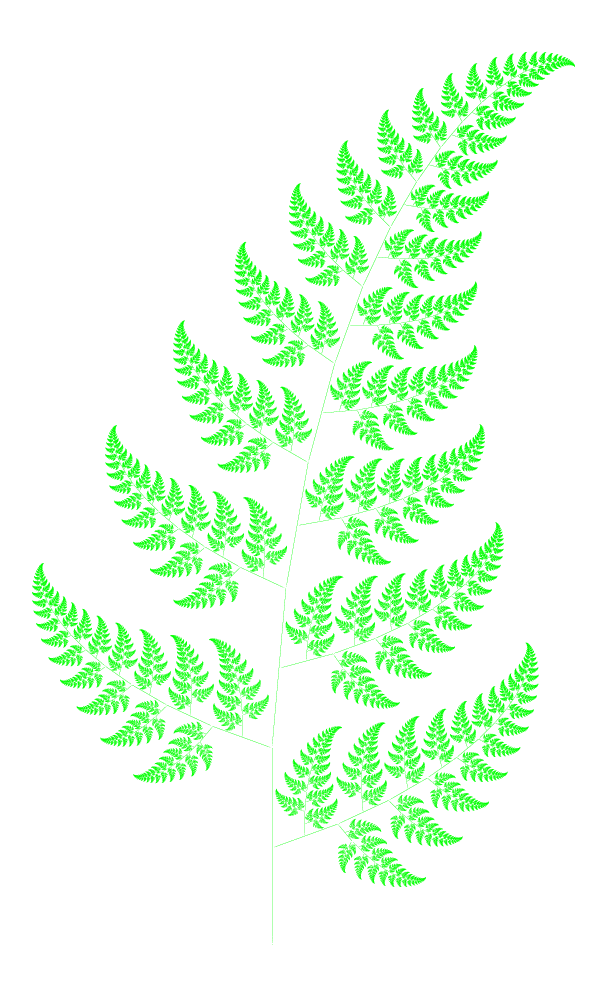

# Récursivité {ignore=true}

## Sommaire {ignore=true}

[TOC]

> « Nous les hackers nous [...] avions aussi une tradition d'acronymes récursifs qui consiste à dire que le programme qu'on crée est similaire à un programme existant. »
> *Richard Stallman*

## Exemples
### Sigles récursifs
* **GNU** : *GNU's Not UNIX* (GNU n'est pas UNIX)
* **LAME** : *Lame Ain't an MP3 Encoder* (Lame n'est pas un encodeur mp3.)
* **PHP** : *PHP: Hypertext Preprocessor*. (Historiquement, ce sigle récursif était l'abréviation de Personal Home Page ; en 2008, le sigle récursif est le sens officiel de PHP)
* **HURD** : *Hird of Unix-Replacing Daemons* et **HIRD** : *Hurd of Interfaces Representing Depth* ; exemple de paire de sigles mutuellement récursifs.


> *Les Deux Mystères*, René Magritte

### Images

Dans la nature, on trouve différents objets qui font preuve d'auto-similarité. On peut aussi les construire artificiellement.





## Définitions
(D'après [Wikipédia](https://fr.wikipedia.org/wiki/R%C3%A9cursivit%C3%A9))
La récursivité est une démarche qui fait référence à l'objet même de la démarche à un moment du processus. En d'autres termes, c'est une démarche dont la description mène à la répétition d'une même règle. Ainsi, les cas suivants constituent des cas concrets de récursivité :

1. Décrire un processus dépendant de données en faisant appel à ce même processus sur d'autres données plus « simples » ;
2. Montrer une image contenant des images similaires ;
3. Écrire un algorithme qui s'invoque lui-même ;
4. Définir une structure à partir de l'une au moins de ses sous-structures.

En NSI, nous abordons ces différents aspects.
1. Le concept «Diviser pour mieux régner » donne par exemple le principe de recherche par dichotomie dans un tableau trié.
2. Les [fractales](https://fr.wikipedia.org/wiki/Fractale), par exemple.
3. Nous allons voir de nombreux exemples de fonctions récursives !
4. Les structures arborescentes, arbres et graphes, par exemple.


## Fonctions récursives

Une **fonction récursive** est une fonction qui s'appelle elle-même. (Ou bien qui fait partie d'un ensemble de fonctions qui s'appellent mutuellement).

### Exemple, somme des premiers entiers

$$S_n = 1 + 2 + 3 + \cdots + (n-1) + n$$

On a :
* $S_0 = 0$, et
* $S_{n} = S_{n-1} + n$

Par exemple, $S_5 = 1 + 2 + 3 + 4 + 5 = 15$.

#### Version itérative

```python
def somme_premiers_entiers(n):
    """Renvoie la somme 0 + 1 + ... + n

    >>> somme_premiers_entiers(5)
    15

    """
    somme = 0
    for i in range(1, n+1):
        somme += i
    return somme
```

#### Version récursive

```python
def somme_premiers_entiers(n):
    """Renvoie la somme 0 + 1 + ... + n

    >>> somme_premiers_entiers(5)
    15

    """
    if n == 0:
        return 0
    else:
        return somme_premiers_entiers(n-1) + n
```

Les appels récursifs sont stockés dans une pile d'appels.

⚠️ Attention, par défaut, Python limite à $1000$, la profondeur des appels récursifs. Cela peut se modifier.

### Différents types de fonctions récursives

#### Appels multiples

Voici, par exemple, une version naïve pour calculer un terme de la suite de Fibonacci.

> Rappel : cette suite est  $[0, 1, 1, 2, 3, 5, 8, 13, 21, \cdots]$
> On commence avec $[0, 1]$, puis chaque nouveau terme est la somme des deux précédents.

```python
def fibonacci(n):
    """Renvoie le terme d'indice n de la suite
    >>> fibonacci(6)
    8
    >>> fibonacci(0)
    0
    """
    if n < 2:
        return n
    else:
        return fibonacci(n-1) + fibonacci(n-2)
```

Cette version est naïve, en effet l'appel `fibonacci(5)` est effectué de nombreuses fois pour `fibonacci(8)` et le résultat n'est pas stocké, donc recalculé à chaque fois... On utilisera la **mémoïsation** pour améliorer cela.

```python
fib_dico = {0: 0, 1: 1} # valeurs initiales
def fibonacci(n):
    """Renvoie le terme d'indice n de la suite
    >>> fibonacci(6)
    8
    >>> fibonacci(0)
    0
    """
    if n in fib_dico:
        return fib_dico[n]
    else:
        fib_n = fibonacci(n-1) + fibonacci(n-2)
        fib_dico[n] = fib_n
        return fib_n
```

#### Appels croisés

```python
def fonction_A(x):
    ...
    ...
    ...fonction_B(...x...)
    ...
    return ...

def fonction_B(x):
    ...
    ...
    ...fonction_A(...x...)
    ...
    return ...
```

La `fonction_A` utilise la `fonction_B` qui utilise elle-même la `fonction_A`, *a priori* avec un paramètre qui dépend du paramètre donné en entrée...

⚠️ Faire des appels croisés est **légal**, cependant on veillera que cela fasse progresser le "calcul", donc sans rentrer dans une boucle infinie. On remarquera que ce principe est général, et que l'exemple simple suivant boucle à l'infini pour toute entrée `n` supérieure à `0`.

```python
def bizarre(n):
    if n == 0:
        return 9
    else:
        return bizarre(n + 1)
```


## Exercices concrets
### Nombre de chiffres
Écrire une version récursive d'une fonction qui renvoie le nombre de chiffres d'un entier strictement positif.
> **Indice** : Quel est le nombre de chiffres de $n$, par rapport à celui de $n$ divisé par $10$ ?

### Nombre de bits égaux à 1
Écrire une version récursive d'une fonction qui renvoie le nombre de bits égaux à $1$ d'un entier strictement positif.
> **Indice** : S'inspirer de l'exercice précédent.

### Calcul de puissance
En partant du principe que :
* si $n$ est pair, alors $a^n = \left(a^{n/2}\right)^2$
* si $n$ est impair, alors $a^n = \left(a^{(n-1)/2}\right)^2×a$

> Exemples 
> 1. $a^{2021} = (a^{1010})^2×a$
> 2. $a^{1010} = (a^{505})^2$
> 3. ...

1. Écrire une fonction récursive `puissance(a, n)` qui renvoie $a^n$.
> **Indice** : Penser au cas de base !
2. Compter à la main le nombre d'appels récursifs pour `puissance(7, 20)`.

### FranceIOI
Résoudre les problèmes au sujet de [la récursivité sur FranceIOI](http://www.france-ioi.org/algo/chapter.php?idChapter=513).

### Arbre de Pythagore

### Flocon de Von Koch

### Triangle de Pascal

### Fonction d'Ackermann

### Récursions imbriquées

D'après John McCarthy :

$$
f_{91}(n)=
\begin{cases}
n-10, &\text{si } n > 100\\
f_{91}\left(f_{91}(n+11)\right), &\text{si } n \leqslant 100\\
\end{cases}
$$

1. Implémenter cette fonction en Python.
2. Donner un tableau de valeurs de $f_{91}(n)$, pour $n\in [\![0..100]\!]$.

### Nombre de façons d'écrire comme une somme
On considère $f(n)$ : le nombre de façons d'écrire un entier $n>0$ comme somme d'entiers strictement positifs, sans tenir compte de l'ordre.

Par exemple, $5$ peut s'écrire de $f(5) = 7$ façons :
* $1+1+1+1+1$ ; la somme la plus longue,
* $2+2+1$,
* $1+3+1$,
* $2+3$,
* $5$ ; oui, une somme à un seul terme,
* $1+4$,
* $1+2+1+1$.

Écrire une fonction qui renvoie $f(n)$.

## Quelques suites numériques utilisant l'auto-référence ==**Nouveau**==
> Le coin NSI + maths expertes

[Douglas Hofstadter](https://fr.wikipedia.org/wiki/Douglas_Hofstadter) est l'auteur du livre [Gödel, Escher, Bach : Les Brins d'une Guirlande Éternelle](https://fr.wikipedia.org/wiki/G%C3%B6del,_Escher,_Bach_:_Les_Brins_d%27une_Guirlande_%C3%89ternelle).

On y trouve en particulier certaines suites étonnantes.

### 1- *Hofstadter Q-sequence*

Cette suite ressemble à celle de Fibonacci ou de Lucas, chaque terme est la somme de deux termes presque précédents.

La suite $a$ est définie par :
* $a_1 = a_2 = 1$,
* $a_n = a_{n-a_{n-1}} + a_{n-a_{n-2}}$, pour $n \geqslant 3$.

Personne n'a prouvé que cette suite est bien définie pour tout $n\in\mathbb N^*$.

On ne connaît pas son taux de croissance.

> Écrire un code qui calcule les termes succéssifs en vérifiant que chacun est bien défini.

$a = (1, 1, 2, 3, 3, 4, 5, 5, 6, 6, 6, 8, 8, 8, 10, 9, \cdots)$ ; suite http://oeis.org/A005185


### 2- *Hofstadter Figure-Figure sequences*

Les suites *Hofstadter Figure-Figure* $R$ et $S$ sont des suites d'entiers complémentaires définies par :

* $R_1 = 1$, $S_1 = 2$.
* $R_n = R_{n - 1} + S_{n-1}$, pour $n > 1$.
* avec la suite $(S_{n})$ définie comme strictement croissante contenant tous les entiers absents de $(R_{n})$.


Les premiers termes sont :
* $R = (1, 3, 7, 12, 18, 26, 35, 45, 56, 69, 83, 98, 114, 131, 150, 170, 191, 213, 236, 260, \cdots)$ ; suite http://oeis.org/A005228
* $S = (2, 4, 5, 6, 8, 9, 10, 11, 13, 14, 15, 16, 17, 19, 20, 21, 22, 23, 24, 25, \cdots)$ ; suite http://oeis.org/A030124

> Implémenter les fonctions `R` et `S` en Python.

### 3- *Hofstadter–Conway $10,000 dollars sequence*

La suite $a$ est définie par :

* $a_{1} = a_{2} = 1$,
* $a_{n} = a_{a_{n-1}} + a_{n-a_{n-1}}$, pour $n \geqslant 3$.

$a = (1, 1, 2, 2, 3, 4, 4, 4, 5, 6, 7, 7, 8, 8, 8, 8, 9, 10, 11, 12, \cdots)$ ; suite http://oeis.org/A004001

1. *(Facile)* Calculer les premiers termes.
2. *(Variable)* Étudier le comportement asymptotique de $S(n) = \sum\limits_{i=1}^n a_i$.
3. *(Vraiment très difficile)* [Vérifier si votre code est efficace](https://www.spoj.com/problems/HC10000/).
