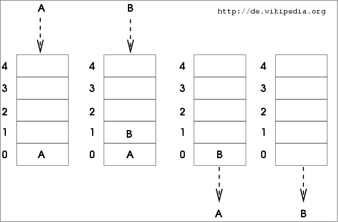

# 🚛 Structures linéaires

## Rappels sur le tableau

> Exemple de tableau : les nombres premiers inférieurs à 100.

|Indice | $0$ | $1$ | $2$ | $3$ | $4$ | $5$ | $6$ | $7$ | $8$ | $9$ | $10$ | $11$ | $12$ | $13$ | $14$ | $15$ | $16$ | $17$ | $18$ | $19$ | $20$ | $21$ | $22$ | $23$ | $24$ |
|-------|-----|-----|-----|-----|--|--|--|--|--|--|--|--|--|--|--|--|--|--|--|--|--|--|--|--|--|
|Élément| $2$ | $3$ | $5$ | $7$ | $11$ | $13$ | $17$ | $19$ | $23$ | $29$ | $31$ | $37$ | $41$ | $43$ | $47$ | $53$ | $59$ | $61$ | $67$ | $71$ | $73$ | $79$ | $83$ | $89$ | $97$ |

Un tableau, `table` par exemple, est une structure de données, abstraite et élémentaire :
* avec des éléments de même type, et de même taille `taille_élément`,
* un nombre d'éléments fixé à la création ; `nb_éléments`,
* rangés de façon continue en mémoire, indicés de `0` **inclus** à `nb_éléments` **exclu**.

> En interne, on accède, en pratique, à un élément d'indice `i` du tableau par son adresse mémoire qui est égale à `adresse_tableau + i * taille_élément`.

On peut lire et modifier un élément d'indice `i`. Avec un langage de programmation, on note très souvent `table[i]` cet élément de `table` d'indice `i`.

Avec cette structure de données, on a déjà résolu de nombreux problèmes, mais on peut aussi construire de nouvelles structures de données.

Concrètement, on retrouve des implémentations de cette structure abstraite, le tableau, dans la plupart des langages de programmation. Une limitation évidente est la taille d'un tableau, limitée par la capacité de mémoire disponible ; sinon, c'est assez simple.

* Le cours de première est toujours [accessible ici](https://franckchambon.github.io/ClasseVirtuelle/NSI/nsi-accueil.html).

## La pile

On utilisera les notations de la POO.

* C'est une structure abstraite de donnée linéaire (agencée en ligne en mémoire).
* Les éléments sont de même type.
* On dispose de méthodes :
    * Le constructeur `Pile()`, via la méthode `.__init__(self)` qui initialise une pile vide.
    * `.est_vide(self)` renvoie un booléen, `True` pour une pile vide.
    * `.empile(self, élément)` ajoute un `élément` au sommet de la pile.
    * `.dépile(self)` enlève l'élément au sommet de la pile, et le renvoie.
    * Éventuellement d'autres méthodes...

_LIFO.svg.png)
> Image : [wikipedia, la pile](https://fr.wikipedia.org/wiki/Pile_%28informatique%29)

### Implémentation avec tableau

On propose ici, en Python, une implémentation qui utilise en arrière-plan une structure de type `list` de Python, **mais** en limitant volontairement l'usage, comme **un tableau**, sans méthode dynamique. Ainsi l'implémentation pourrait être réalisée dans de nombreux langages de programmation avec de rares ajustements.

> La limitation, **ici**, sera que les éléments de la pile devront être de même type, et de même taille.

```python
class Pile():
    """
    Une classe "pile d'entiers", de taille maximale 'taille_max',
    implémentée avec les données dans un tableau.
    """

    def __init__(self, taille_max: int):
        self.taille_max = taille_max
        self.données = [0 for _ in range(taille_max)] # un tableau
        self.hauteur = 0

    def est_vide(self) -> bool:
        return self.hauteur == 0

    def empile(self, élément):
        """Ajoute `élément` au sommet de la pile.
        """
        if self.hauteur == self.taille_max:
            raise ValueError('Pile pleine')
        self.données[self.hauteur] = élément
        self.hauteur += 1
    
    def dépile(self):
        """Enlève et renvoie l' `élément` du sommet de la pile.
        """
        if self.est_vide():
            raise ValueError('Pile vide')
        self.hauteur -= 1
        élément = self.données[self.hauteur]
        #self.données[self.hauteur] = 0 # optionnel
        return élément
```

On pourrait ajouter une méthode `.__str__(self)`.

```python
    def __str__(self) -> str:
        """Pour usage interne, tests.
        """
        ans = "[Début de pile]"
        for i in range(self.hauteur):
            ans += str(self.données[i])
            ans += ", "
        ans += " [Fin de pile.]"
        return ans
```

Idéalement, il faudrait écrire les attributs `taille_max`, `hauteur` et `données` en les préfixant de `__` pour les rendre privés. **Exercice 1** : faire cela et justifier ce choix.

**Exercice 2** : Ajouter une méthode accesseur `.hauteur(self)`. Cela donne une raison de plus d'avoir préfixé l'attribut !

**Exercice 3** : Vérifier l'utilisation avec le code suivant.

```python
ma_pile = Pile(100)
for x in range(20):
    ma_pile.empile(x*x + 2)
print(ma_pile)

for i in range(11):
    print("valeur dépilée :", ma_pile.dépile())

print("Et ensuite")

print(ma_pile)

ma_pile.empile(1337)

print(ma_pile)

print(dir(ma_pile))
```

* Tester `2000` au lieu de `20`.
* Tester `31` au lieu de `11`.
* Repérer, et justifier, où dans le code on gère ces erreurs.


### Implémentation avec les listes dynamiques de Python
On peut facilement implémenter une pile de taille arbitraire avec le type `list` de Python et ses méthodes `.append(self, élément)` et `.pop(self)`. Tous les langages de programmation ne le permettent pas aussi facilement...

```python
class Pile():
    def __init__(self):
        self.données = []

    def __str__(self) -> str:
        return str(self.données)

    def est_vide(self) -> bool:
        return self.données == []

    def empile(self, valeur):
        self.données.append(valeur)
    
    def dépile(self):
        if self.est_vide():
            raise ValueError('Pile vide')
        return self.données.pop()
```

> On remarque que nous n'avons pas ici (besoin) de méthode ni d'attribut `hauteur`... Pour le type abstrait pile, on travaille parfois sans l'avoir disponible au départ.

**Exercice 1** : rendre l'attribut `données` privé et ajouter une méthode `.hauteur(self)`.
Refaire les tests vus précédemment.

**Exercice 2** : Résoudre le problème [Dates de péremption](http://www.france-ioi.org/algo/task.php?idChapter=527&idTask=356) sur France-IOI.

**Exercice 3** : Pour cet exercice, on supposera qu'on ne dispose **que** du constructeur d'une pile vide, ainsi que des méthodes `est_vide(self)`, `.empile(self, élément)` et `.dépile(self)`. 
* Question 1 : Que fait la méthode `mystère` suivante ? Donner un vrai nom et une *doctring*. On testera à la main sur l'exemple simple : 
    * sommet de la pile $\rightarrow 4, 6, 3, 9, 7 |$.

```python
    # suite de class Pile():
    def mystère(self):# -> Pile:
        autre = Pile()
        while not self.est_vide():
            autre.empile(self.dépile())
        return autre
```

* Question 2 : Proposer alors une méthode `.hauteur(self)-> int` qui renvoie la hauteur d'une pile, en la laissant inchangée en fin de compte. *Rappel* : on ne dispose pas du détail d'implémentation, et on ne peut donc pas utiliser `len` ; d'ailleurs sur quel objet ?!?

* Question 3 : Proposer une méthode `.max_pile(self, i: int) -> int` qui renvoie la (plus petite) position de l'élément maximal parmi les `i` derniers empilés. La position du sommet de la pile est, par convention ici, égale à $1$. La pile doit être inchangée en fin de compte.

* Question 4 : Proposer une méthode `.retourner(self, i: int) -> None` qui modifie la pile en inversant l'ordre des `i` derniers éléments empilés. *On peut utiliser deux piles auxiliaires*.

### Implémentation de façon récursive

Gardons à l'esprit qu'un programme n'a pas une vue d'ensemble d'une pile. Il ne *voit* que le sommet ; en effet l'accès lui est aisé, moins pour le reste. On peut alors considérer une pile comme étant :
* Soit une pile vide.
* Soit un sommet que l'on nomme souvent ==tête==, et le reste caché qui est ... une pile (vide ou non), que l'on nomme souvent ==queue==.

On devine alors une définition récursive d'une pile :
* Pile vide, ou alors un couple `(tête, queue)`
* où `tête` est un élément, et `queue` une autre pile.

Dans l'implémentation ci-dessous, on choisit :
* le tuple vide `()` pour la pile vide,
* sinon, le tuple `(tête, queue)`.

```python
class Pile():
    def __init__(self):
        self.__données = () # un tuple sans élément
    
    def est_vide(self):
        return self.__données == ()

    def empile(self, élément):
        queue = self.__données
        tête = élément
        self.__données = (tête, queue)
    
    def dépile(self):
        if self.est_vide():
            raise ValueError('Pile vide')
        tête, queue = self.__données
        self.__données = queue
        return tête
```

On aurait pu écrire la méthode `empile` en une seule ligne avec `self.__données = (élément, self.__données)`, mais c'est moins lisible, et moins pédagogique.

> **Attention** : ici nous avons en structure interne une pile qui est un tuple, soit vide, soit qui n'a que **deux** éléments, et de type différent. Nous nous l'étions interdit pour les listes ! Acceptons l'idée qu'il s'agit en réalité de deux adresses. L'adresse de l'élément `tête` puis celle de `queue`. D'autre part `queue` est un tuple qui contient probablement un tuple qui contient un tuple ; chaque fois de deux éléments.

Voilà un exemple de la représentation interne de cette pile :
```python
(31, (12, (55, (20, ()))))
```

* Ici le sommet (la tête) de la pile est `31`.
* Et le reste (la queue) est la pile `(12, (55, (20, ())))`

Nous reviendrons sur cette construction, c'est une bonne méthode pour construire la structure de type **liste** ; oui, ça vient ensuite !

L'intérêt de ce genre de définition est qu'il est très commode de construire d'autres méthodes qui se prêtent bien à la récursivité. Par exemple :

```python
    def hauteur(self):
        """Renvoie la hauteur de la pile"""
        if self.est_vide():
            return 0
        tête, queue = self.__données
        return 1 + queue.hauteur()
```
> Dit autrement : la hauteur d'une pile c'est zéro si la pile est vide, sinon, c'est un, plus, la hauteur de la pile qui est sous l'élément au sommet.

**Exercice 1** : Proposer une méthode récursive qui renvoie la somme des valeurs d'une telle pile, en supposant qu'il ne s'agisse que de nombres entiers.

**Exercice 2** : Proposer une méthode récursive `.contient_valeur(self, valeur)` qui renvoie un booléen, `True` si un élément possède une certaine `valeur`, et `False` sinon.

> On rappelle au passage un point technique, la différence entre élément et valeur. Regardons l'exemple ci-dessous.
```python
>>> 2 == 2.0 # même valeur ?
True
>>> 2 is 2.0 # même élément ?
False
```

> ⚠️ On fera attention.
> * **Souvent** on vous demandera si un objet contient un élément d'une certaine valeur ; on pourra utiliser un test d'égalité de valeur `==`.
> * Parfois on vous demandera s'il contient un élément. Dans ce second cas, il faudra utiliser le test d'identité `is`, et non le test d'égalité de valeur `==`.


> (Pour aller plus loin) : Un autre intérêt de cette présentation est son approche d'un style de programmation, le [filtrage par motif](https://fr.wikipedia.org/wiki/Filtrage_par_motif) (*pattern matching*).

### Utilisations concrètes

* Lors d'appels récursifs une pile d'appels est créée en mémoire.
* Lors de l'utilisation d'un navigateur de recherche, la navigation est stockée dans une pile, pour permettre de revenir facilement en arrière.
* Avec un éditeur de code, un traitement de texte ou bien un logiciel de traitement d'image, on peut annuler les dernières opérations ; elles sont stockées dans une pile.


## La file

* Le principe de la pile est : *LIFO : Last In, First Out*, (dernier entré, premier sorti).
* Le principe de la file est : *FIFO : First In, First Out*, (premier entré, premier sorti).



> Wikipedia [file](https://fr.wikipedia.org/wiki/File_(structure_de_donn%C3%A9es))

### Utilisations concrètes

* Les travaux à imprimer sont envoyés dans une file, le premier arrivé sera le premier servi.
* Un processeur reçoit des calculs à effectuer, ils arrivent dans une file. L'ordonnanceur est souvent plus élaboré qu'une simple file, et des travaux prioritaires peuvent être traités avant.

**Exercice 1** : En s'inspirant de la **première** implémentation de la pile, donner une implémentation d'une **file** d'une certaine taille maximale. On proposera le constructeur ainsi que les méthodes `.est_vide(self)`, `.enfile(self, élément)` et `.défile(self)` analogues au cas de la pile.

**Exercice 2** : Résoudre le problème [Distributeur automatique](http://www.france-ioi.org/algo/task.php?idChapter=527&iOrder=2) sur France-IOI.

> **Aide** : on pourra considérer [ce devoir](TAD-file-eval.pdf) et ses indications.

> **Conseil** : on peut résoudre les problèmes dans un premier temps sans l'écriture avec style POO. Cependant, on demande alors une seconde écriture. Pourquoi ?
> * Le jour où on dispose d'une meilleure structure de données, il suffit de remplacer uniquement le bout de code de la classe, le problème restant intact. Sans POO, il faut souvent réécrire tout le problème pour utiliser les nouvelles idées... L'écriture avec le stye POO permet de s'affranchir presque totalement de la manière dont est écrit la classe. Il faut en revanche **toujours** garder à l'esprit : quel est le coût algorithmique de chaque méthode ?


>>> **Toujours utile** : relire [le tutoriel sur les structures de données sur python.org](https://docs.python.org/fr/3/tutorial/datastructures.html)


## Autres structures

En plus des structures [présentées ici](https://fr.wikipedia.org/wiki/Type_abstrait), il existe une autre structure linéaire assez utilisée.

* `Deque` : (*double end queue*), une structure qui permet facilement d'ajouter ou d'enlever facilement un élément à une des deux extrémités, si elle est non vide.


## Glossaire anglais - français

*push*
: c'est le terme qu'on retrouve le plus pour empiler, enfiler. On trouve aussi *append* avec Python.

*pop*
: c'est le terme qu'on retrouve le plus pour dépiler, défiler.

> Liens wikipedia en anglais et en français pour ceux qui veulent aller plus loin :

|*English*|Français|
|---------|--------|
|[*data structure*](https://en.wikipedia.org/wiki/Data_structure)|[structure de données](https://fr.wikipedia.org/wiki/Structure_de_donn%C3%A9es)|
|[*array*](https://en.wikipedia.org/wiki/Array_data_structure)|[tableau](https://fr.wikipedia.org/wiki/Tableau_(structure_de_donn%C3%A9es))|
|[*stack*](https://en.wikipedia.org/wiki/Stack_(abstract_data_type)) | [pile](https://fr.wikipedia.org/wiki/Pile_(informatique)) |
|[*queue*](https://en.wikipedia.org/wiki/Queue_(abstract_data_type)) | [file](https://fr.wikipedia.org/wiki/File_(structure_de_donn%C3%A9es)) |
|[*pattern matching*](https://en.wikipedia.org/wiki/Pattern_matching)|[filtrage par motif](https://fr.wikipedia.org/wiki/Filtrage_par_motif)|
|*push*|empiler, ou enfiler|
|*pop*|dépiler, ou défiler|
 
 > [List of data structures](https://en.wikipedia.org/wiki/List_of_data_structures#Linear_data_structures) ; en anglais.
