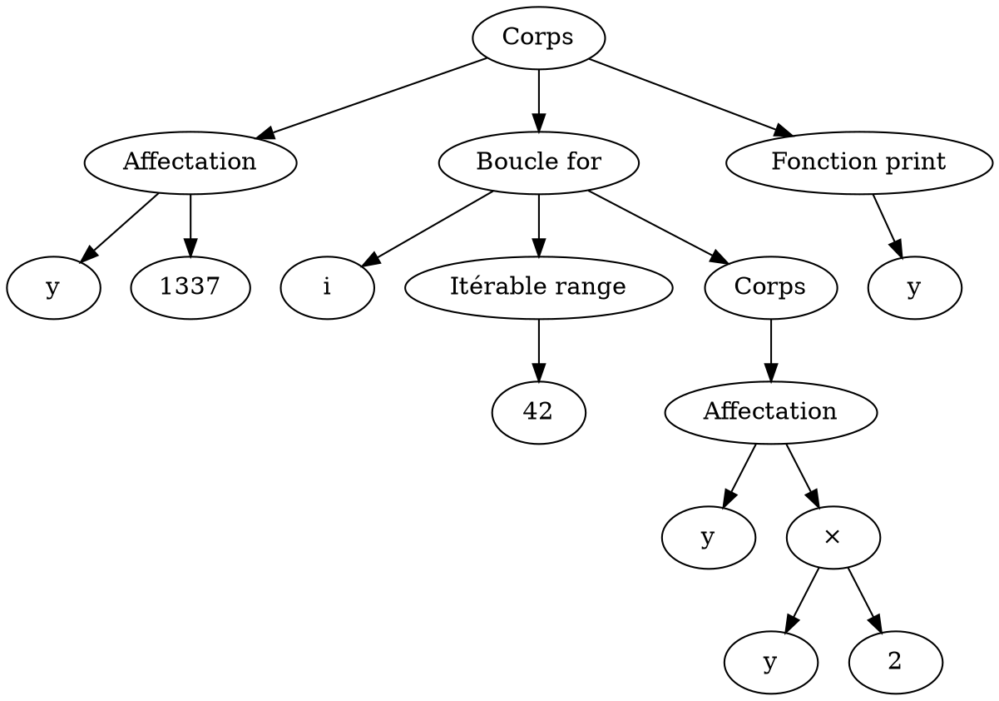
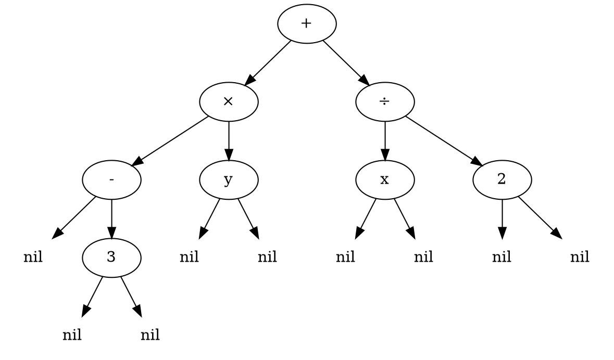
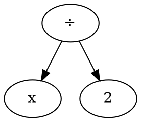

# :deciduous_tree: Arbres binaires {ignore=true}

## Sommaire {ignore=true}

[TOC]

## Exemples introductifs

### Arbre syntaxique
* Une page web, un document `xml`, ou bien un programme informatique peut être représenté par un **arbre**.



Cet arbre pourrait représenter le programme suivant :

```python
y = 1337
for i in range(42):
    y = y * 2
print(y)
```

L'interpréteur Python, quand il lit un programme, commence par le traduire en arbre syntaxique en suivant la grammaire du langage. Il peut détecter à cette occasion une erreur de syntaxe avant même le début de l'exécution du programme.

**Exercice 1** : Chercher lesquels parmi les formats de fichiers suivants peuvent être lus et représentés par un arbre syntaxique.
* Fichier document (`.odt`)
* Fichier image vectorielle (`.svg`)
* Fichier web (`.html`)
* Fichier image matricielle (`.jpg`)


### Expression littérale



Cet **arbre binaire** est une représentation de l'expression $-3y + \frac x 2$.


**Exercice 2** : Dessiner un arbre représentant l'expression $(-x+7)×(y-2) + (5-x^2)$.
> On pourra ne pas dessiner `nil`.


## Définitions

### Nœud
Un nœud contient un élément et des enfants, qui sont d'autres nœuds : zéro, un ou plusieurs nœuds.

> Dans l'exemple précédent, `+`, `×`, `3`, `x`, et les autres sont des nœuds, sauf les `nil` qui représentent l'absence de nœud.

### Arbre enraciné

Un arbre enraciné est un ensemble fini non vide de nœuds, avec un nœud en particulier : la racine de l'arbre. Les nœuds sont organisés de manière hiérarchique dans un graphe :
* Tout nœud est issu de la racine ; le graphe est connexe (il est d'un seul tenant).
* Un nœud ne possède qu'un seul parent ; le graphe est sans cycle (pas de boucle).

### Arbre binaire
Un arbre binaire est un ensemble fini de nœuds qui ont exactement deux enfants, un à gauche, un à droite : des nœuds ou éventuellement `nil` et que l'on pourra alors omettre.

Une définition récursive est alors :
* Un arbre binaire peut avoir zéro nœud, il est alors vide, on le note `nil`.
* Un arbre binaire non vide possède un nœud particulier, sa racine, et deux enfants, un à gauche et un à droite, qui sont des arbres binaires.

> L'arbre binaire ci-dessous est un sous-arbre de l'exemple précédent. On a, cette fois, omis les `Nil`.



> Les arbres binaires sont **presque** des cas particuliers d'arbres enracinés.
> * Un arbre binaire peut être vide, mais pas un arbre enraciné.
> * Sinon, un arbre binaire non vide est un exemple d'arbre enraciné.

### Feuille
* Pour un arbre enraciné, une feuille est un nœud sans enfants.
* Pour un arbre binaire, une feuille est un nœud qui possède deux sous arbres vides.

> Ce sont les extrémités de l'arbre.

Dans le premier exemple, `3`, `y`, `x`, et `2` sont des feuilles.

### Taille d'un arbre

La taille d'un arbre est son nombre de nœuds.

> L'exemple de l'arbre syntaxique est un arbre de taille $8$, dont $4$ feuilles. Il y a donc $8-4$ nœuds intérieurs.


### Hauteur d'un arbre
> ⚠️ La définition de hauteur n'est pas la même partout. Vérifier celle du document que vous lisez.

* Un arbre vide a une hauteur nulle.
* La hauteur d'un arbre non vide est le nombre maximal de **nœuds** de la racine jusqu'à une feuille. C'est aussi le nombre de liens maximal pour joindre la racine à `nil`.

L'arbre syntaxique donné en exemple est de hauteur $4$.

> Dans l'**autre définition très commune**, un arbre vide a pour hauteur $-1$, et s'il est non vide, c'est le nombre maximal de **liens** pour joindre la racine à une feuille.

Même si l'autre est assez répandue, nous préférerons la définition où l'arbre vide est de hauteur nulle. Cette définition et l'autre ne diffère que de $1$.

> La hauteur $h$ est une notion importante pour le calcul de la complexité d'un algorithme. De nombreux algorithmes ont une complexité en $\mathcal O(h)$, et ainsi, un décalage de $1$ dans la définition est absolument **sans importance**.

### Arbre peigne
Un arbre binaire **peigne** est un cas particulier extrême d'arbre binaire, tous les nœuds intérieurs ont un seul fils qui est non vide, et toujours du même côté. Techniquement c'est une liste chainée.

> Un arbre peigne montre une situation extrême où les algorithmes que nous verront ne seront pas efficaces. Avec un arbre peigne, la hauteur est égale à la taille ; on ne peut pas obtenir une plus grande hauteur à taille fixée.

### Arbre parfait
Un arbre binaire **parfait** possède des nœuds intérieurs qui ont tous exactement deux enfants non vides. C'est l'arbre idéal pour les algorithmes... Une taille maximale pour une hauteur minimale.

### Arbre équilibré
Un arbre binaire est **équilibré** si pour chaque nœud, son sous arbre gauche et son sous arbre droit ont une hauteur qui ne diffère que de $1$ au plus.
> Concrètement, un arbre est équilibré quand tous les nœuds intérieurs ont deux enfants non vides, sauf les plus éloignés qui en ont un ou deux. **Techniquement, les enfants vides sont tous à la profondeur maximale**.

### Arbre presque complet (à gauche)
Un arbre binaire est complet (à gauche) s'il est équilibré et qu'à la profondeur maximale les feuilles sont entassées du même côté (à gauche).


> ⚠️ les définitions de complet et équilibré varient parfois, de même en anglais. Vérifier avec le document que vous utilisez.

## Représentation en Python
### Avec un tuple à trois éléments

Un arbre binaire peut être représenté par un ensemble de nœuds de la forme `(fils_gauche, élément, fils_droit)` et avec `None` pour désigner `nil`.

Exemple, l'expression numérique $A = 6×5 - (3+6)$ peut être représentée par :

```python
six_1 = (None, "6", None)
cinq_1 = (None, "5", None)
produit_1 = (six_1, "×", cinq_1)
trois_1 = (None, "3", None)
six_2 = (None, "6", None)
somme_1 = (trois_1, "+", six_2)
A = (produit_1, "-", somme_1)
```

> **Remarque** : on notera la numérotation des nœuds afin d'avoir deux nœuds étiquetés `"six_?"` différents. De même, si plusieurs sommes la composait, l'objectif étant de sécuriser l'éventuel partage de données, même si c'est possible en faisant très attention...

Avec cette représentation on peut donner le code de certaines fonctions.

@import "arbre_binaire_1.py"
```python
```

### Avec une classe `Nœud`

@import "arbre_binaire_2.py"

### Avec un tuple nommé
Le type tuple nommé est peu connu en Python, c'est pourtant un type recommandé au sein du programme de NSI ; il permet d'avoir la légèreté du tuple en ayant une part de l'expressivité de la POO.

@import "arbre_binaire_3.py"

## Parcours d'un arbre binaire

