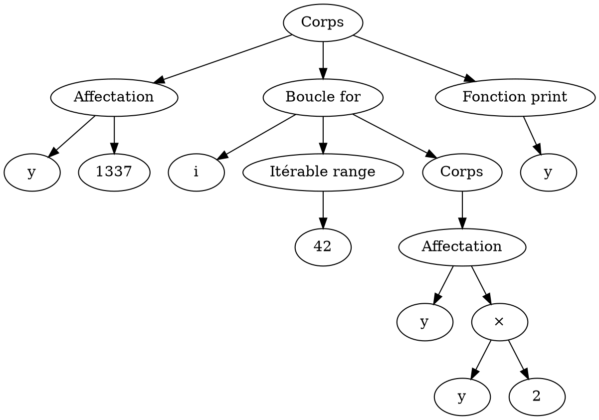
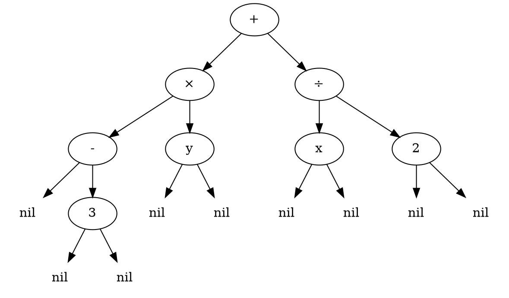
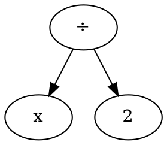
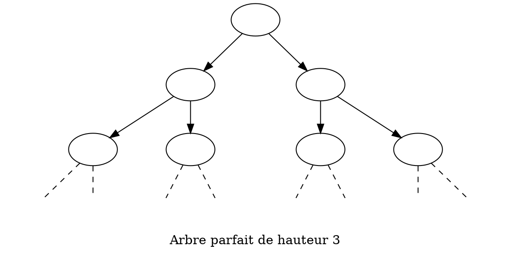
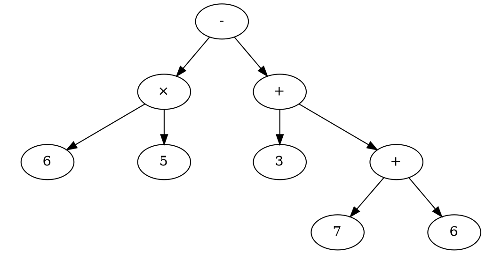

# :christmas_tree: Arbres {ignore=true}

## Sommaire {ignore=true}

[TOC]

## Exemples introductifs

### Arbre syntaxique
* Une page web, un document `xml`, ou bien un programme informatique peut être représenté par un **arbre**.



Cet arbre pourrait représenter le programme suivant :

```python
y = 1337
for i in range(42):
    y = y * 2
print(y)
```

L'interpréteur Python, quand il lit un programme, commence par le traduire en arbre syntaxique en suivant la grammaire du langage. Il peut détecter à cette occasion une erreur de syntaxe avant même le début de l'exécution du programme.

**Exercice 1** : Chercher lesquels parmi les formats de fichiers suivants peuvent être lus et représentés par un arbre syntaxique.
* Fichier document (`.odt`)
* Fichier image vectorielle (`.svg`)
* Fichier web (`.html`)
* Fichier image matricielle (`.jpg`)


### Expression littérale



Cet **arbre binaire** est une représentation de l'expression $-3y + \frac x 2$.


**Exercice 2** : Dessiner un arbre représentant l'expression $(-x+7)×(y-2) + (5-x^2)$.
> On pourra ne pas dessiner `nil`.


## Définitions


### Arbre enraciné

#### Nœud
Un nœud contient un élément et des enfants, qui sont d'autres nœuds : zéro, un ou plusieurs nœuds.

### Arbre enraciné
Un arbre enraciné est un ensemble fini non vide de nœuds, avec un nœud en particulier : la racine de l'arbre. Les nœuds sont organisés de manière hiérarchique dans un graphe :
* Tout nœud est issu de la racine ; le graphe est connexe (il est d'un seul tenant).
* Un nœud ne possède qu'un seul parent ; le graphe est sans cycle (pas de boucle).

### Arbre binaire
#### Nœud
Dans un arbre binaire, un nœud contient un élément et **deux enfants**, qui sont d'autres arbres binaires.

> Dans l'exemple précédent, `+`, `×`, `3`, `x`, et les autres sont des nœuds, sauf les `nil` qui représentent l'absence de nœud.

#### Arbre binaire
Un arbre binaire est un ensemble fini de nœuds qui ont exactement deux enfants, un à gauche, un à droite ; les enfants sont des nœuds ou éventuellement `nil` (une absence de nœud) et que l'on pourra alors omettre.

Une définition récursive est alors :
* Un arbre binaire peut avoir zéro nœud, il est alors vide, on le note `nil`.
* Un arbre binaire non vide possède un nœud particulier, sa racine, et deux enfants, un à gauche et un à droite, qui sont des arbres binaires.

> L'arbre binaire ci-dessous est un sous-arbre de l'exemple précédent. On a, cette fois, omis les `nil`.



> Les arbres binaires sont **presque** des cas particuliers d'arbres enracinés.
> * Un arbre binaire peut être vide, mais pas un arbre enraciné.
> * Sinon, un arbre binaire non vide est un exemple d'arbre enraciné.

Un arbre binaire est aussi un graphe connexe, sans cycle.

### Feuille
* Pour un arbre enraciné, une feuille est un nœud sans enfant.
* Pour un arbre binaire, une feuille est un nœud qui possède deux sous-arbres vides.

> Les feuilles sont les extrémités de l'arbre.

Dans le premier exemple, `3`, `y`, `x`, et `2` sont des feuilles.

### Taille d'un arbre

La taille d'un arbre est son nombre de nœuds.

> L'exemple de l'arbre de l'expression littérale est un arbre de taille $8$, dont $4$ feuilles. Il y a donc $8-4$ nœuds intérieurs.


### Hauteur d'un arbre
> ⚠️ La définition de hauteur n'est pas la même partout. Vérifier celle du document que vous lisez.

* Un arbre vide a une hauteur nulle.
* La hauteur d'un arbre non vide est le nombre maximal de **nœuds** de la racine jusqu'à une feuille. C'est aussi le nombre de liens maximal pour joindre la racine à `nil`.

L'arbre précédent donné en exemple est de hauteur $4$ ; la branche la plus profonde possède les nœuds `+`, `×`, `-`, `3`.

> Dans l'**autre définition très commune**, un arbre vide a pour hauteur $-1$, et s'il est non vide, c'est le nombre maximal de **liens** pour joindre la racine à une feuille.

Même si l'autre est assez répandue, nous préférerons la définition où l'arbre vide est de hauteur nulle. Cette définition et l'autre ne diffère que de $1$.

> La hauteur $h$ est une notion importante pour le calcul de la complexité d'un algorithme. De nombreux algorithmes ont une complexité en $\mathcal O(h)$, et ainsi, un décalage de $1$ dans la définition est absolument **sans importance**.

### Arbre peigne
Un arbre binaire **peigne** est un cas particulier extrême d'arbre binaire, tous les nœuds intérieurs ont un seul enfant qui est non vide, et toujours du même côté. Techniquement c'est une liste chainée.

```dot
digraph expression
{
    ratio = 0.8
    label = "Arbre peigne gauche de hauteur 4"
    "0" [label=""];

    "1" [label=""];
    "1d" [label="",shape=plaintext];
    "0" -> "1";
    "0" -> "1d" [style=dashed, arrowhead=none];

    "2" [label=""];
    "2d" [label="",shape=plaintext];
    "1" -> "2";
    "1" -> "2d" [style=dashed, arrowhead=none];

    "3" [label=""];
    "3d" [label="",shape=plaintext];
    "2" -> "3";
    "2" -> "3d" [style=dashed, arrowhead=none];

    "4" [label="",shape=plaintext];
    "4d" [label="",shape=plaintext];
    "3" -> "4" [style=dashed, arrowhead=none];
    "3" -> "4d" [style=dashed, arrowhead=none];

}
```

> Un arbre peigne montre une situation extrême où certains algorithmes que nous verrons ne seront pas efficaces. Avec un arbre peigne, la hauteur est égale à la taille ; on ne peut pas obtenir une plus grande hauteur à taille fixée.

### Arbre parfait
Un arbre binaire **parfait** possède des nœuds intérieurs qui ont tous exactement deux enfants non vides. C'est l'arbre idéal pour certains algorithmes... Une taille maximale pour une hauteur minimale.




### Arbre équilibré
Un arbre binaire est **équilibré** si pour chaque nœud, son sous-arbre gauche et son sous-arbre droit ont une hauteur qui ne diffère que de $1$ au plus.
> Concrètement, un arbre est équilibré quand tous les nœuds intérieurs ont deux enfants non vides, sauf les plus éloignés qui en ont un ou deux. **Techniquement, les nœuds intérieurs forment un arbre parfait, et l'arbre peut devenir parfait uniquement en complétant avec des feuilles au dernier niveau.**


```dot
digraph expression
{
    ratio = 0.5
    label = "Arbre équilibré"
    "1" [label=""];

    "2" [label=""];
    "3" [label=""];
    "1" -> "2" ;
    "1" -> "3" ;

    "4" [label=""];
    "5" [label="",shape=plaintext];
    "2" -> "4" ;
    "2" -> "5" [style=dashed, arrowhead=none];

    "6" [label=""];
    "7" [label=""];
    "3" -> "6" ;
    "3" -> "7" ;

"8" [label="",shape=plaintext];
"9" [label="",shape=plaintext];
"4" -> "8" [style=dashed, arrowhead=none];
"4" -> "9" [style=dashed, arrowhead=none];


"12" [label="",shape=plaintext];
"13" [label="",shape=plaintext];
"6" -> "12" [style=dashed, arrowhead=none];
"6" -> "13" [style=dashed, arrowhead=none];

"14" [label="",shape=plaintext];
"15" [label="",shape=plaintext];
"7" -> "14" [style=dashed, arrowhead=none];
"7" -> "15" [style=dashed, arrowhead=none];

}
```


### Arbre presque complet (à gauche)
Un arbre binaire est presque complet (à gauche) s'il est équilibré et qu'à la profondeur maximale les feuilles sont entassées du même côté (à gauche).


```dot
digraph expression
{
    ratio = 0.5
    label = "Arbre presque complet"
    "1" [label=""];

    "2" [label=""];
    "3" [label=""];
    "1" -> "2" ;
    "1" -> "3" ;

    "4" [label=""];
    "5" [label=""];
    "2" -> "4" ;
    "2" -> "5" ;

    "6" [label="",shape=plaintext];
    "7" [label="",shape=plaintext];
    "3" -> "6" [style=dashed, arrowhead=none];
    "3" -> "7" [style=dashed, arrowhead=none];

"8" [label="",shape=plaintext];
"9" [label="",shape=plaintext];
"4" -> "8" [style=dashed, arrowhead=none];
"4" -> "9" [style=dashed, arrowhead=none];

"10" [label="",shape=plaintext];
"11" [label="",shape=plaintext];
"5" -> "10" [style=dashed, arrowhead=none];
"5" -> "11" [style=dashed, arrowhead=none];


}
```


> ⚠️ les définitions de (presque) complet et équilibré varient parfois, de même en anglais. Vérifier avec le document que vous utilisez.

## Représentation en Python

Prenons par exemple, l'expression numérique $A = 6×5 - (3+7+6)$ qui peut être représentée par l'arbre binaire suivant. (`nil` non dessinés.)




### Avec un tuple à trois éléments

Un arbre binaire peut être représenté par un ensemble de nœuds de la forme `(enfant_gauche, élément, enfant_droit)` et avec `None` pour désigner `nil`.

Notre exemple peut être alors représenté par :

```python
six_1 = (None, "6", None)
cinq_1 = (None, "5", None)
produit_1 = (six_1, "×", cinq_1)

trois_1 = (None, "3", None)

sept_1 = (None, "7", None)
six_2 = (None, "6", None)
somme_1 = (sept_1, "+", six_2)

somme_2 = (trois_1, "+", somme_1)
expr_A = (produit_1, "-", somme_2)
```

> **Remarque** : on notera la numérotation des nœuds afin d'avoir deux nœuds étiquetés `"six_?"` différents. De même, plusieurs sommes le composent, l'objectif étant de sécuriser l'éventuel partage de données, même si c'est possible en faisant très attention...

Avec cette représentation on peut donner le code de certaines fonctions.

@import "arbre_binaire_1.py"

On remarquera que ce code est bien moins lisible que les suivants. Nous n'utiliserons plus ici les tuples avec les indices pour accéder aux champs de données !

### Avec une classe `Nœud`

@import "arbre_binaire_2.py"

On remarque un code bien plus lisible et extensible à volonté. **Très bon choix.**

### Avec un tuple nommé
Le type tuple nommé est peu connu en Python, c'est pourtant un type recommandé au sein du programme de NSI ; il permet d'avoir la légèreté du tuple en ayant une part de l'expressivité de la POO.

> Lire [la documentation officielle](https://docs.python.org/fr/3/library/collections.html#collections.namedtuple) ; On constatera ici, qu'après la redéfinition de `Nœud`, la suite du code est inchangée !

@import "arbre_binaire_3.py"

On remarque un code aussi clair, moins extensible mais plus léger en empreinte mémoire. À utiliser en cas de volonté d'optimisation temporelle mais surtout mémoire. (Ou alors pour préparer une initiation à la POO ???)

> Nous utiliserons la POO pour la suite, pour sa lisibilité, son extensibilité. Nous ne cherchons pas ici les performances.

## Parcours en profondeur d'un arbre binaire

Les fonctions que nous avons découvertes utilisaient des opérateurs commutatifs, en effet on a `max(a, b) == max(b, a)` et `1 + x + y == x + 1 + y == y + x + 1`. Que se passe-t-il avec des fonctions non commutatives ?

> Si on conserve une action à gauche avant celle de droite, alors il reste trois positions pour appliquer l'action sur le nœud en cours.

**Exercice 3** : Appliquer les fonctions suivantes. **Vous ferez sur papier** les parcours avec `action` définie comme « afficher le nœud en cours », sur l'arbre de notre exemple.

```python
def parcours_préfixe(arbre, action):
    if not est_vide(arbre):
        action(arbre)
        parcours_préfixe(arbre.gauche)
        parcours_préfixe(arbre.droite)

def parcours_infixe(arbre, action):
    if not est_vide(arbre):
        parcours_infixe(arbre.gauche)
        action(arbre)
        parcours_infixe(arbre.droite)

def parcours_postfixe(arbre, action):
    if not est_vide(arbre):
        parcours_postfixe(arbre.gauche)
        parcours_postfixe(arbre.droite)
        action(arbre)
```

---

Ceci est un dessin humoristique lié aux parcours d'arbre.

[](https://xkcd.com/2407/)

## Exercices sur les arbres binaires

### Exercice 4 - Dessiner des arbres
> Dessiner à la main tous les arbres binaires ayant trois ou quatre nœuds.

**Facultatif :** Pour dessiner des arbres dans un document écrit en Markdown, on regardera le code source de ce document...

### Exercice 5 - Dénombrement des arbres binaires
* Il y a $1$ arbre binaire ayant $0$ nœud, l'arbre vide.
* Il y a $1$ arbre binaire ayant $1$ nœud.
* Il y a $2$ arbres binaires ayant $2$ nœuds.
* Il y a $5$ arbres binaires ayant $3$ nœuds.
* Il y a $14$ arbres binaires ayant $4$ nœuds.
> Combien y a-t-il d'arbres binaires ayant $5$ nœuds. *(Ne pas tous les dessiner ; trouver juste le moyen de tous les dénombrer.)*

### Exercice 6 - Parcours infixe
On considère l'arbre binaire suivant :

```dot
digraph expression
{
    ratio = 0.5
    label = "exemple_6"
    "A" -> "B" [weight=0.75];
    "A" -> "D" [weight=0.75];
    "Bg" [label="",shape=plaintext]
    "B" -> "Bg" [style=dashed, arrowhead=none];
    "B" -> "C";
    "Cg" [label="",shape=plaintext]
    "C" -> "Cg" [style=dashed, arrowhead=none];
    "Cd" [label="",shape=plaintext]
    "C" -> "Cd" [style=dashed, arrowhead=none];
    "Dg" [label="",shape=plaintext]
    "D" -> "Dg" [style=dashed, arrowhead=none];
    "Dd" [label="",shape=plaintext]
    "D" -> "Dd" [style=dashed, arrowhead=none];
    
}
```

1. Construire sa représentation interne en Python à l'aide de la classe `Nœud`.
2. Écrire une fonction `affichage` définie par :
    * sur un arbre vide, ne rien faire ;
    * sur un arbre non vide, 
        * afficher `(`, puis
        * afficher (récursivement) le sous-arbre gauche, puis
        * afficher la racine, puis
        * afficher (récursivement) le sous-arbre droite, puis
        * afficher `)`
3. Vérifier que `affichage(exemple_6)` produit `'((B(C))A(D))'`.
4. Dessiner un `arbre` dont `affichage(arbre)` produit `'(1((2)3))'`.
5. De manière générale, expliquer comment retrouver un arbre dont l'affichage est donné.

### Exercice 7 - Parcours en largeur
* Pour afficher (ou faire une autre action) un arbre avec un parcours en largeur :
    * On utilise une file initialement vide.
    * On enfile l'arbre (son nœud racine, ou nil) dans la file.
    * Tant que la file est non vide :
        * On défile un arbre.
        * S'il n'est pas nil, c'est un nœud et :
            * On affiche (ou un traîte suivant une action) l'`élément` du nœud.
            * On enfile le sous-arbre gauche (puis droit).
1. Écrire une fonction de parcours en largeur.
2. Tester votre fonction.
3. Vérifier qu'elle consiste à lire l'arbre étage par étage en commençant par la racine, puis de gauche à droite pour chaque étage.
4. Modifier votre fonction pour qu'une étiquette soit affichée avec son niveau. La racine est au niveau `0`.

### Exercice 8 - Reconstruire un arbre

Un arbre binaire est étiqueté avec des lettres.
* Un parcours préfixe donne un affichage `ALORHGIMET`.
* Un parcours infixe donne un affichage `OLHRAMIEGT`.

1. Reconstruire l'arbre qui a produit ces affichages.
2. Qu'obtient-on avec un parcours en largeur ?
3. Qu'obtient-on avec un parcours postfixe ?

