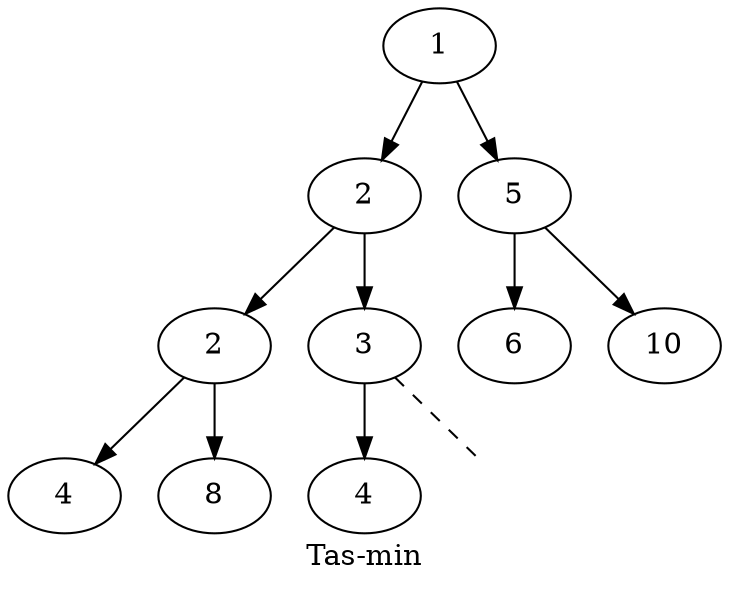

# :grapes: Tas binaire {ignore=true}

## Sommaire {ignore=true}

[TOC]

On considère des arbres binaires particuliers, avec des données toutes de même type, un type qui possède une relation d'ordre. Par exemple : des entiers, on peut les comparer.

## Définition

Un **tas binaire** (ou **tas-max**) est un arbre binaire presque complet à gauche, tel que :
* le nœud racine porte une donnée supérieure ou égale à celle des autres nœuds ;
* ses deux sous-arbres sont aussi des tas.

Un **tas-min** est une structure équivalente mais avec la racine portant une valeur inférieure ou égale à celles de sa filiation.

> La structure de tas binaire est utilisée dans un algorithme de tri efficace (le tri par tas), dans la gestion des files de priorité, etc.

### Exemple




## Construction d'une classe `Tas`

### La classe `Nœud`
On reprend notre classe `Nœud` pour les arbres binaires.

```python
class Nœud:
    def __init__(self, gauche, élément, droite):
        self.gauche = gauche
        self.élément = élément
        self.droite = droite

def __repr__(self):
    return str(self.élément)
```

On a ajouté une méthode pour donner la **repr**ésentation d'un nœud, qui poura être utilisée par `str(mon_nœud)` par exemple.

### La classe `Tas_min`

On construit une autre classe qui utilisera la classe `Nœud`. Nous ne construisons pas celle-ci par héritage.
> L'héritage est hors-programme en NSI. Le principe de l'héritage est de construire une nouvelle classe sur la base d'une autre, elle héritera de ses méthodes qu'il sera inutile de réécrire. Les méthodes pourront toutefois être réécrites en utilisant éventuellement celle de l'ancêtre ; au choix. Des méthodes pourront être ajoutées...


