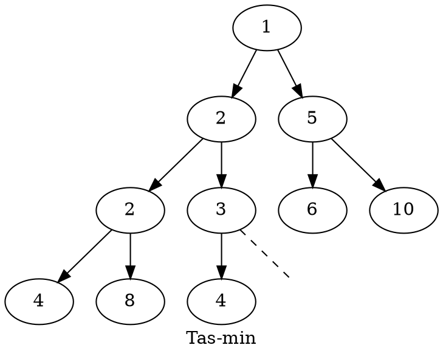

# :grapes: Tas binaire {ignore=true}

## Sommaire {ignore=true}

[TOC]

On considère des arbres binaires particuliers, avec des données toutes de même type, un type qui possède une relation d'ordre. Par exemple : des entiers, on peut les comparer.

## Définition

Un **tas binaire** (ou **tas-max**) est un arbre binaire presque complet à gauche, tel que s'il est non vide :
* le nœud racine porte une donnée supérieure ou égale à celle des autres nœuds ;
* ses deux sous-arbres sont aussi des tas.

Un **tas-min** est une structure équivalente mais avec la racine portant une valeur inférieure ou égale à celles de sa filiation.

> La structure de tas binaire est utilisée dans un algorithme de tri efficace (le tri par tas), dans la gestion des files de priorité, etc.

### Exemple

## Construction d'une classe `Tas`

### Implémentation avec un tableau

Tout arbre binaire presque complet gauche peut être implémenté en stockant les données dans un tableau.
* L'indice $0$ ne stocke pas de données, ou alors peut servir à stocker la taille en cours du tableau.
* Si l'arbre est non vide, sa racine est stockée à l'indice $1$.
* Pour tout nœud stocké à l'indice $i$, ses enfants sont stockés aux indices $2i$ et $2i+1$.

Par exemple, le tas-max précédent peut être stocké dans le tableau :

|Indice |$0$ |$1$ |$2$ |$3$ |$4$ |$5$ |$6$ |$7$ |$8$ |$9$ |$10$|
|-------|:--:|:--:|:--:|:--:|:--:|:--:|:--:|:--:|:--:|:--:|:--:|
|Élément|    |$10$|$8$ |$4$ |$5$ |$6$ |$2$ |$1$ |$4$ |$2$ |$3$ |

Ce tableau correspond à une lecture lors d'un parcours en largeur.

**Exercice 1** : Donner le tableau correspondant au tas-min donné en exemple.

**Exercice 2** : Compléter
> Cette implémentation permet de se déplacer facilement à partir d'un nœud.
> * L'enfant gauche d'un nœud stocké à l'indice $i$ est stocké à l'indice ...
> * L'enfant droite d'un nœud stocké à l'indice $i$ est stocké à l'indice ...
> * Le parent d'un nœud **stocké à l'indice $i > 1$** est stocké à l'indice ...

### La classe `Tas`

On propose de stocker :
* Les données dans une liste dynamique Python, avec l'élément d'indice $0$ mis à `None`.
* La taille dans un attribut stocké à part

> La taille est souvent stockée à l'indice $0$. Nous ne le ferons pas, en effet, la taille est un entier, mais les éléments du tas ne le sont peut-être pas !

On propose les méthodes :
* Initialisation, qui fait suite au constructeur ;
* `.est_vide(self)` qui indique la vacuité du tas, ou non ;
* `.ajout(self, x)` qui ajoute un élément au tas (en respectant les règles) ;
* `.extrait(self)` qui supprime et renvoie l'élément à la racine, si l'arbre est non vide, en réagençant le tas en respectant les règles.

@import "tas.py"
