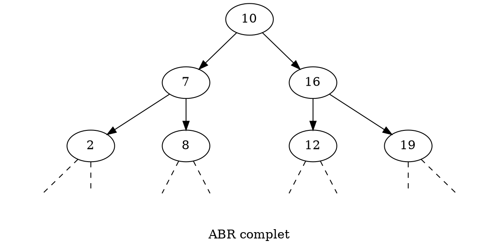
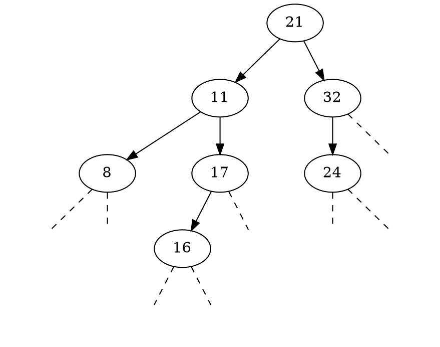

# :dart: Arbre binaire de recherche {ignore=true}

## Sommaire {ignore=true}

[TOC]

On considère des arbres binaires particuliers, avec des données toutes de même type, un type qui possède une relation d'ordre. Par exemple : des entiers, on peut les comparer.

## Définition

Un **arbre binaire de recherche (ABR)** est un arbre binaire, tel que s'il est non vide :
* le nœud racine porte une donnée supérieure ou égale à celle de son enfant gauche (s'il existe) ;
* le nœud racine porte une donnée inférieure ou égale à celle de son enfant droite (s'il existe) ;
* ses deux sous-arbres sont aussi des ABR.

Les inégalités sont parfois strictes pour obtenir des éléments distincts, parfois strictes d'un seul côté.

> En anglais : *binary search tree (BST)*.

### Exemples

#### Un ABR peut être complet



#### Un ABR peut être un peigne

```dot
digraph expression
{
    ratio = 0.8
    label = "ABR peigne gauche"
    "0" [label="10"];

    "1" [label="7"];
    "1d" [label="",shape=plaintext];
    "0" -> "1";
    "0" -> "1d" [style=dashed, arrowhead=none];

    "2" [label="6"];
    "2d" [label="",shape=plaintext];
    "1" -> "2";
    "1" -> "2d" [style=dashed, arrowhead=none];

    "3" [label="2"];
    "3d" [label="",shape=plaintext];
    "2" -> "3";
    "2" -> "3d" [style=dashed, arrowhead=none];

    "4" [label="",shape=plaintext];
    "4d" [label="",shape=plaintext];
    "3" -> "4" [style=dashed, arrowhead=none];
    "3" -> "4d" [style=dashed, arrowhead=none];

}
```

#### ABR en général

Un ABR peut être complet, peigne, équilibré, presque complet, mais en général peut être de toute forme d'arbre binaire.

> Nous verrons que de nombreux algorithmes sont efficaces lorsque l'arbre est équilibré (ou presque) et peu efficaces lorsqu'il y a la présence d'une partie peigne importante.

## Exercices débranchés

### Constructions d'ABR

Pour construire un ABR, on peut partir d'un ABR vide, et ajouter des nœuds en respectant la règle des ABR.

1. Montrer qu'en ajoutant successivement les nombres $[10, 7, 16, 2, 8, 12, 19]$ on retrouve l'ABR complet donné en exemple.
2. Trouver une autre liste permettant de construire le **même** ABR. Cette liste est une permutation de la première !
3. Trouver deux autres permutations de cette liste qui donnent trois ABR **différents**.
4. Quels sont les types d'ABR qui ne peuvent se construire qu'avec une unique liste ? 

### Recherche dans un ABR
> Pour chaque question, on demande quelques phrases claires. On se place comme une machine qui n'a pas la vision d'ensemble de l'ABR, mais qui a seulement l'accès à la racine (si elle existe), et à ses enfants de manière récursive...
1. Expliquer comment faire pour rechercher la présence d'un élément dans un ABR.
2. Pour un ABR donné, quel est le pire des cas pour le nombre d'étapes dans la recherche d'un élément.
3. Pour une taille donnée, quel est le pire type d'ABR qui peut donner le pire nombre d'étapes dans la recherche d'un élément.
4. Pour une taille donnée, quel est le meilleur type d'ABR qui permet de trouver un élément, dans le pire des cas, en le moins d'étapes.
5. Expliquer comment trouver l'élément minimal (resp. maximal) d'un ABR non vide.


### Suppression dans un ABR

> La suppression dans un ABR n'est pas au programme en NSI. Cependant, on peut découvrir **pourquoi** !

1. Montrer, en utilisant un exemple précédent, que la suppression d'un nœud est un problème qui n'est pas trivial ; qu'il y a du travail à réaliser pour obtenir un ABR suite à la suppression d'un nœud.

2. Donner des exemples où la suppression d'un nœud est triviale ; il n'y a pas beaucoup de travail à effectuer.

3. **Hors programme** : Expliquer comment supprimer un nœud d'un ABR.


## Implémentation

On va reprendre notre class `Nœud`, et on va créer une autre classe `ABR` qui **utilise** simplement la classe `Nœud`, mais **pas par héritage**.

> L'héritage est hors-programme en NSI. Le principe de l'héritage est de construire une nouvelle classe **sur la base d'une autre**, elle héritera de ses méthodes qu'il sera inutile de réécrire. Les méthodes pourront toutefois être réécrites en utilisant éventuellement celle de l'ancêtre ; au choix. Des méthodes pourront être ajoutées...

@import "ABR.py"

## Étude de la complexité
On suppose que l'ABR est de taille $n$, et de hauteur $h$.
1. Quelle est la complexité, en fonction de $h$, pour la recherche, l'ajout (ou la suppression) d'un élément ?
2. Si l'arbre est équilibré (ou presque), quelle est la complexité en fonction de $n$ ?
2. Si l'arbre est un peigne (ou presque), quelle est la complexité en fonction de $n$ ?

> Les méthodes que nous avons vues ne garantissent pas de conserver un arbre équilibré (ou presque). Les solutions étudiées post BAC seront les arbres AVL ou encore les arbres rouges et noirs.

## Exercices

### Nombre d'occurrences
On suppose qu'on a un ABR où un élément peut être présent plusieurs fois, et que donc les inégalités dans la définition se comprennent au sens large.
1. Donner une méthode efficace `.nb_occurrences(self, élément)` qui renvoie le nombre d'occurrences de `élément` dans l'ABR `self`. Cette méthode ne doit rien pré-supposer sur la méthode de construction de l'ABR, mais uniquement qu'il respecte les règles.

### Méthode vers liste triée
1. Écrire une méthode de la classe `ABR` qui renvoie la liste de ses éléments dans l'ordre croissant.
2. Un tri de liste peut être réalisé en construisant un ABR à partir d'une liste non triée, puis en utilisant la question 1, et obtenir la liste triée. Quelle est l'efficacité (temps et mémoire) de ce tri ?

### ABR de chaîne de caractères
1. En considérant l'ordre lexicographique, construire à la main un ABR presque complet ayant les étiquettes :
`["Pascal", "Sylvain", "Claire", "Marie", "Sandrine", "Manu", "Clarence", "Martin", "Severine", "Claude", "Patricia", "Sonia", "Joël", "Alain"]`
2. Ajouter cinq prénoms à cet ABR.

### Ajout si absent

Réécrire la classe ABR avec une unique méthode `ajout_si_absent(élément)` qui ajoute un élément uniquement s'il était absent, et renvoie `True` s'il était absent et `False` sinon. Cette méthode doit être efficace et ne parcourir qu'une fois l'ABR.

```python
>>> abr = ABR()
>>> abr.ajout_si_absent(42)
True
>>> abr.ajout_si_absent(1337)
True
>>> abr.ajout_si_absent(42)
False
```


### FranceIOI

Faire les exercices suivants, sans utiliser les facilités du langage Python que sont les ensembles. Utiliser une classe `ABR` et uniquement des méthodes simples que l'on pourrait écrire dans de nombreux langages.


* [Densité du plastique](http://www.france-ioi.org/algo/task.php?idChapter=525&idTask=756)
 * [Carte de cinéma](http://www.france-ioi.org/algo/task.php?idChapter=527&idTask=1796)

> Conseils :
> 1. Pour 'Densité du plastique'. Utiliser simplement la classe `ABR` du cours. Vous ne pourrez passer que les tests 1 à 7 et le 9.
> 2. Pour 'Carte de cinéma'. Utiliser votre réécriture avec `ajoute_si_absent`. Vous ne pourrez pas passer les tests 9 et 10.

## Visualisation des ABR (Bonus)

Votre professeur vous offre deux outils de visualisation de vos ABR. Un outil à utiliser dans un terminal, un autre pour obtenir un graphique `GraphViz` avec le langage dot.

### Dans un terminal

```python
    def est_feuille(self):
        return self.racine.gauche.est_vide() and self.racine.droite.est_vide()
    
    def _repr(self, préfixe):
        # Auteur: Franck CHAMBON
        if self.est_vide():
                return [préfixe[:-3] + '--']

        sortie = [préfixe[:-3] + '-- :' + str(self.racine.élément)]
        if not(self.est_feuille()):
            sortie.extend(self.racine.droite._repr(préfixe + '|   '))
            sortie.extend(self.racine.gauche._repr(préfixe + '    '))
        return sortie

    def __repr__(self):
        return "\n".join(self._repr('   '))
```

Ce code ajouté à votre classe `ABR` vous permet d'obtenir un affichage console rudimentaire de votre arbre. La fonction `__repr__` est automatiquement appelée par le terminal dans l'exemple suivant :

```python
>>> import ABR
>>> exemple_abr = ABR.ABR()
>>> for x in [21, 32, 11, 17, 24, 8, 16]: exemple_abr.ajout(x)
>>> exemple_abr
-- :21
   |-- :32
   |   |--
   |    -- :24
    -- :11
       |-- :17
       |   |--
       |    -- :16
        -- :8
```

En penchant la tête, on retrouve une lecture de l'ABR.

Vous pouvez aussi l'utiliser pour déboguer votre code, il suffit d'ajouter un `print(repr(votre_abr))` à la place d'un (très vilain) `print(votre_variable_inconnue)`, ou bien d'utiliser un bon explorateur de variables dans votre éditeur préféré, s'il en dispose d'un.

### Utilisation de GraphViz
Il y a plusieurs façons d'utiliser GraphViz ; un outil de visualisation de graphe, comme son nom l'indique. Une façon est d'indiquer qu'on utilise le langage `dot`.
1. On peut, comme dans ce document dont le code source est en Markdown, inclure du code `dot`. Pour ce faire, voir la [documentation](https://shd101wyy.github.io/markdown-preview-enhanced/#/diagrams?id=graphviz).
2. On peut utiliser un [outil en ligne](https://dreampuf.github.io/GraphvizOnline/) pour visualiser son graphe.
3. On peut installer aussi le logiciel...

> Mais comment obtenir le code `dot` pour votre ABR ?
>> Votre professeur vous offre une méthode `__str__` qui vous renvoie le code `dot` pour afficher votre ABR. Mais aussi une méthode `affiche_en_ligne` qui donne un lien internet direct vers votre ABR. **Magique.**

```python
    def __str__(self):
        # Auteur : Franck CHAMBON
        code_dot = []
        ajout = code_dot.append
        ajout("digraph arbre {")
        sous_arbres = File()
        sous_arbres.enfile((1, self))
        while not sous_arbres.est_vide():
            id_sous_arbre, sous_arbre = sous_arbres.défile()
            if sous_arbre.est_vide():
                ajout(f'    {id_sous_arbre} [label="", shape=plaintext];')
            else:
                ajout(f'    "{id_sous_arbre}" [label="{sous_arbre.racine.élément}"];')
                id_gauche = 2*id_sous_arbre + 0
                id_droite = 2*id_sous_arbre + 1
                sous_arbres.enfile((id_gauche, sous_arbre.racine.gauche))
                sous_arbres.enfile((id_droite, sous_arbre.racine.droite))
                style_gauche = "[style=dashed, arrowhead=none]" if sous_arbre.racine.gauche.est_vide() else ""
                ajout(f'    "{id_sous_arbre}" -> "{id_gauche}"' + style_gauche +' ;')
                style_droite = "[style=dashed, arrowhead=none]" if sous_arbre.racine.droite.est_vide() else ""
                ajout(f'    "{id_sous_arbre}" -> "{id_droite}"' + style_droite +' ;')
        ajout('}')
        sortie = '\n'.join(code_dot)
        return sortie

    def affiche_en_ligne(self):
        """

        >>> exemple_abr = ABR()
        >>> for x in [21, 32, 11, 17, 24, 8, 16]: exemple_abr.ajoute(x)
        >>> exemple_abr.affiche_en_ligne()
        'https://dreampuf.github.io/GraphvizOnline/#digraph%20arbre%20%7B%0A%20%20%20%20%221%22%20%5Blabel%3D%2221%22%5D%3B%0A%20%20%20%20%221%22%20-%3E%20%222%22%20%3B%0A%20%20%20%20%221%22%20-%3E%20%223%22%20%3B%0A%20%20%20%20%222%22%20%5Blabel%3D%2211%22%5D%3B%0A%20%20%20%20%222%22%20-%3E%20%224%22%20%3B%0A%20%20%20%20%222%22%20-%3E%20%225%22%20%3B%0A%20%20%20%20%223%22%20%5Blabel%3D%2232%22%5D%3B%0A%20%20%20%20%223%22%20-%3E%20%226%22%20%3B%0A%20%20%20%20%223%22%20-%3E%20%227%22%5Bstyle%3Ddashed%2C%20arrowhead%3Dnone%5D%20%3B%0A%20%20%20%20%224%22%20%5Blabel%3D%228%22%5D%3B%0A%20%20%20%20%224%22%20-%3E%20%228%22%5Bstyle%3Ddashed%2C%20arrowhead%3Dnone%5D%20%3B%0A%20%20%20%20%224%22%20-%3E%20%229%22%5Bstyle%3Ddashed%2C%20arrowhead%3Dnone%5D%20%3B%0A%20%20%20%20%225%22%20%5Blabel%3D%2217%22%5D%3B%0A%20%20%20%20%225%22%20-%3E%20%2210%22%20%3B%0A%20%20%20%20%225%22%20-%3E%20%2211%22%5Bstyle%3Ddashed%2C%20arrowhead%3Dnone%5D%20%3B%0A%20%20%20%20%226%22%20%5Blabel%3D%2224%22%5D%3B%0A%20%20%20%20%226%22%20-%3E%20%2212%22%5Bstyle%3Ddashed%2C%20arrowhead%3Dnone%5D%20%3B%0A%20%20%20%20%226%22%20-%3E%20%2213%22%5Bstyle%3Ddashed%2C%20arrowhead%3Dnone%5D%20%3B%0A%20%20%20%207%20%5Blabel%3D%22%22%2C%20shape%3Dplaintext%5D%3B%0A%20%20%20%208%20%5Blabel%3D%22%22%2C%20shape%3Dplaintext%5D%3B%0A%20%20%20%209%20%5Blabel%3D%22%22%2C%20shape%3Dplaintext%5D%3B%0A%20%20%20%20%2210%22%20%5Blabel%3D%2216%22%5D%3B%0A%20%20%20%20%2210%22%20-%3E%20%2220%22%5Bstyle%3Ddashed%2C%20arrowhead%3Dnone%5D%20%3B%0A%20%20%20%20%2210%22%20-%3E%20%2221%22%5Bstyle%3Ddashed%2C%20arrowhead%3Dnone%5D%20%3B%0A%20%20%20%2011%20%5Blabel%3D%22%22%2C%20shape%3Dplaintext%5D%3B%0A%20%20%20%2012%20%5Blabel%3D%22%22%2C%20shape%3Dplaintext%5D%3B%0A%20%20%20%2013%20%5Blabel%3D%22%22%2C%20shape%3Dplaintext%5D%3B%0A%20%20%20%2020%20%5Blabel%3D%22%22%2C%20shape%3Dplaintext%5D%3B%0A%20%20%20%2021%20%5Blabel%3D%22%22%2C%20shape%3Dplaintext%5D%3B%0A%7D'

        """
        sortie = self.__str__()
        for x, y in [(" ", "%20"), ("\n", "%0A"), ("{", "%7B"), ('"', "%22"),
                     ("[", "%5B") ,("]", "%5D"), ("=", "%3D"), (";", "%3B"),
                     (">", "%3E"), (",", "%2C"), ("}", "%7D")]:
            sortie = sortie.replace(x, y)
        return "https://dreampuf.github.io/GraphvizOnline/#" + sortie
```

**Utilisation.** Comme précédemment, mais avec l'usage explicite de `print` en console ou en script.

```python
>>> import ABR
>>> exemple_abr = ABR.ABR()
>>> for x in [21, 32, 11, 17, 24, 8, 16]: exemple_abr.ajout(x)
>>> print(exemple_abr) # pour le code dot
>>> exemple_abr.affiche_en_ligne() # pour un lien Internet direct
```

```
https://dreampuf.github.io/GraphvizOnline/#digraph%20arbre%20%7B%0A%20%20%20%20%221%22%20%5Blabel%3D%2221%22%5D%3B%0A%20%20%20%20%221%22%20-%3E%20%222%22%20%3B%0A%20%20%20%20%221%22%20-%3E%20%223%22%20%3B%0A%20%20%20%20%222%22%20%5Blabel%3D%2211%22%5D%3B%0A%20%20%20%20%222%22%20-%3E%20%224%22%20%3B%0A%20%20%20%20%222%22%20-%3E%20%225%22%20%3B%0A%20%20%20%20%223%22%20%5Blabel%3D%2232%22%5D%3B%0A%20%20%20%20%223%22%20-%3E%20%226%22%20%3B%0A%20%20%20%20%223%22%20-%3E%20%227%22%5Bstyle%3Ddashed%2C%20arrowhead%3Dnone%5D%20%3B%0A%20%20%20%20%224%22%20%5Blabel%3D%228%22%5D%3B%0A%20%20%20%20%224%22%20-%3E%20%228%22%5Bstyle%3Ddashed%2C%20arrowhead%3Dnone%5D%20%3B%0A%20%20%20%20%224%22%20-%3E%20%229%22%5Bstyle%3Ddashed%2C%20arrowhead%3Dnone%5D%20%3B%0A%20%20%20%20%225%22%20%5Blabel%3D%2217%22%5D%3B%0A%20%20%20%20%225%22%20-%3E%20%2210%22%20%3B%0A%20%20%20%20%225%22%20-%3E%20%2211%22%5Bstyle%3Ddashed%2C%20arrowhead%3Dnone%5D%20%3B%0A%20%20%20%20%226%22%20%5Blabel%3D%2224%22%5D%3B%0A%20%20%20%20%226%22%20-%3E%20%2212%22%5Bstyle%3Ddashed%2C%20arrowhead%3Dnone%5D%20%3B%0A%20%20%20%20%226%22%20-%3E%20%2213%22%5Bstyle%3Ddashed%2C%20arrowhead%3Dnone%5D%20%3B%0A%20%20%20%207%20%5Blabel%3D%22%22%2C%20shape%3Dplaintext%5D%3B%0A%20%20%20%208%20%5Blabel%3D%22%22%2C%20shape%3Dplaintext%5D%3B%0A%20%20%20%209%20%5Blabel%3D%22%22%2C%20shape%3Dplaintext%5D%3B%0A%20%20%20%20%2210%22%20%5Blabel%3D%2216%22%5D%3B%0A%20%20%20%20%2210%22%20-%3E%20%2220%22%5Bstyle%3Ddashed%2C%20arrowhead%3Dnone%5D%20%3B%0A%20%20%20%20%2210%22%20-%3E%20%2221%22%5Bstyle%3Ddashed%2C%20arrowhead%3Dnone%5D%20%3B%0A%20%20%20%2011%20%5Blabel%3D%22%22%2C%20shape%3Dplaintext%5D%3B%0A%20%20%20%2012%20%5Blabel%3D%22%22%2C%20shape%3Dplaintext%5D%3B%0A%20%20%20%2013%20%5Blabel%3D%22%22%2C%20shape%3Dplaintext%5D%3B%0A%20%20%20%2020%20%5Blabel%3D%22%22%2C%20shape%3Dplaintext%5D%3B%0A%20%20%20%2021%20%5Blabel%3D%22%22%2C%20shape%3Dplaintext%5D%3B%0A%7D
```

On obtient un lien, que l'on peut copier et ouvrir avec son navigateur Internet. Le code obtenu est ici :

```
digraph arbre {
    "1" [label="21"];
    "1" -> "2" ;
    "1" -> "3" ;
    "2" [label="11"];
    "2" -> "4" ;
    "2" -> "5" ;
    "3" [label="32"];
    "3" -> "6" ;
    "3" -> "7"[style=dashed, arrowhead=none] ;
    "4" [label="8"];
    "4" -> "8"[style=dashed, arrowhead=none] ;
    "4" -> "9"[style=dashed, arrowhead=none] ;
    "5" [label="17"];
    "5" -> "10" ;
    "5" -> "11"[style=dashed, arrowhead=none] ;
    "6" [label="24"];
    "6" -> "12"[style=dashed, arrowhead=none] ;
    "6" -> "13"[style=dashed, arrowhead=none] ;
    7 [label="", shape=plaintext];
    8 [label="", shape=plaintext];
    9 [label="", shape=plaintext];
    "10" [label="16"];
    "10" -> "20"[style=dashed, arrowhead=none] ;
    "10" -> "21"[style=dashed, arrowhead=none] ;
    11 [label="", shape=plaintext];
    12 [label="", shape=plaintext];
    13 [label="", shape=plaintext];
    20 [label="", shape=plaintext];
    21 [label="", shape=plaintext];
}
```

Et le résultat :

