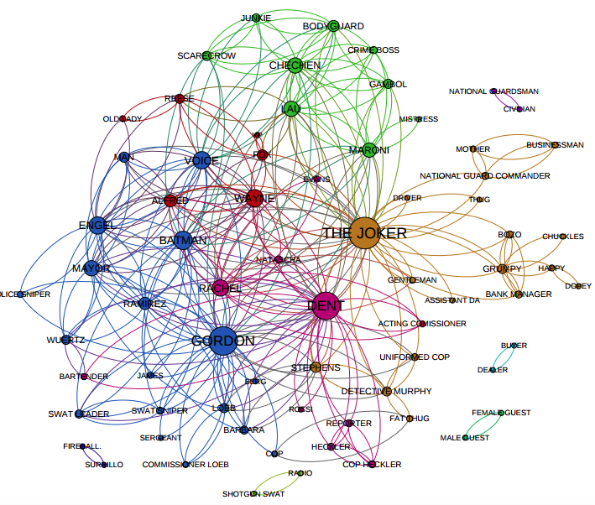
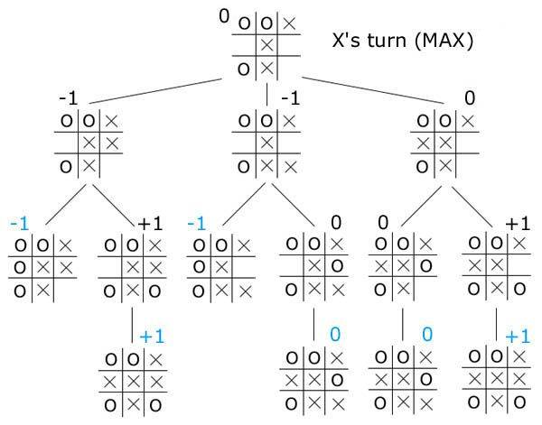

# :diamond_shape_with_a_dot_inside: Graphes {ignore=true}

## Sommaire {ignore=true}

[TOC]

## Exemples introductifs

### Réseaux et cartes
#### Réseau social



Sur ce graphe, on constate qu'il y a une grosse **composante connexe**, et quelques petites.

#### Réseau routier, cartes


Sur ce graphe, les **sommets** sont des lieux sur la carte, et les **arcs** sont des routes les reliant.

On pourrait ajouter des flèches, pour indiquer les sens uniques. Dans ce cas, le graphe serait **orienté**.

#### Labyrinthe


Voici un labyrinthe qui n'est pas parfait, il y a un îlot. On ne peut pas en sortir en utilisant la technique de la main gauche (ou droite) si on part d'un point entre $D$ et $F$.

À droite, on voit une modélisation sous forme de graphe, dont on pourra faire un **parcours**.

### Positions à un jeu


Dans un jeu où on ne retrouve pas deux fois dans la même partie la même position, le graphe des positions est **sans cycle**, donc un arbre. Ici, on peut prouver qu'il y a match nul pour deux joueurs qui ont la meilleure stratégie.
* Les feuilles sont des parties finies, $-1$ pour une défaite de `X`, $+1$ pour une victoire, et $0$ pour un nul.
* À chaque étage, pour remonter
    * si c'est le tour de `X`, on prend le maximum des possibilités.
    * Si c'est le tour de `O`, on prend le minimum des possibilités.


### Graphes de prérequis

Ce graphe indique les modules requis pour accéder à d'autres dans un cursus universitaire en informatique.

Ce genre de graphe est utilisé, par exemple, en compilation, où un source ne peut être compilé que si ses dépendances sont satisfaites... Il faut évidemment vérifier l'absence de **cycle** !

## Définitions

Un **graphe** est un ensemble fini de **sommets** reliés entre eux par des **arcs**. On note souvent $G = (V, E)$.
* $V$ (pour _**V**ertex_, 'sommet' en anglais) est un ensemble fini ; ce sont les points ou sommets ou nœuds du graphe.
* $E$ (pour _**E**dge_, 'arête' en anglais) est un ensemble fini de paires de sommets distincts qui définissent les arcs.

* L'**ordre** d'un graphe est son nombre de sommets.

* La **taille** d'un graphe est son nombre d'arcs.


* Un graphe peut être **orienté**, les arcs ont chacun un sens.


* Un graphe peut être **non orienté**, les arcs n'ont alors pas de sens en particulier. Dans ce cas on parle parfois d'**arêtes**.


## Vocabulaire sur les graphes non orientés
Une **chaîne** est un ensemble fini non vide de sommets reliés deux à deux consécutivement par des arêtes distinctes.

> Dans l'exemple précédent, [sommet_1, sommet_3, sommet_2] constitue une chaîne.

Un graphe non orienté est dit **connexe** si, pour toute paire de sommets, il existe une chaîne les reliant. Cela signifie que le graphe est en un seul morceau.

> Par exemple, s'il n'y a pas de pont entre deux îles, le réseau routier de ces îles n'est pas connexe.

Si une chaîne relie un sommet à lui-même, on parle de **cycle**.

> Dans l'exemple précédent, [sommet_1, sommet_3, sommet_4, sommet_1] constitue un cycle.


> On a déjà évoqué qu'un arbre enraciné est un graphe non vide, connexe et sans cycle, avec un sommet particulier désigné comme racine.


## Vocabulaire sur les graphes orientés

Un **chemin** est un ensemble fini de sommets reliés deux à deux consécutivement par des arcs.


Un graphe orienté est dit **connexe**, si sa version non orientée est connexe.


Un graphe orienté est dit **fortement connexe**, si, pour chaque paire de sommets, il existe un chemin les reliant.

> L'exemple précédent est connexe, mais pas fortement connexe ; en effet il n'y a pas de chemin reliant $\text{D}$ à $\text{A}$.

Nous verrons bientôt des algorithmes pour déterminer s'il existe un chemin d'un sommet à un autre, et pour déterminer la longueur du plus petit.

Si les arcs sont pondérés, on peut aussi s'intéresser au chemin entre deux sommets dont le coût total des arcs est le plus petit.

### Variantes de vocabulaire
* Parfois les sommets sont appelés nœuds.
* Parfois les chemins sont définis par une liste d'arêtes ; c'est utile si le graphe n'est pas simple, et où plusieurs arcs relient la même paire de sommet.


## Représentation en Python

Il est très commode de faire une numérotation des sommets à partir de $0$, et ainsi de disposer d'un tableau de sommets dont la longueur est l'ordre du graphe.

### Matrice d'adjacence

Pour un graphe $G$, pour chaque indice $0 \leqslant i < \text{ordre}(G)$, on peut disposer d'un tableau encore de même longueur indiquant s'il y a un arc reliant le sommet $i$ aux sommets $j$.


Par exemple, pour $G_1$, on a :
* `adjacence[0] = [False, True, False, True]`
* `adjacence[1] = [False, False, True, False]`

**Exercice 1.** Compléter le code suivant :
```python
adjacence = [
    [False, True, False, True],
    [False, False, True, False],
    ...
]
# adjacence est un tableau de tableaux de booléens
```

Que vaut `adjacence[0][1]` ? Et de manière générale, que signifie `adjacence[i][j]` ? Est-ce conforme à la pratique commune de désigner les lignes par leur indice $i$ et les colonnes par leur indice $j$ ?


On dit aussi que `adjacence` est une **matrice** de booléens. Et si on code `True` par $1$ et `False` par $0$, on peut l'écrire aussi :

$$\begin{pmatrix}
0 & 1 & 0 & 1 \\
0 & 0 & 1 & 0 \\
0 & 0 & 0 & 0 \\
0 & 1 & 0 & 0 \\
\end{pmatrix}
$$

**Exercice 2.** Dessiner le graphe dont la matrice d'adjacence est :

$$\begin{pmatrix}
0 & 1 & 0 & 1 \\
1 & 0 & 1 & 1 \\
1 & 0 & 0 & 0 \\
1 & 1 & 1 & 0 \\
\end{pmatrix}
$$

**Exercice 3.** Relire le cours et trouver la raison pour laquelle la diagonale principale ne comporte que des $0$.

#### Implémentation Python

```python
class Graphe:
    """Un graphe est ici représenté en interne par une matrice d'adjacence
       entre les sommets qui sont les entiers de 0 inclus à n exclu.
    n est l'ordre du graphe.
    """

    def __init__(self, n):
        self.n = n
        self.adjacence = [[False for j in range(n)] for i in range(n)]
    
    def ajout_arc(self, i, j):
        self.adjacence[i][j] = True
    
    def est_arc(self, i, j):
        return self.adjacence[i][j]
    
    def voisins(self, i):
        sommets_voisins_i = []
        for j in range(self.n):
            if self.adjacence[i][j]:
                sommets_voisins_i.append(j)
        return sommets_voisins_i
```


Le graphe précédent peut alors être construit avec le code :
```python
g = Graphe(4)
g.ajout_arc(0, 1)
g.ajout_arc(0, 3)
g.ajout_arc(1, 2)
g.ajout_arc(3, 1)
```

Cette implémentation est certes simple, mais elle a des défauts. On note $n$ l'ordre d'un graphe $G$, et $t$ sa taille (le nombre d'arcs).

> On rappelle que :
> *  $\mathcal O(1)$ signifie un coût constant.
> *  $\mathcal O(n)$ signifie un coût proportionnel à $n$ uniquement.
> *  $\mathcal O(n^2)$ signifie un coût proportionnel à $n^2$ uniquement.
> *  $\mathcal O(n×t)$ signifie un coût proportionnel à $n$ et $t$ uniquement.


**Exercice 4.** 
1. Quelle quantité de mémoire est utilisée ? $\mathcal O(1)$ ou $\mathcal O(n)$ ou $\mathcal O(n^2)$ ou $\mathcal O(n×t)$ ou autre ? _Justifier._
2. Pour itérer sur les voisins de $i$, quelle est la complexité ? $\mathcal O(n)$ ou $\mathcal O(n^2)$ ou $\mathcal O(n×t)$ ou autre ? _Justifier._
3. Pour un graphe ayant un nombre de sommets très important, mais peu d'arcs (on parle de graphe peu dense), cette implémentation est-elle efficace ? Et pour un graphe dense ? Comment définiriez-vous un **graphe dense** ?

### Dictionnaire d'adjacence

```python
class Graphe:
    """Un graphe est ici représenté en interne par un dictionnaire d'adjacence
       entre des sommets qui sont toute étiquette possible.
    """

    def __init__(self):
        self.n = n
        self.adjacence = dict() # un dictionnaire vide
    
    def ajout_sommet(self, sommet):
        if sommet not in self.adjacence:
            self.adjacence[sommet] = set() # un ensemble vide

    def ajout_arc(self, sommet_1, sommet_2):
        self.ajout_sommet(sommet_1)
        self.ajout_sommet(sommet_1)
        self.adjacence[sommet_1].add(sommet_2)
    
    def est_arc(self, sommet_1, sommet_2):
        return sommet_2 in self.adjacence[sommet_1]
    
    def sommets(self):
        return list(self.adjacence)
    
    def voisins(self, sommet):
        return self.adjacence[sommet] # un ensemble
```

**Exercice 5.** Reprendre l'exercice 4, avec cette nouvelle implémentation.

### Listes d'adjacences
Il est possible aussi d'utiliser des listes, en vérifiant bien l'absence de doublon.

Pour implémenter cette solution, on utilise souvent le principe de **marquage** des sommets, lorsqu'ils sont visités par exemple.
* Sur un schéma, on leur met une couleur, ou on l'entoure.
* Dans un programme, on modifie la valeur du sommet, par un code indiquant qu'il est visité. On peut même indiquer des informations plus pertinentes comme la distance minimale par rapport à un point de départ...