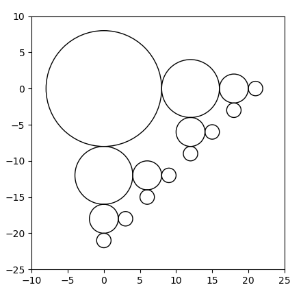

# Terminale NSI - Devoir surveillé n°1

## Exercice 1 (3 pts)

Expliquer en deux ou trois phrases ce qu'est une fonction récursive, sans donner d'exemple.

## Exercice 2 (4 pts)

Donner une fonction récursive `fibonacci` en Python, qui prend $n$ comme paramètre entier positif, et renvoie $f_n$ défini par :
$$f_n = \begin{cases} n &\text{si } n \leqslant 1 \\
f_{n-1}+f_{n-2} & \text{si } n > 1 \end{cases} $$

> On attend le code d'une fonction, avec sa *docstring*.

## Exercice 3 (9 pts)

Voici trois fonctions « mystères », donner une *docstring* pour chacune d'elle. On y attend une description rapide et deux tests de fonctionnement.

```python
def mystère1(x: int) −> int :
    assert x >= 0, "x doit être positif"
    if x == 0 :
        return 1
    else :
        return 2 * mystère1(x − 1)
```

```python
def mystère2(lst: list) −> int :
    # lst est une liste d'entiers, peut-être vide
    if lst != [] :
        return lst[0] + mystère2(lst[1:])
    else :
        return 0
```

```python
def mystère3(lst: list) −> bool :
    # lst est une liste d'entiers, peut-être vide
    if len(lst) > 1 :
        if lst[0] > lst[1] :
            return False
        else :
            return mystère3(lst[1:])
    else :
        return True
```

## Exercice 4 (5 pts)

On suppose que l'on dispose d'une fonction `cercle(x, y, r)` qui trace un cercle de centre $(x, y)$ et de rayon $r$.

1. Donner une fonction récursive `fig_c` qui permettrait de construire la figure ci-dessous.
2. Donner l'appel effectif `fig_c(...???...)` qui construit effectivement cette figure.

