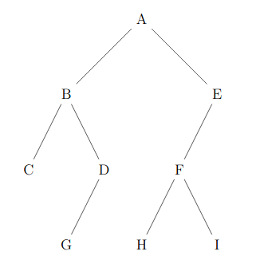
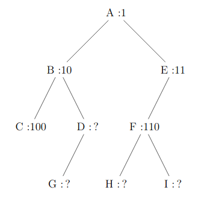
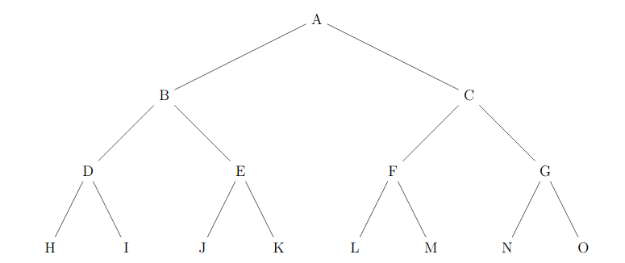

# BACCALAURÉAT blanc SESSION 2021

Épreuve de l'enseignement de spécialité  NUMÉRIQUE et SCIENCES INFORMATIQUES

> DURÉE DE L’ÉPREUVE : 3 heures 30 min ; Sujet de 6 pages, avec 7 exercices

Calculatrice interdite, ainsi que tout document.

## Exercice 1

On donne la fonction `mystère` :

```python
def mystère(a: int, b: int) -> int:
    if b == 0:
        return 1
    else:
        truc = mystère(a, b//2)
        if b % 2 == 0:
            return truc * truc
        else:
            return truc * truc * a
```

1. Comment appelle-t-on les fonctions du genre de `mystère` ?
2. Donner les étapes de calculs de `mystère(3, 5)`.
3. Donner une *docstring* avec *doctest* à la fonction `mystère`.
4. Proposer une fonction `mystère_force_brute` bien plus simple qui réalise le même calcul. La seule opération mathématique autorisée sera la multiplication.
    * Combien de multiplications seront effectuées pour le calcul de `mystère_force_brute(3, 1000)` ?
5. On suppose que les multiplications sont des opérations à coût constant, justifier que le coût du calcul de `mystère(a, b)` est presque proportionnel au nombre de chiffres en binaire de `b`.
    * Combien de multiplications seront effectuées pour le calcul de `mystère(3, 1000)` ?
6. **Question BONUS difficile**
    * Donner une explication sur le fait que « On suppose que les multiplications sont des opérations à coût constant » est fausse en réalité.
    * Justifier que si on choisit un modulo de la taille d'un mot machine, alors en faisant des multiplications modulaires, la phrase devient vraie.


## Exercice 2

```python
def f(x):
    return 10 // (x - 2)

def tableau_valeurs(g, a, b):
    tableau = []
    for x in range(a, b):
        try:
            y = g(x)
        except:
            pass
        tableau.append((x, y))
    return tableau

def h(n):
    if n < 0:
        raise ValueError("n doit être positif")
    if n == n + 1:
        raise TypeError("n doit être entier")
    réponse = 1
    for x in range(1, n + 1):
        réponse *= x
    return réponse

```

1. Quel est le type de données de `tableau` ?
2. A-t-on le droit de définir la fonction `f` après la fonction `tableau_valeurs` ?
    * Doit-on nécessairement donner à cette fonction l'identifiant `f` ?
3. A-t-on le droit de définir la fonction `f` comme ci-dessous ?
    * `f : lambada t = 10 // (t - 2)`
    * Si non, corriger les erreurs si c'est possible.
4. Calculer, si possible, `f(2)`, `f(4)`, `f(8)`, `f(16)`.
5. Expliquer le fonctionnement de la fonction `tableau_valeurs` en prenant l'exemple de l'appel `tableau_valeurs(f, -2, 4)`.
    * On demande autant une explication des étapes que le résultat de cet appel. Inutile d'expliquer tous les tours de boucle, uniquement ceux qui sont très différents.
6. **Question BONUS difficile**
    * Expliquer toutes les étapes de la définition de la fonction `h`.
    * Donner lui une *docstring* complète.

---


## Exercice 3

On souhaite créer une structure de données qui maintient une liste de valeurs dans l'ordre croissant.

```python
class ListeCroissante:

    def __init__(self):
        self.__liste = []
        self.__taille = 0

    def donne_taille(self):
        return self.__taille
    
    def donne_liste(self):
        """
        Renvoie la liste dans l'ordre croissant.
        """
        return self.__liste

    def ajoute(self, x):
        ...
    
    def contient(self, x):
        ...
    
    def extrait(self, x):
        ...
```

1. Comment appelle-t-on les méthodes `donne_taille` et `donne_liste` ?
2. Quelles raisons peut-on avoir à déclarer `liste` et `taille` préfixée de `__` ?
3. Écrire la méthode `.contient(self, x)` qui renvoie un booléen : « `self` contient-il la valeur `x` ? ».
    * On **interdit** d'utiliser `in` dans votre code.
    * On attend l'écriture d'une simple boucle qui teste la valeur des éléments.
    * Un retour prématuré sera valorisé.
4. Écrire la méthode `ajoute(self, x)` qui ajoute la valeur `x` à la liste, uniquement si elle n'est pas déjà présente, et en maintenant l'ordre croissant.
    * On suppose que tous les éléments `x` ajoutés sont comparables. Par exemple, ce sont tous des chaînes de caractères, ou bien tous un mélange d'entiers et de flottants...
    * On autorise uniquement un seul `append` avec un seul paramètre.
    * On interdit **toutes** les autres méthodes dynamiques des listes Python.
    * On attend essentiellement de la manipulation de tableau.
5. Écrire la méthode `extrait(self, x)` dans l'esprit de l'exercice.
6. **Question BONUS difficile**
    * Réécrire la méthode `contient(self, x)` qui aura une meilleure complexité.


## Exercice 4

L'écriture polonaise inverse des expressions arithmétiques place l'opérateur après ses opérandes. Cette notation ne nécessite aucune parenthèse ni aucune règle de priorité. Ainsi l'expression polonaise inverse décrite par la chaîne de caractères `'1 2 3 * + 4 *'` désigne l'expression traditionnellement notée $(1+2×3)×4$. La valeur d'une telle expression peut être calculée facilement en utilisant une pile pour stocker les résultats intermédiaires. Pour cela, on observe un à un les éléments de l'expression et on effectue les actions suivantes :
* si on voit un nombre, on le place sur la pile ;
* si on voit un opérateur binaire, on récupère les deux nombres sur la pile, on leur applique l'opérateur, et on replace le résultat sur la pile.

1. Décrire étape par étape l'état de la pile dans le calcul de `'1 2 3 * + 4 *'`.
2. Écrire une fonction `calcule_RPN` qui prend un seul paramètre `expression` et qui renvoie le résultat du calcul de cette expression donnée avec la notation polonaise inversée (_Reverse Polish notation_ ; **RPN**).
    * On supposera que l'expression ne contient que des entiers et des opérateurs parmi `+`, `-`, `*` et `/` qui sont les opérateurs classiques usuels sur les entiers à résultat entier.
    * On supposera que l'expression contient ses éléments séparés par des espaces.
    * On attend que votre fonction lève une erreur `ValueError: mauvaise expression` pour une expression mal écrite comme `'1 + 2'`.

---

## Exercice 5

Dans cet exercice, on utilisera la convention suivante : la hauteur d'un arbre binaire ne comportant qu'un nœud est $1$.

1. Déterminer la taille et la hauteur de l'arbre binaire suivant :

2. On décide de numéroter en binaire les nœuds d’un arbre binaire de la façon suivante :
    * la racine correspond à 1 ;
    * la numérotation pour un fils gauche s’obtient en ajoutant le chiffre `0` à droite au numéro de son père ;
    * la numérotation pour un fils droit s’obtient en ajoutant le chiffre `1` à droite au numéro de son père ;
    * Par exemple, dans l’arbre suivant, on a utilisé ce procédé pour numéroter les nœuds `A`, `B`, `C`, `E` et `F`.

    1. Dans l’exemple précédent, quel est le numéro en binaire associé au nœud `G` ?
    2. Quel est le nœud dont le numéro en binaire vaut $13$ en décimal ?
    3. En notant $h$ la hauteur de l’arbre, sur combien de bits seront numérotés les nœuds les plus en bas ?
    4. Justifier que pour tout arbre de hauteur $h$ et de taille $n\geqslant 2$, on a : $h \leqslant n \leqslant 2^h−1$.
3. Un arbre binaire est dit complet si tous les niveaux de l'arbre sont remplis. Comme ci-dessous.

On décide de représenter un arbre binaire complet par un tableau de taille $n+ 1$, où $n$ est la taille de l'arbre, de la façon suivante :
* La racine a pour indice $1$;
* Le fils gauche du nœud d’indice $i$ a pour indice $2×i$ ;
* Le fils droit du nœud d’indice $i$ a pour indice $2×i+ 1$ ;
* On place la taille $n$ de l'arbre dans la case d’indice $0$.
    1. Déterminer le tableau qui représente l'arbre binaire complet de l’exemple précédent.
    2. On considère le père du nœud d’indice $i$ avec $i\geqslant 2$. Quel est son indice dans le tableau ?
4. On se place dans le cas particulier d'un arbre binaire de recherche complet où les nœuds contiennent des entiers et pour lequel la valeur de chaque nœud est supérieure à celles des nœuds de son fils gauche, et inférieure à celles des nœuds de son fils droit.   1. Écrire une fonction `recherche` ayant pour paramètres un arbre `arbre` et un élément `élément`. Cette fonction renvoie `True` si `élément` est dans l'arbre et `False` sinon. L'arbre sera représenté par un tableau comme dans la question précédente.

## Exercice 6

Une liste de booléen peut être associée de manière unique à un entier strictement positif en utilisant la formule suivante :
* Pour une liste $b$ de $n$ booléens,
* on définit $f(b) = 2^n + b_{n-1}×2^{n-1} + b_{n-2}×2^{n-2} + \cdots + b_{1}×2^{1} + b_{0}×2^{0}$

1. Montrer que $f([\text{True} ,\text{True} ,\text{False} ,\text{True}]) = 29$.
2. Quelle est la liste $b$ de booléens telle que $f(b)= 42$ ?
3. En supposant qu'en Python un booléen soit stocké sur $8$ octets, et que le poids d'une liste est la somme des poids de ses éléments. Comparer les poids de $b$ et $f(b)$ pour une très grande liste $b$ de booléens.
4. Donner une implémentation d'une structure de données `class PileBool` qui sera une pile de booléens dont **les données seront entièrement stockées dans un unique entier**. On attend :
    * Un constructeur, et les méthodes suivantes
    * `.est_vide(self)` pour savoir si la pile est vide
    * `.empile(self, x: bool)` pour empiler un booléen `x`,
    * `.dépile(self)` pour dépiler et renvoyer un booléen.
    * On attend **juste une utilisation simpliste** des opérations : ajout de $1$, multiplication par $2$, division par $2$ et son reste. Le tout sur un **unique entier** pour stocker les données.
    
5. **Question BONUS :** donner une méthode `.donne_liste(self)` qui permettrait de répondre automatiquement à la question 2.


## Exercice 7

Pour construire les mots de Łukasiewicz (des chaînes de caractères), 
* à l'étape $0$, on dispose du mot `"b"` ;
* à une étape $n$, on peut construire les nouveaux mots par concaténation de `"a"` et de deux mots disponibles à l'étape $n$. Les nouveaux et les anciens sont disponibles à l'étape $n+1$.

1. Montrer qu'on peut construire le mot `"ababb"`, disponible à l'étape $2$.
2. Donner tous les mots disponibles à l'étape $3$.
3. Démontrer que chaque mot de Łukasiewicz possède un nombre de `b` égal au nombre de `a` plus un.